Basic Programming Concepts
---

Let's keep going with some other programming concepts, both unique to the ESP32 and IoTy but also relevant in most coding practice.

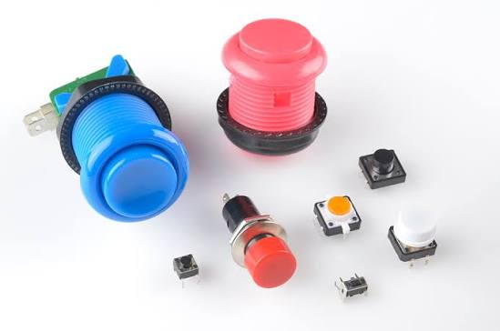

<u>**Light Switch**</u>

Remember the Programmable Button?

Here, on the bottom right of the ESP32, it is labelled Mode (that has to do with its main built-in default function):

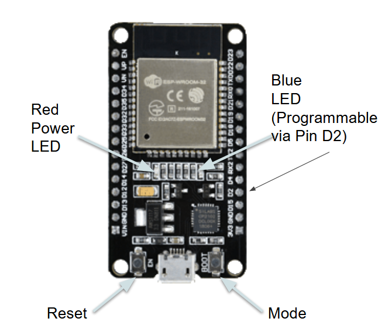

On the ESP32 itself it is labelled BOOT.  

Let's use the Digital Read block to query the state of the button, and we will print the result back to the screen/monitor.

The Print block can be found under Text:

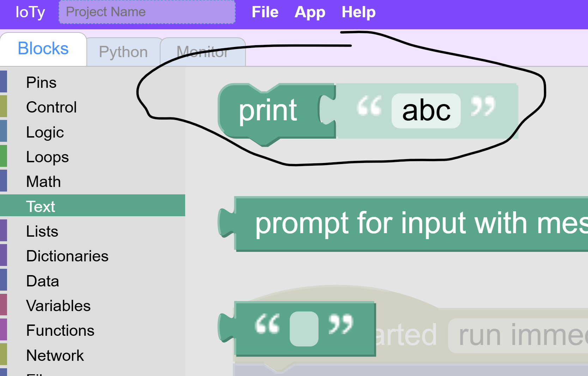

Let's print the state of the Button combining Print with Digital Read:

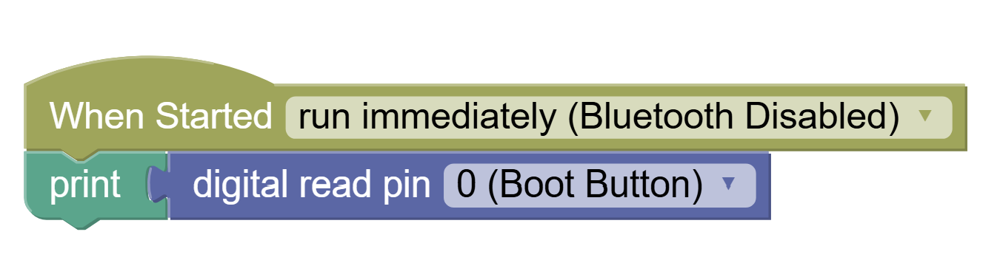

If we donload and run this we won't notice anything happening, but we can open the "Monitor" tab to see if anything is printed out:

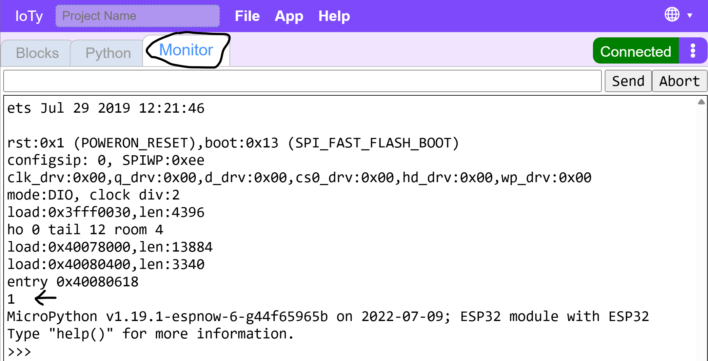

There's quite a lot of built-in debug output that the micropython OS is spitting out at us, but you can see that "1" just before the end.

The monitor is essential for debugging and analyzing the behavior of your code.  Learn to use it as a diagnostic tool early!

Let's make this a bit more interactive.  We will print the state of the button in a stream over and over again so we can see if the output changes when we press it:

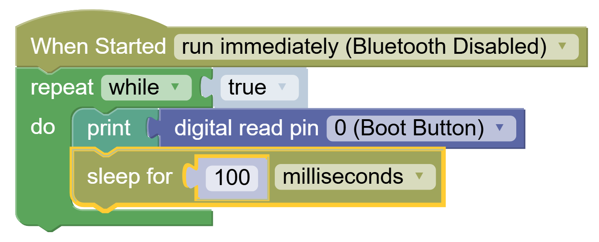

We added a loop around the print statement so it keeps printing the state over and over.  We also added a 100ms Sleep to prevent over-spamming, but it's not %100 necessary.  It is, howver, a good habit to pump the brakes in thes forever loops as a habit.

Let's download this code, reset the device, and monitor the button state while we interact with it - press and let go a few times while monitoring:

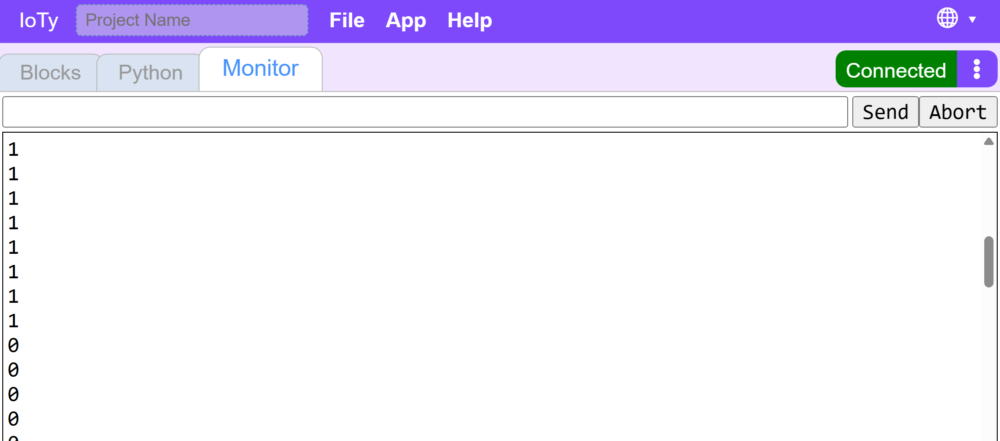

Note that when we press the button the printed State is 0.  When the button is unpressed the State is 1.  Reversed from maybe what you would have assumed, but at least we know the expected logic behavior now.

Let's change the code to turn the Blue light ON when the button is pressed (state == 0).

We will use the IF block in Logic:

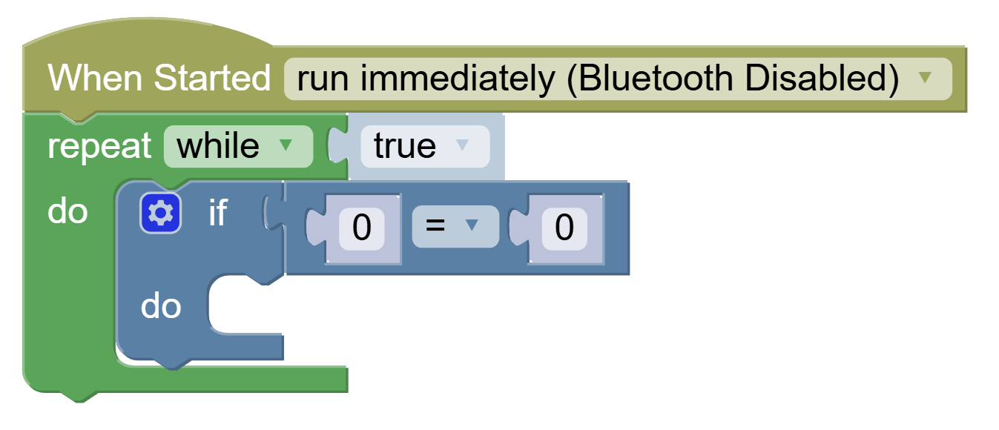

And we will add an "else" path to the code:

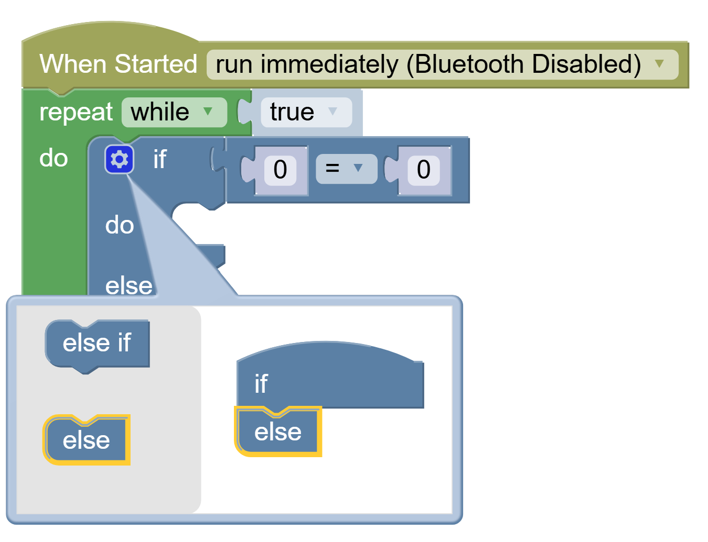

And now we will add what to do in each case - when the button is pressed / Read == 0, let's turn on blue light, othrwise turn it off:

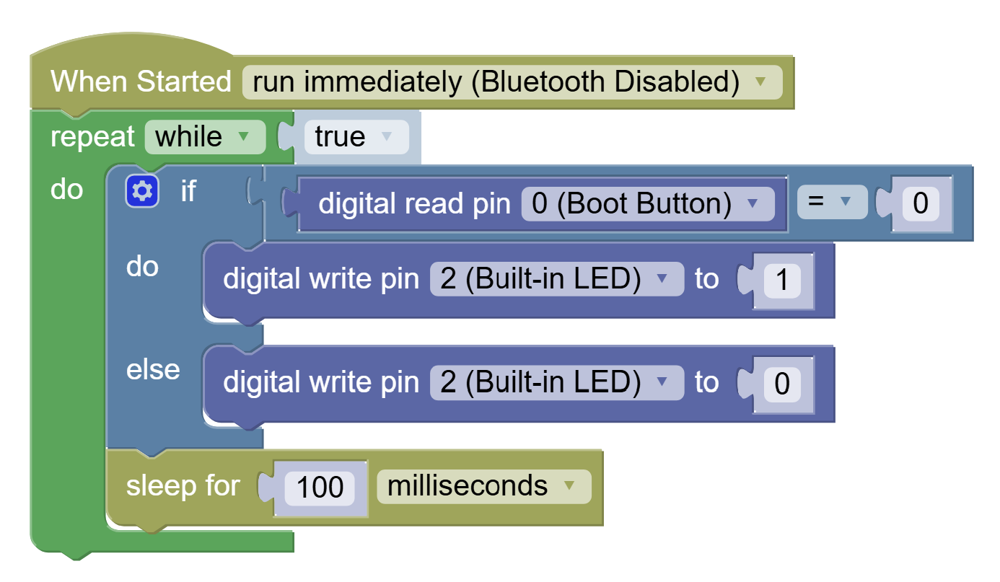

If you download this code successfuly and rerun the device, you could test the button now as a temporary light switch - the light stays on as long as the button is pressed.

CHALLENGE
---

In order to turn the button into a toggle switch, you need to use a variable.  Save the state of the light in the variable, and whenever the button is pressed check what you did last time, and do the opposite.

Creating a variable is easy:

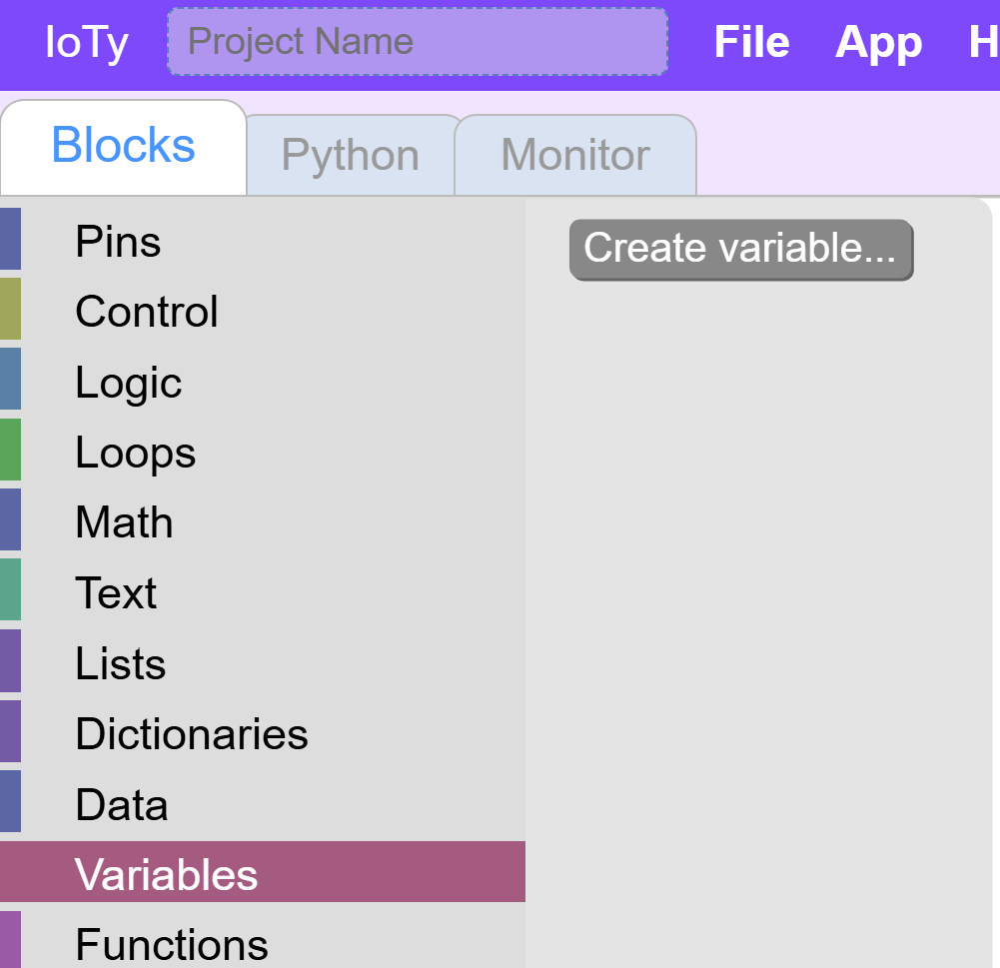

After you create a variable you will see the Set/Change blocks appear under Variables menu.  Let's set the state of the light to off at the beginning of the code, as the light should start off.

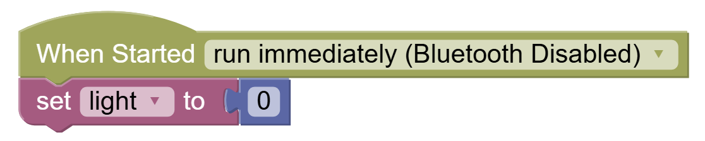

The 0-box comes from Math blocks.

Now the If statement checking if the button is pressed is only used to trigger an event but the nature of the event will be determined by the state of the state variable.

Here is a basic structure:

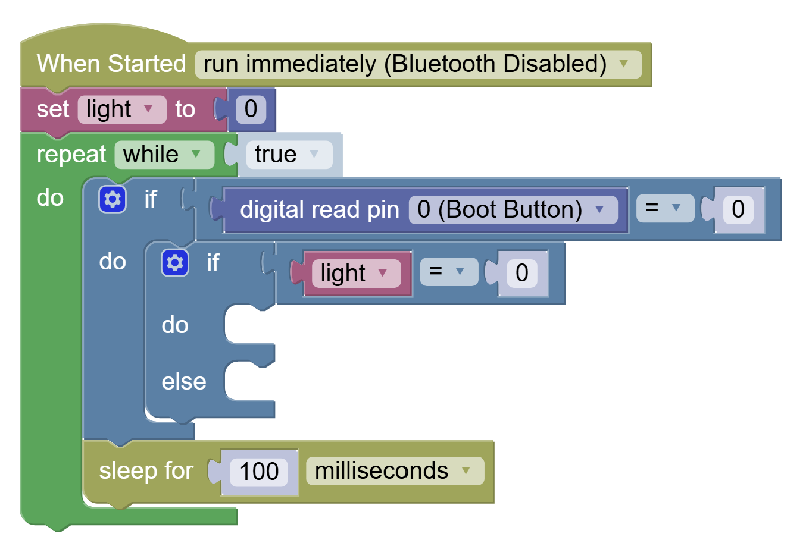

Complete the code to make the light turn on if it's off, and off if it's on.  And don't forget to keep track of the state!