LED Strips
---

The potential of the ESP32 development board is in its ability to connect to and control an unlimited range of electronics.

At this time we will look at two very popular actuators - servo motors and RGB LED Strips.

<u>RGB LED Strip</u>

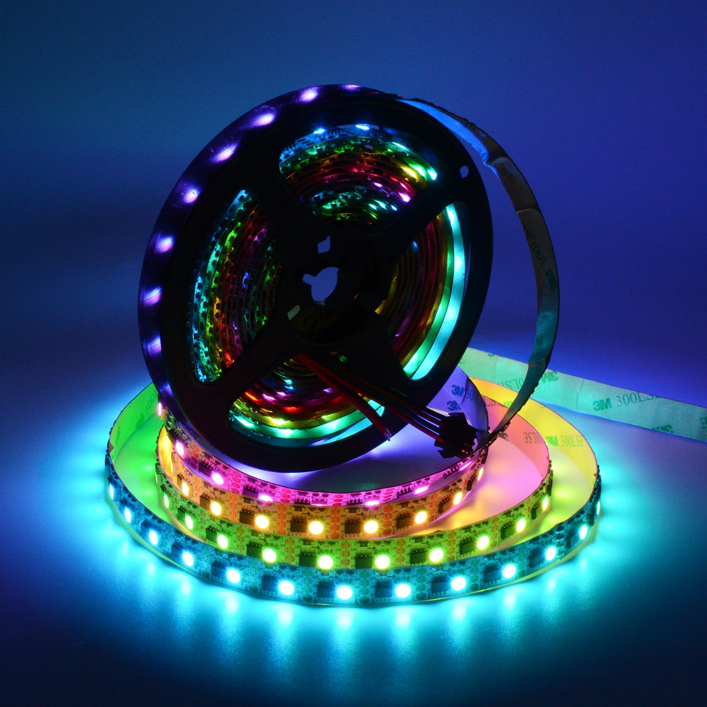

Color LEDs have been used ubiquitously since cheap controllers and light strips began being popularized in the past decade.

The most readily available programmable light strip today is based on ws2812 technology more commonly known as *NeoPixel*.

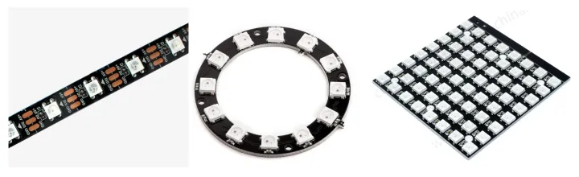

Given a strip you will need to connect it to your controller.

There are various connections and this depends on your kit:

- Straight to ESP32
- Using a bread board
- With breakout board

*Straight to ESP32*
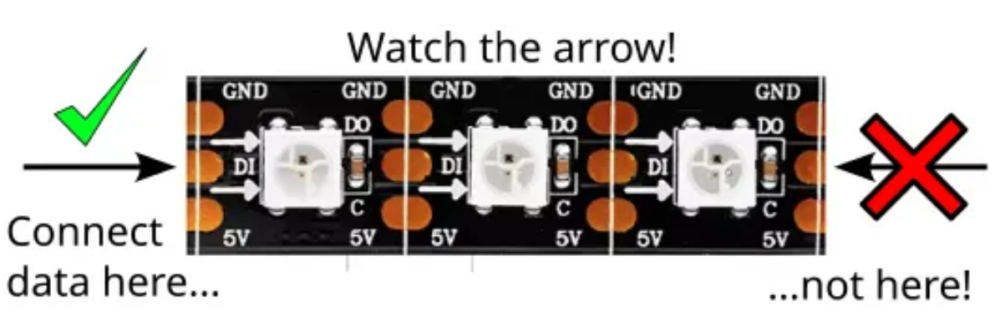

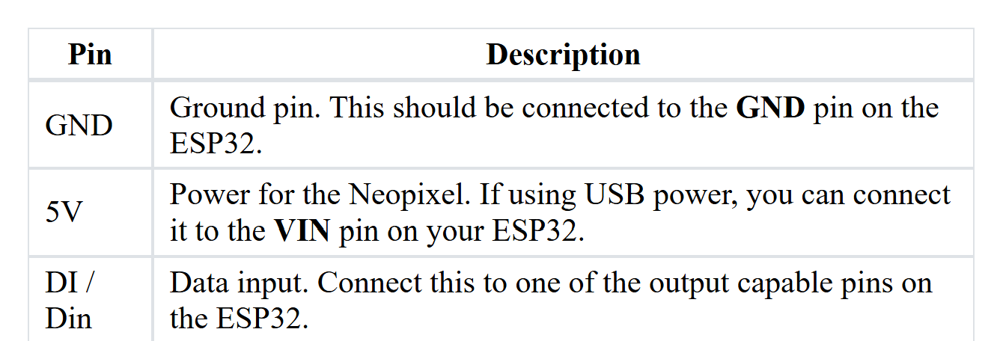

*Using a Bread Board*
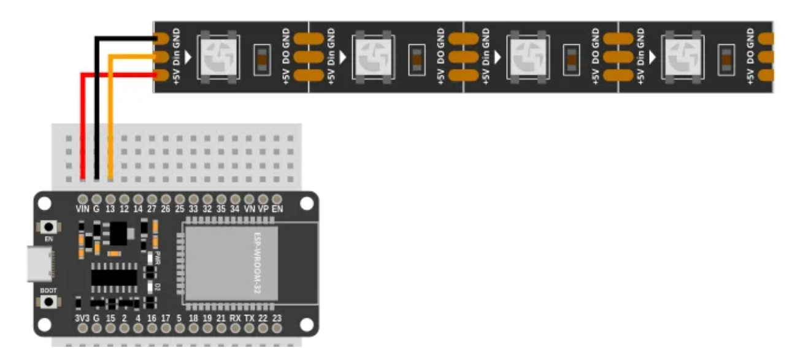

*With Breakout/Expansion*

First, make sure to secure the ESP32 properly into the board:

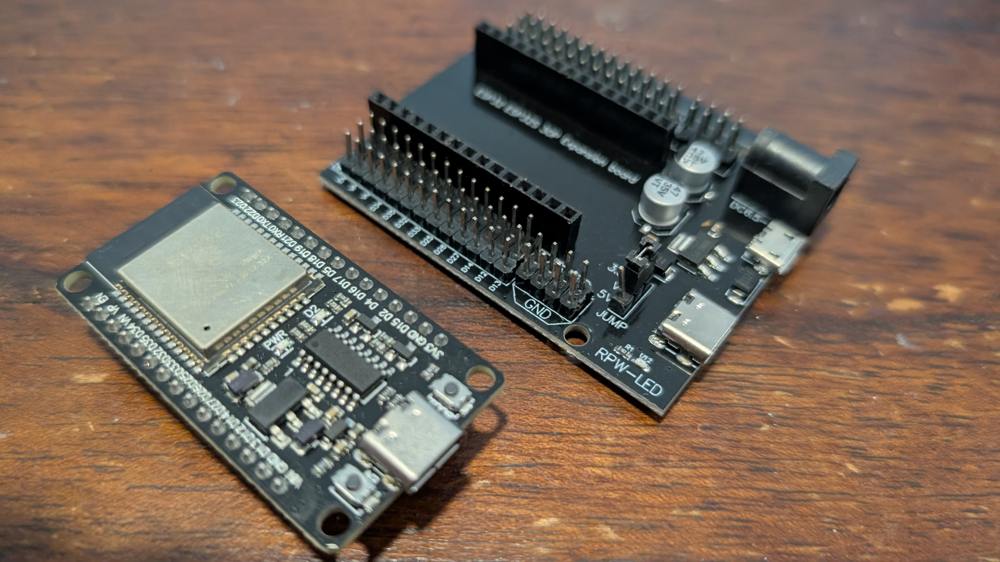

Make sure to **align the pins** properly before pushing them in:

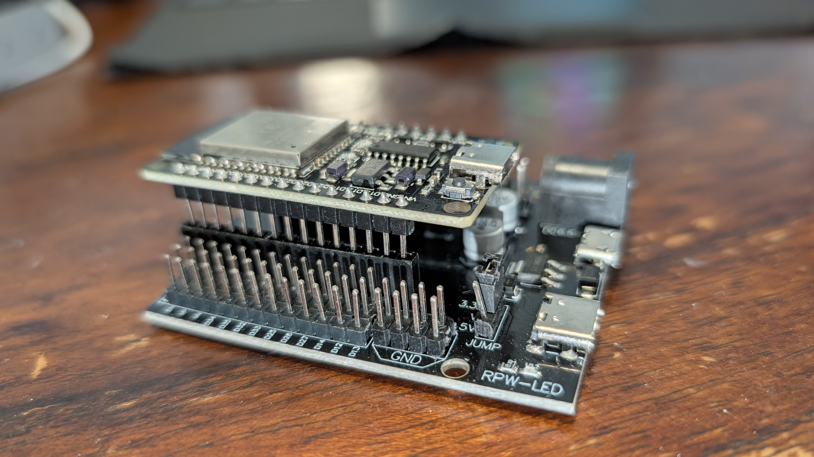

Finally, find the row corresponding to your programming pin, say D13 as in this example, and match:

- +5v wire to the V (middle) column
- Gnd wire to the G (inner) column
- DI wire to the S (outer) column

Like so:

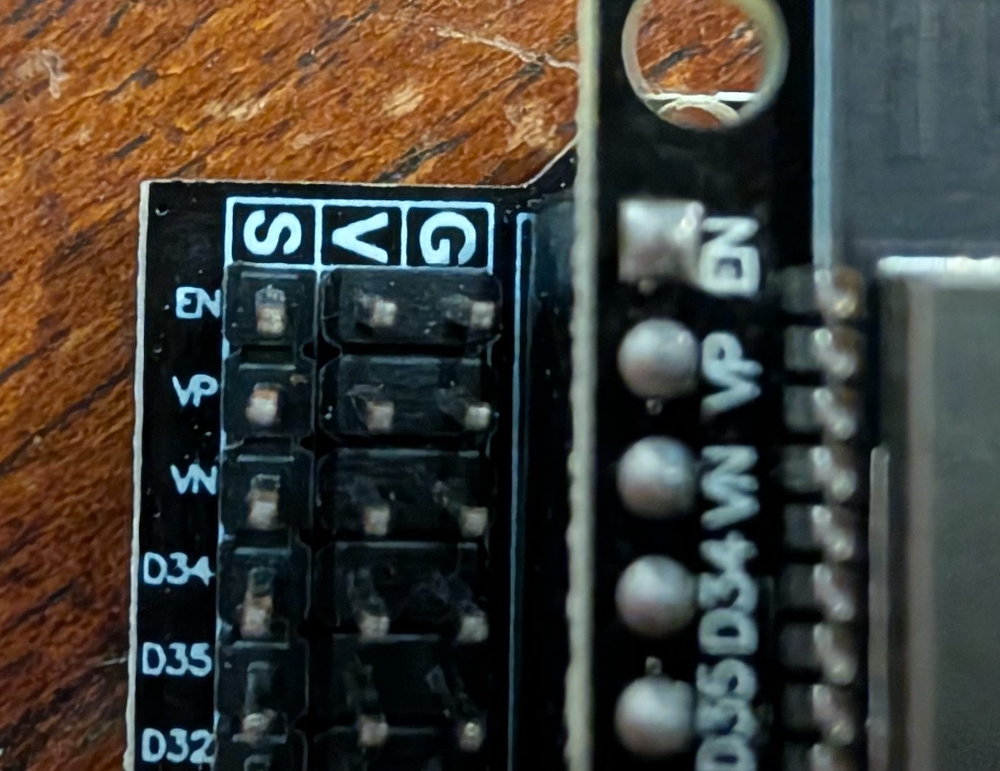

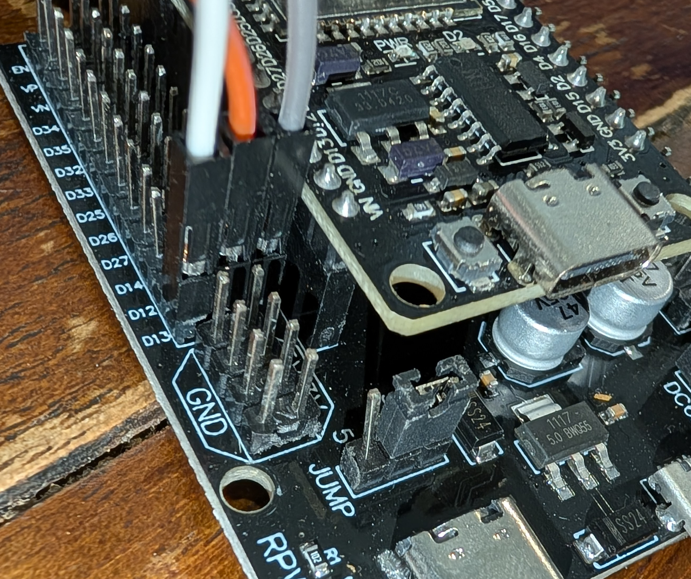

*Programming NeoPixel Strips*

In order to program the NeoPixel strip we need to utilize a NeoPixel library/API.

- Go to **File->Load extension...**
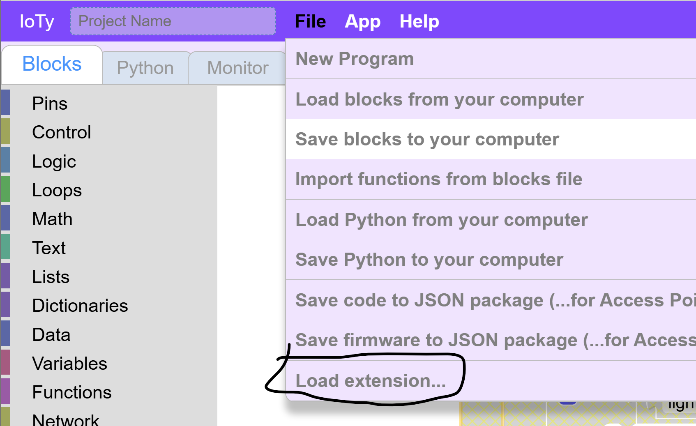

- In the search box type **"neo"**
- You will see NeoPixel choice, click **Install**
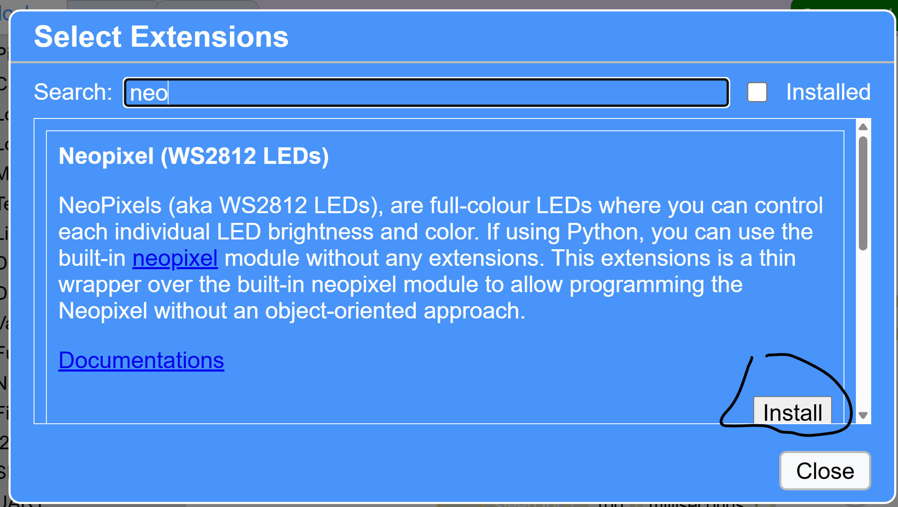

- Close the dialog box and you will see a Code Block category:
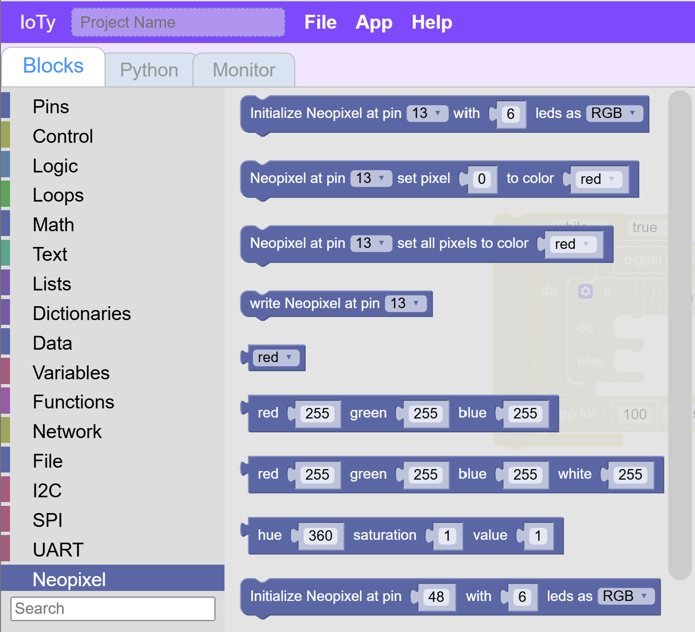

*Make it Red*

- You will need an Initialize block first.  Whicever pin you used for DI above should be the pin you use to initialize.  The number of leds is based on whatver size led strip you are using.  It depends on your kit

- Next let's choose a color to set all the LEDs to...

- Finally, and this is important to remember, after every programmatic change to the LEDs you need to inform the electronics of those changes using a Write block

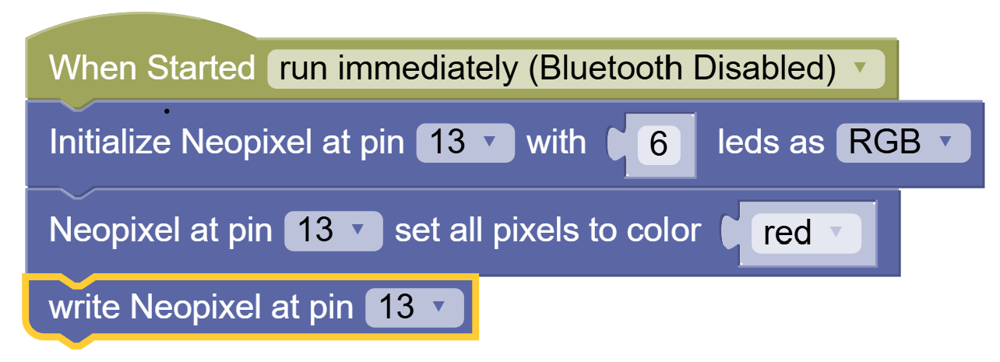