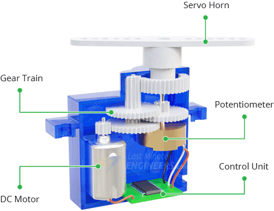
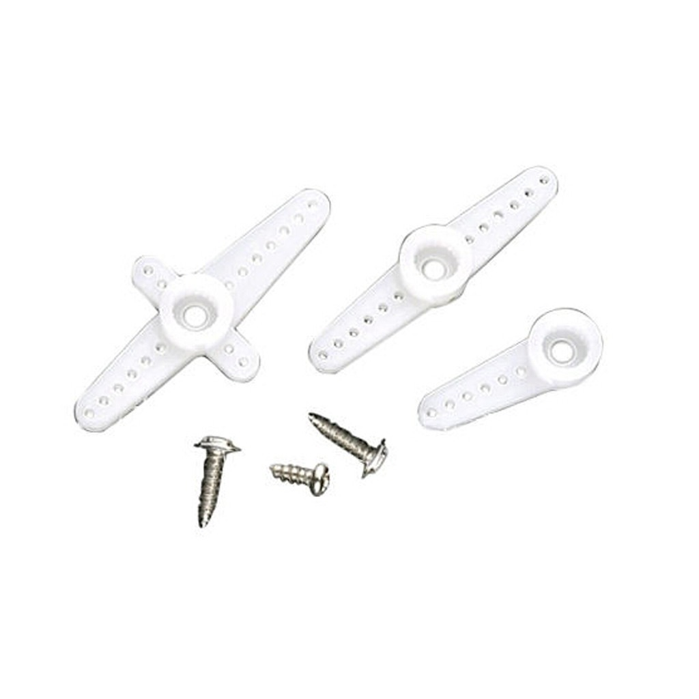
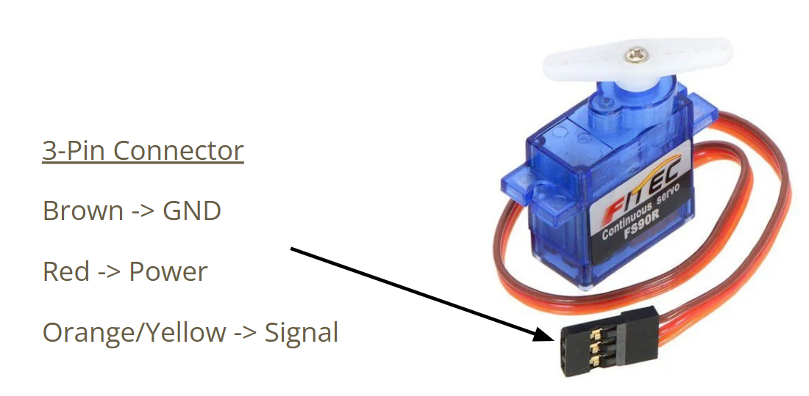
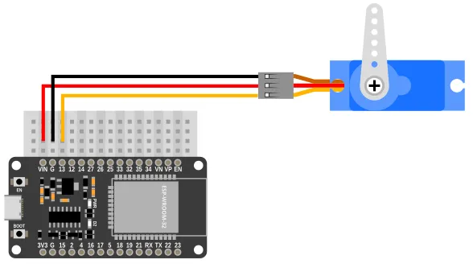
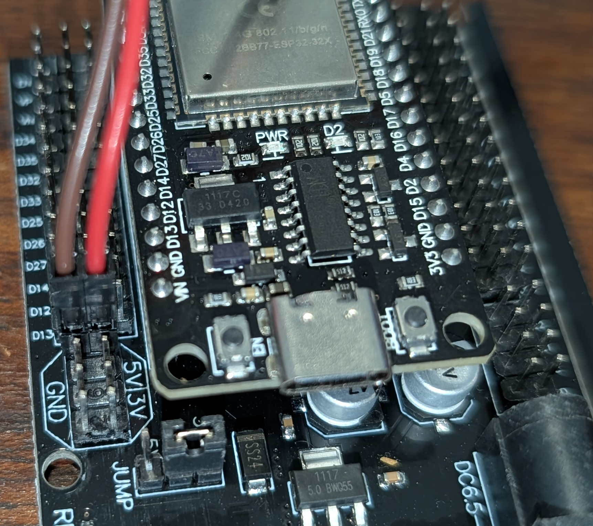
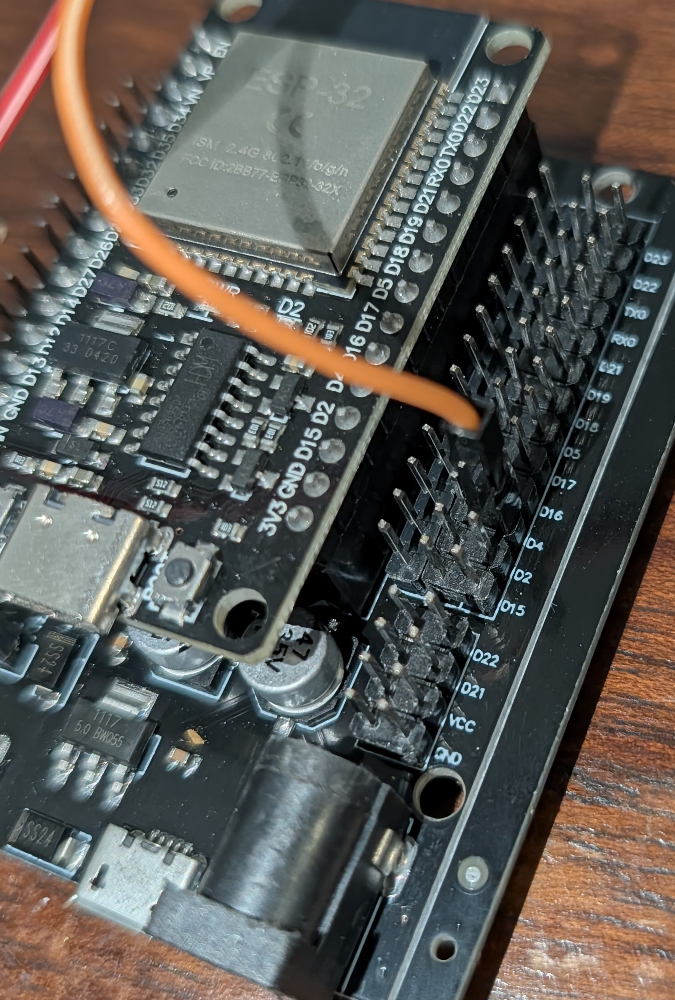
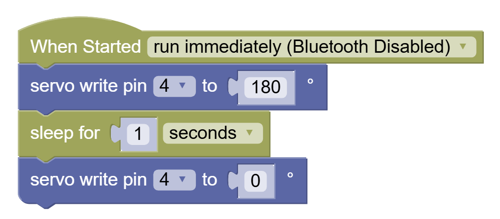
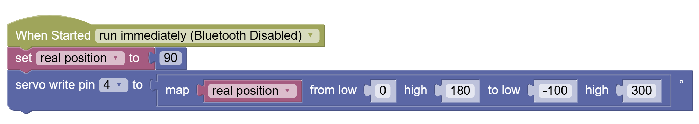
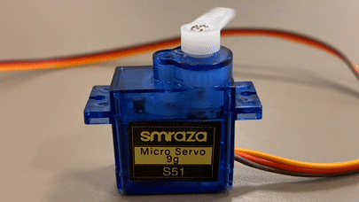

Servo Motor
----

A **Servo Motor** contains a DC motor, some gears with a simple encoder (like a potentiometer), and an on-board electronic controller that will read instructions in and convert them to either a position to hold (180 degree servos) or a direction and speed to spin (360 versions).

<h3>Servo Horns</h3>
Usually a servo will be provided with some servo horns for various use cases.  The common Tower sg90 servo comes with three:

If you want to put a long popsicle stick over the middle of the servo's rotating shaft, then use one of the two bigger double-sided horns.  If you want to make a gantry, or connect a rudder, or have some space constraint then the smaller half-horn is more suitable.

<h3>Screws</h3>
There are 2 types of screws, the mall one is for securing the horn onto the servo shaft.  A lot of times that isn't needed because the servo horn has a good tight fit over the shaft.

The other two screws can be used to secure thehorn onto an external bit of hardware like plastic or wood.

<h3>Wiring</h3>

The Servo has 3 cables:

Red - Power (+)

Brown - Power (-/Gnd)

Orange - Signal (coded behavior)

<h4>Connecting Directly to ESP32</h4>
We cannot use the Servo wire connector directly with the ESP32 board, so we will utilize extra Male-to-Female Dupont wires.  The colors on these extra wires is irrelevant.  As long as:

<table><thead>
<tr>
<th>Servo Wire Color</th>
<th>ESP32 Pin</th>
</tr>
<tr>
</thead>
<tbody>
<tr>
<td>Red</th>
<td>VIN</th>
</tr>
<tr>
<td>Brown</th>
<td>GND</th>
</tr>
<tr>
<td>Orange</th>
<td>Dxx (D04 in coding example)</th>
</tr>
</tbody>
</table>

<h4>Connecting with Breadboard</h4>

Similar to above.  Now we need Male to Male Dupont wires...

NOTE: In this image the signal wire is connected to Pin 13, but in our coding example we use Pin 4, so make the necessary adjustments in code.

<h4>Connecting with Expansion Board</h4>

First, make sure to secure the ESP32 properly into the board:

Make sure to **align the pins** properly before pushing them in:

Then connect the 5V and Gnd to the power pins:

And finally the signal wire to the corresponding pin's (D4?) S or outer column:

You're all set!

<h3>Coding</h3>

Coding the servo is faily simple.  Assuming the most basic servo type (holds positions 0-180 degrees):

The pin denotes the pin that the Servo Signal (orange) wire is connected to.

The second number is the angle position to hold.

In order to move from one position to another you need to give the servo some time to reach the desired position:

ALSO: Note that 0 and 180 may not be exactly 0 and 180.  They map to some API number that is not the same across all servos.  

You may try the range from roughly -100 to 300 and once you find the true range, you can utilize the **map** block like this:

<h2>Challenge</h2>

Make repetitive motion like a car's windshield wiper - use loops, and don't forget to sleep.

