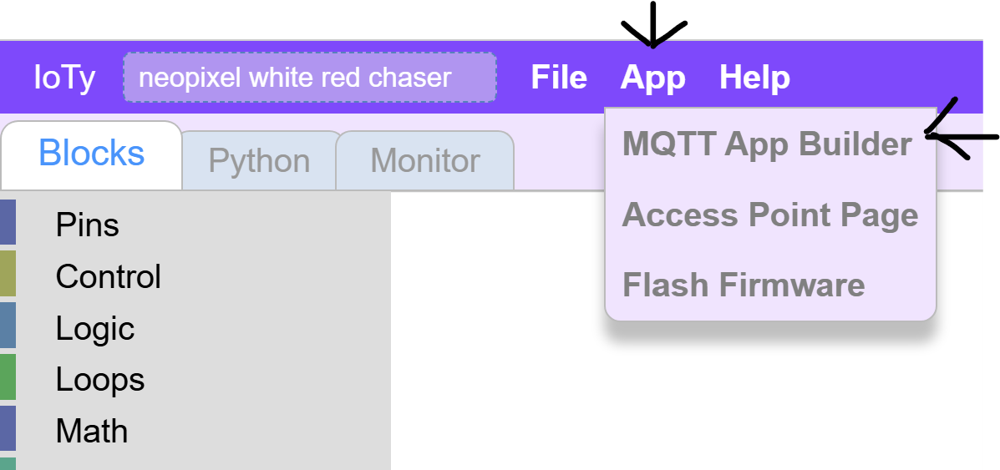
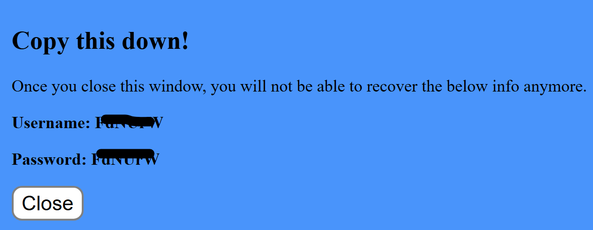
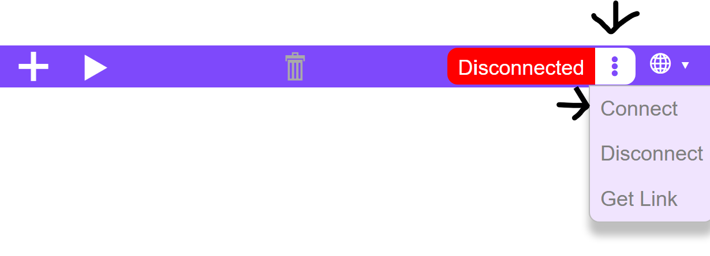
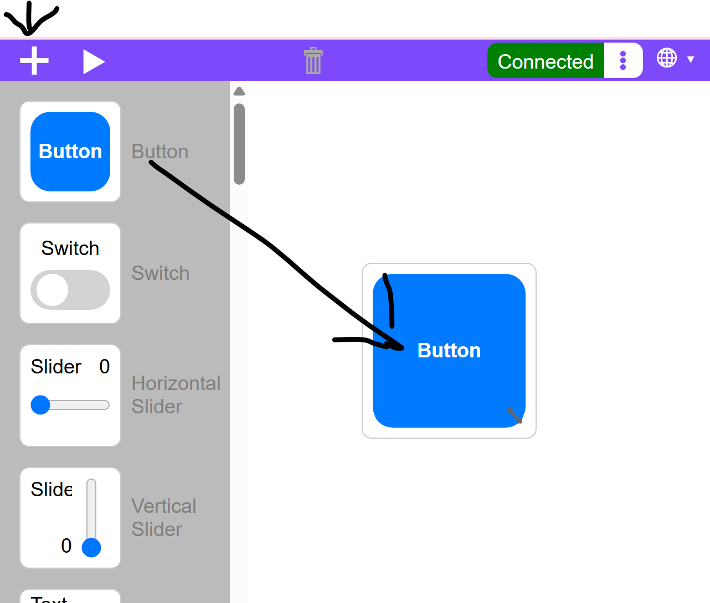
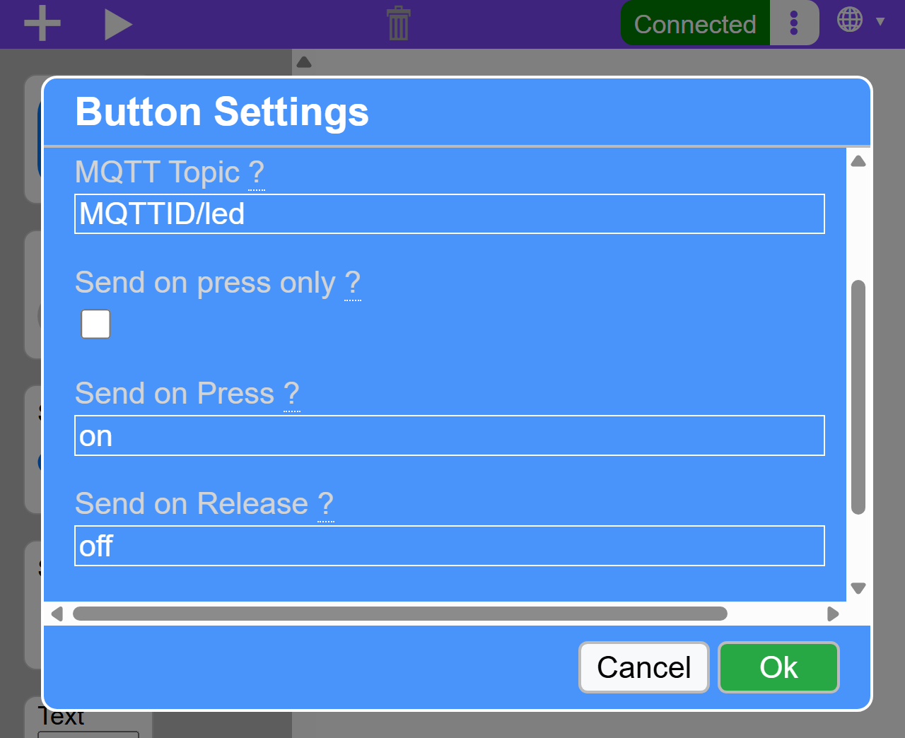
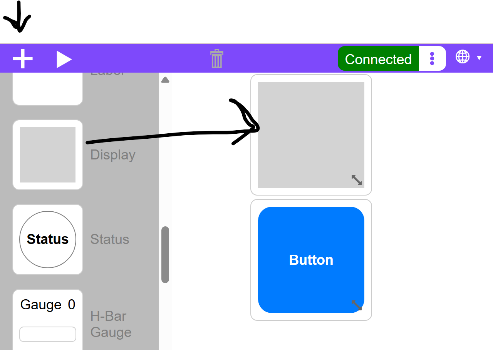
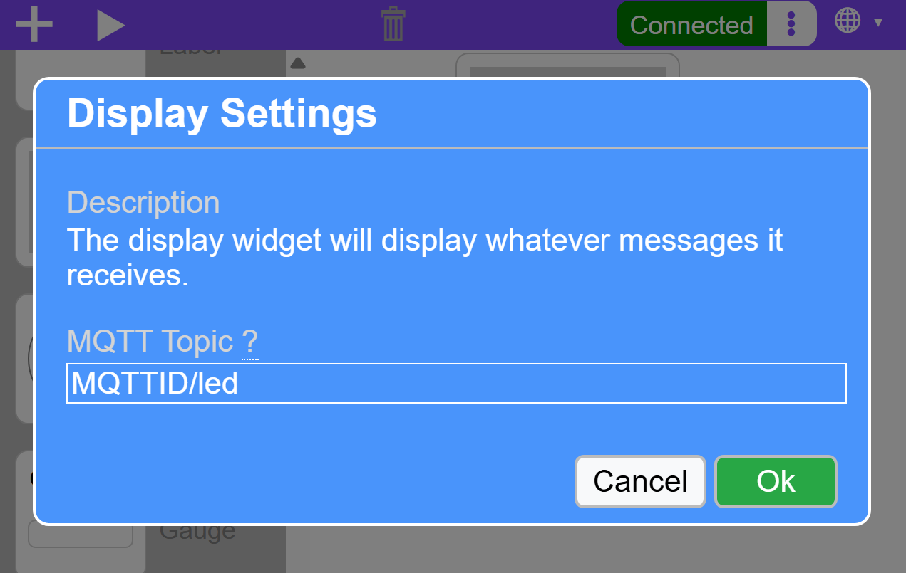
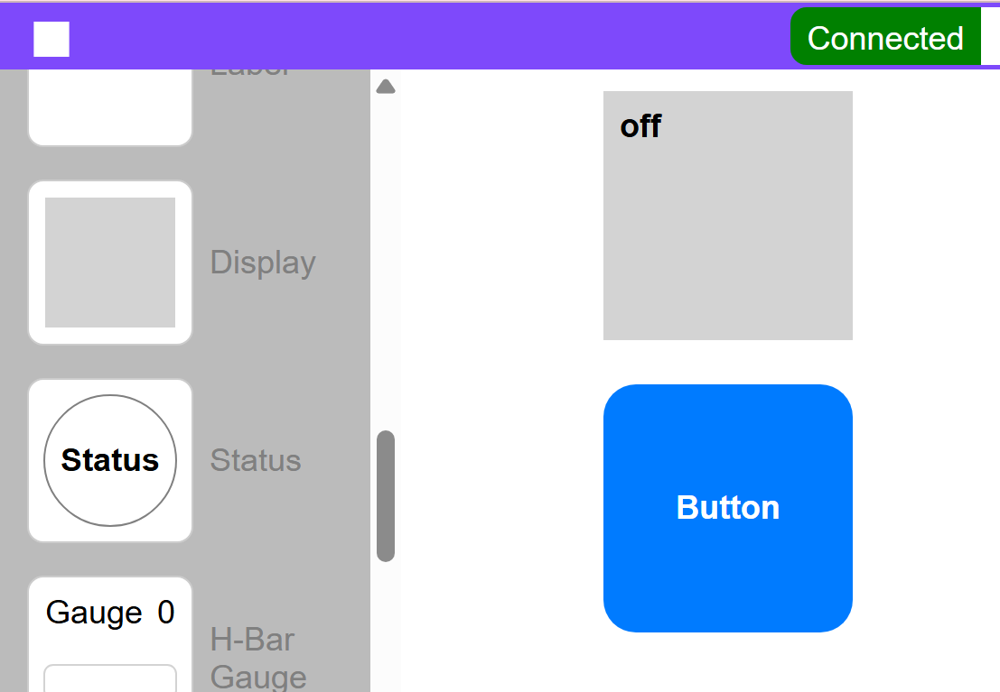

Automation With IoTy
---

We have some electronics that we know how to control with code, and we have some Machine-Learning model that we would like to use to control it.

First, we need to learn how to remote control the electronics through ESP32.  We will be using the IoTy system for that, and we will remote control through the Internet, using an Internet-Of-Things (IoT) infrastructure.

<h3>Connecting to the Internet</h3>

First we need to use WiFi to connect to the wider Internet.  Your school's WiFi does not allow for this, so today we will need to connect to hotspots or a dongled router.

**WIFI Info**

<u>SSID</u>: a9i
 
<u>Password</u>: goodlife

You can use this for your laptops so that your IoTy remote control can connect to the internet properly.

<h3>App Builder</h3>
We will be creating a remote controller from the IoTy's App Builder:

We will need to connect this app to our ESP32 somehow.  The IoTy infrstructure uses MQTT as a server and communication protocol that glues everything together.  This is a very common approach for IoT frameworks.

So, we will need some way to identify your system and how it communicates between various elements.  For that you will need a MQTT ID.

If your ESP32 has a # on it, you can simply use it as a MQTT ID as follows:

<h1>ioty###</h1>

If not, you will need to request an ID from [here](http://mqtt.a9i.sg)

Click on the request button and you will get a 6-character ID:

Note that the username and password are always the same, so just copy either.

Now in the app builder you will use this ID to connect:

You should also use this for your ESP32 to connect:

Notes if you *cannot connect*, check that:
- You have copied the ID correctly
- Your laptop is connected to a hotspot or the a9i WIFI provided above.

Now that our app is connected, let's add a simple widget to use to test how to remote control our electronics.

Click the '+' and drag and drop a Button widget into the app canvas:

Next, click on the Button to define its behavior:

For Topic, enter your MQTT ID followed by '/' and the name of what this widget controls.  In our case we will control the Blue LED first.

You can also change the text the widget will be sending to the ESP32 when you click and release it.  IN our example below we changed it from 'press' to 'on' and from 'release' to 'off' as that is the behavior we expect: Press and hold to "On the LED".

Before we move to the ESSP32, let's test the IoTy service.  We will intercept the button commands inside the app itself to see if it works:

And click on it to define its behavior - listening on the same topic as the button's.

Now test the app, by **clicking on the Play button** to start it, and click on the button to see the Display change:

In the next lesson we will integrate the ESP32 and its LED to this framework.