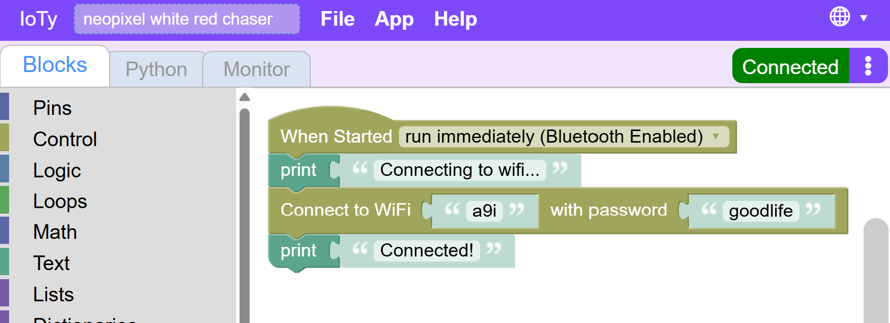
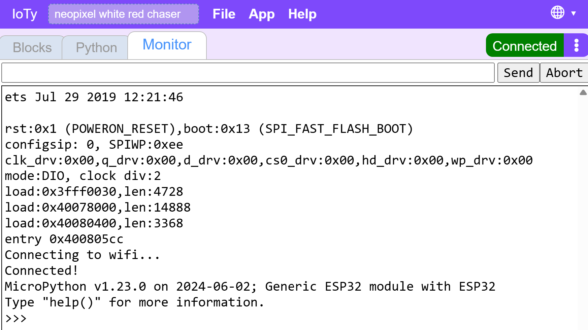
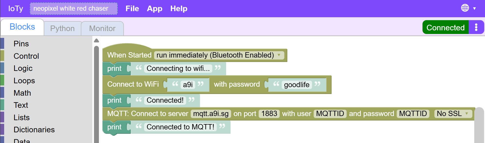
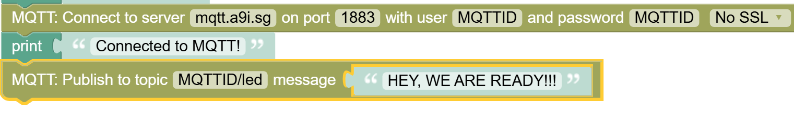
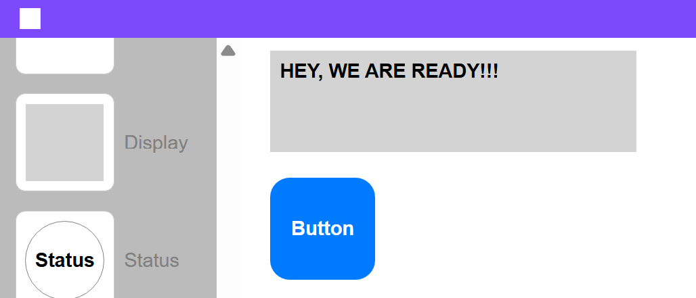

Integrate ESP32 with IoTy
---

Now that we have a simple remote control app connected to the internet, let's connect the ESP32 to the same infrastructure.  Then we can control it and anything connected to it from our web app.

In IoTy's editor add **Network** code blocks to connect the ESP32 to the internet via our WiFi:

**SSID**: a9i
 
**Password**: goodlife

(you can also use your own hotspot, but not the school's WiFi)

We add the Print() commands so we can check in the monitor whether Wifi connection succeeded or not.

You should see something like this:

Now that ESP32 is connected to the entire internet, we need to connect it to the IoTy MQTT server:

If everything goes well (check the monitor), we should be able to publish info to the app and intercept messages from it.

Let's test the simpler thing first - publishing to the app.  We can send it a notification that we are connected and ready:

After downloading and resetting, you should be able to see the message appear in the app:

Troubleshooting:
- Make sure app is in Play and not Edit mode
- Make sure all the Usernames and topic names match wherever you include mqtt topic
- Check esp32 monitor for any insights on where things are failing

Next we will add code to LISTEN to messages from the app.