Listening to IoTy
---

Now that we have managed to send a message from ESP32 to the App, let's try to do the opposite and listen to Button messages from the app to the ESP32.

First, we need to add a place where those topic messages will go by using the OnReceive Network block:

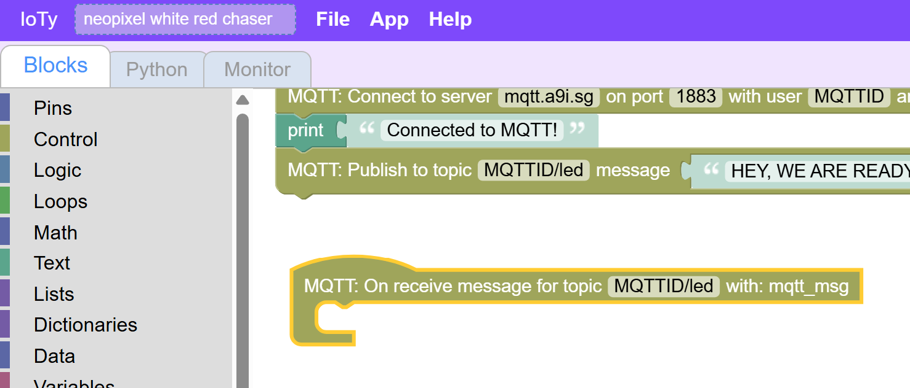

Inside let's just print the mqtt_msg we get.  Make sure you are not ceating some custom variable, but using the Network block "mqtt_msg":

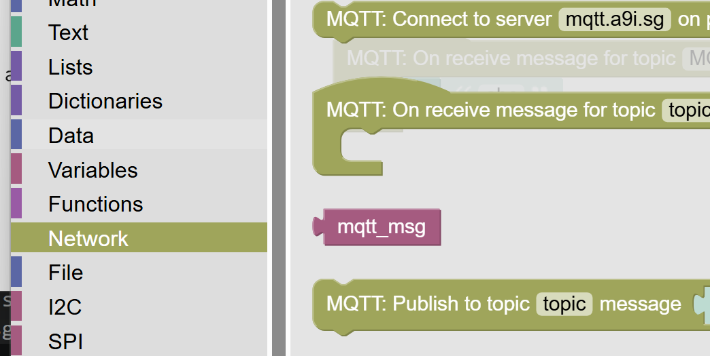

Let's just print that for now:

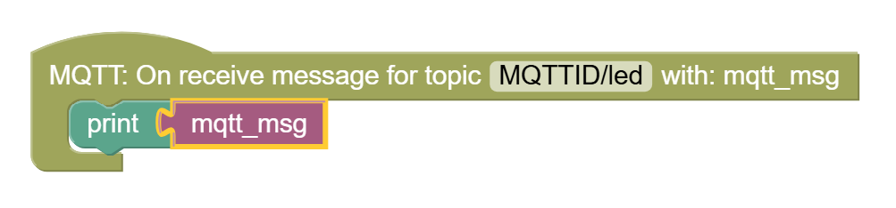

If you test the button now, you will see, that this does not work...  You don't even receive the "Ready" test message in the topic...

We need to add one more thing in the main code - some way to instruct the ESP32 to look out for messages, and not give up control by exiting the program:

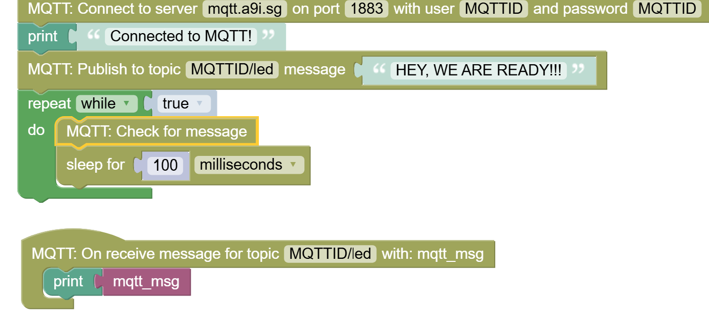

The sleep block is in Control section and make sure to sleep for 100ms or more so that you don't waste bandwidth or overwhelm the servers and your app.

If you did everything right, you shoudl be able to see the on/off messages hitting your ESP32 monintor when you click on the button.  Make sure your app is in Play mode.

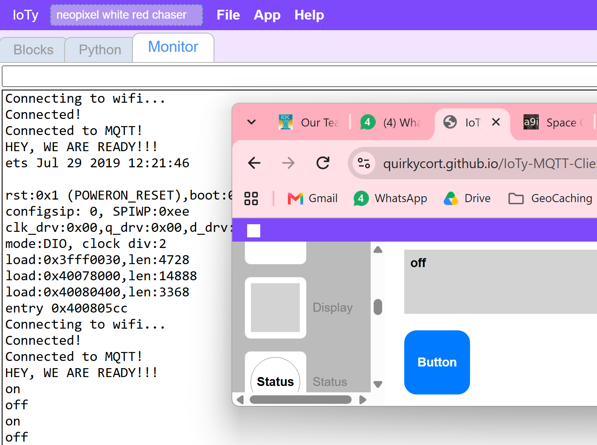

Finally, let's bring all of it together - we will check for the on/off message and turn the Blue light on if we receive on and shut it if we receive off.

First add an IF logic block:

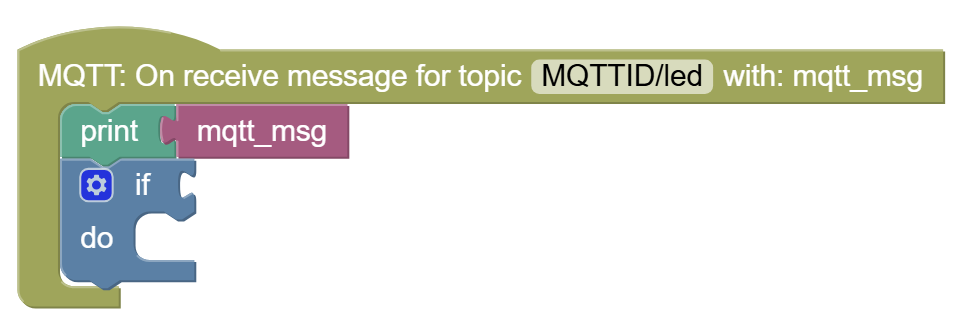

Remove the 0=0 portion, as that only works for integers and we need to compare the mqtt_msg **text**.

Now add the generic comparison block from Logic:

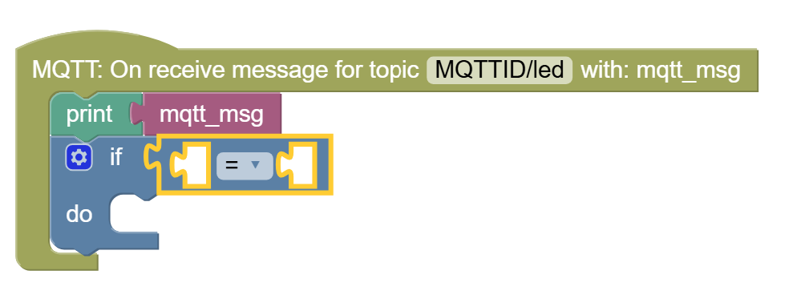

Now add the else portion of the condition:

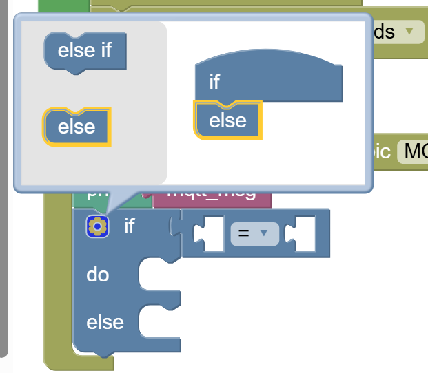

Finally, we will check if mqtt_msg is on or off:

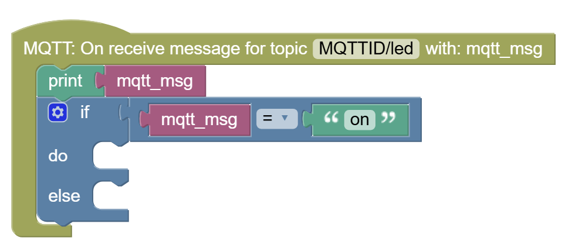

(The "on" comes from an empty Text string block and defining it with the string you want to check)

And the last thing is to turn the LEDs on or off, appropriately:

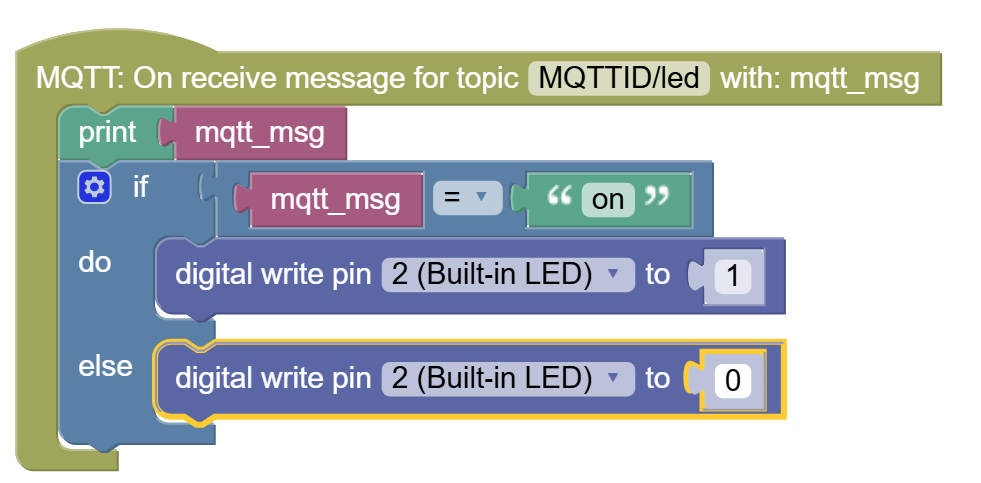

Now test that the LED is turning on/off from the App's button!

You can transfer control to your phone:

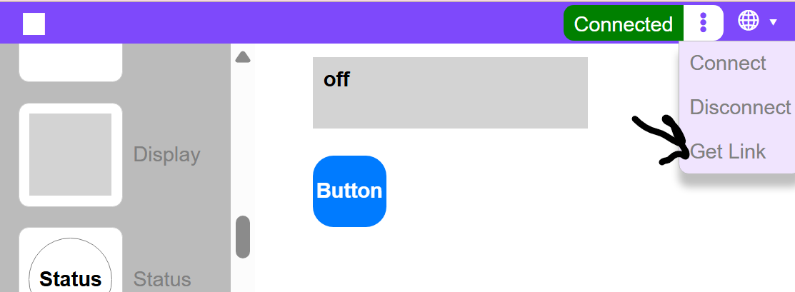

Armed with this, can you try to control NeoPixel LED strips to change colors from the App?

