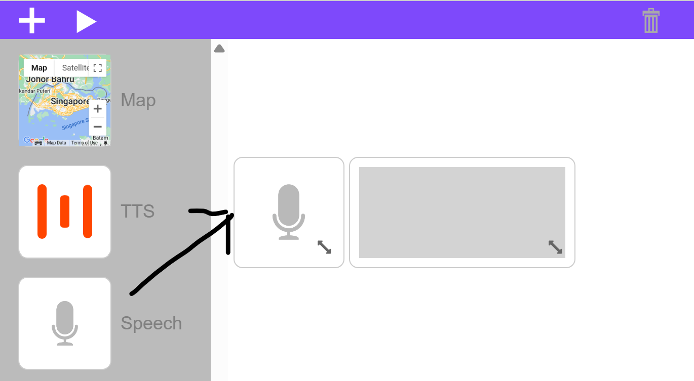
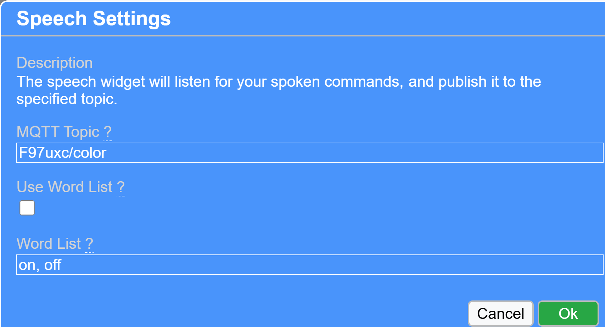
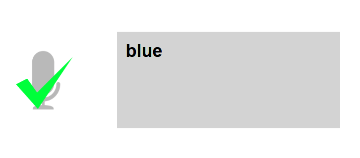
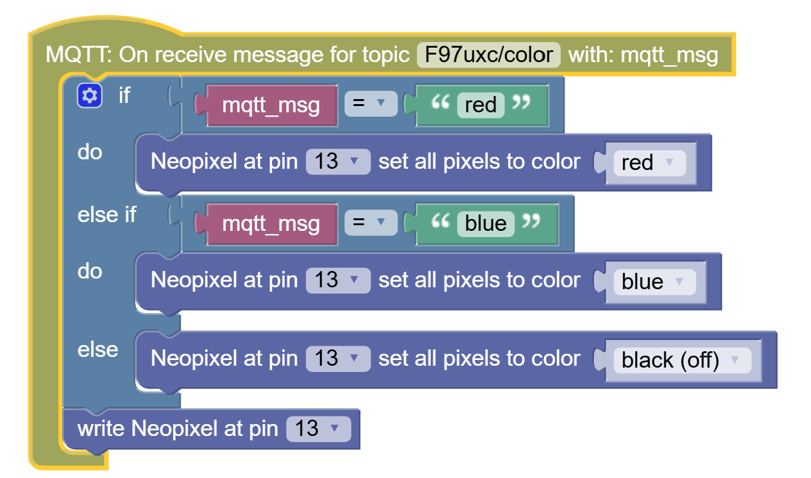
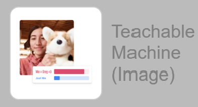
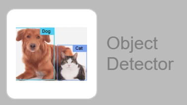
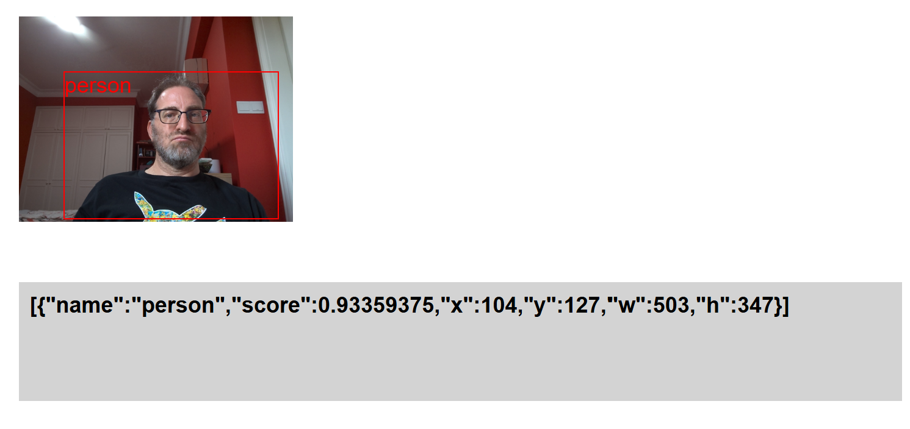
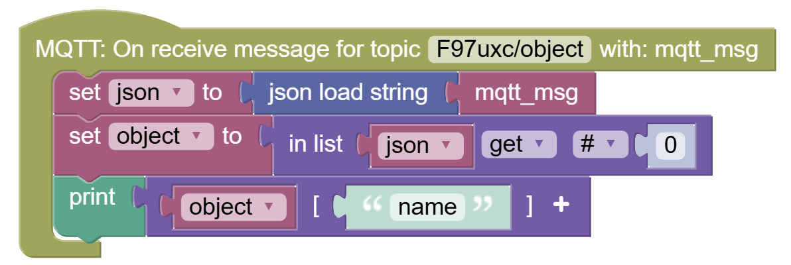
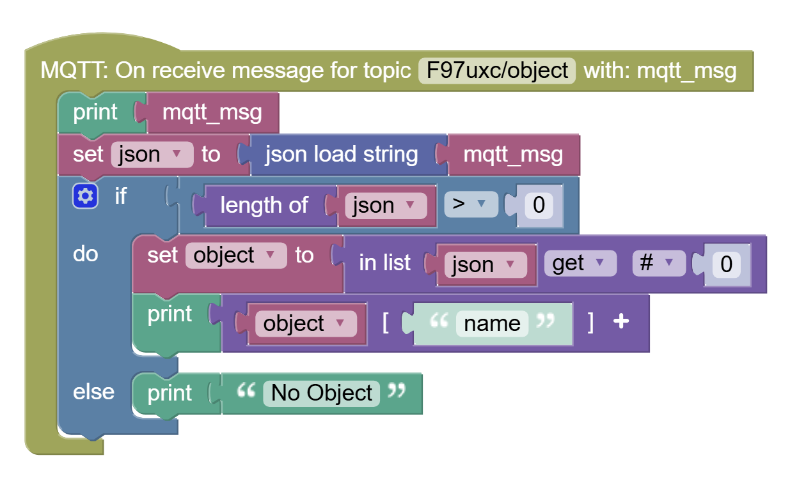
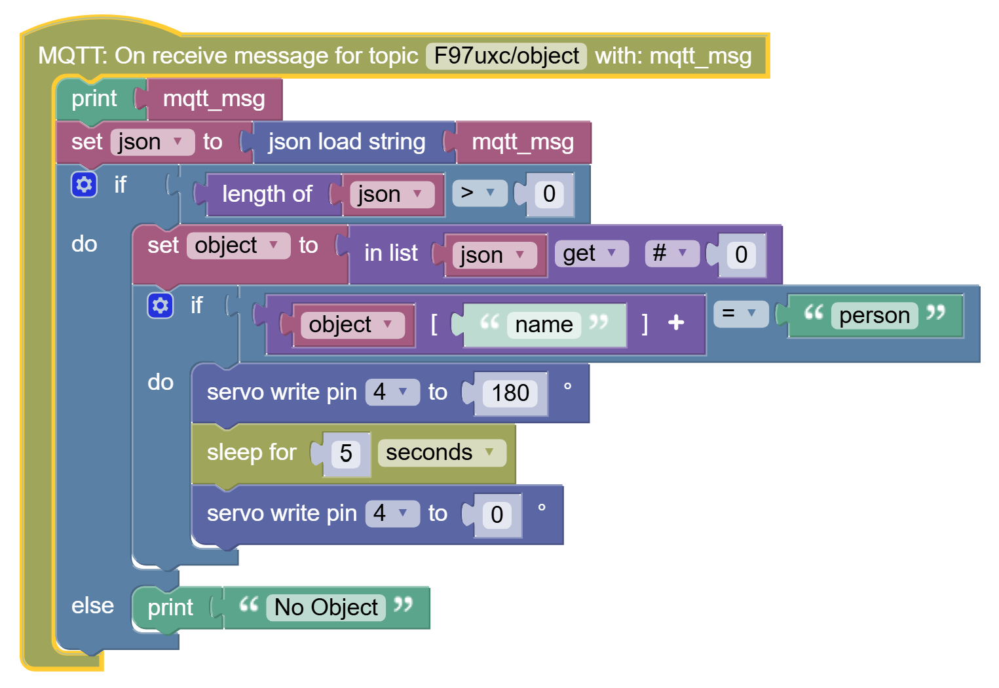

Final Projects
---

You have a choice:

1. Voice-Activated Color Lamp
2. Smart Gantry with Camera

In both cases the AI voice or vision things are happening on your PLD, laptop, or even phone.

You need to code the connection between the AI widget on the app and the ESP32, which will get the event trigger as a communication request, and convert it to an LED or Servo action.

IF YOU HAVE AN IDEA FOR A DIFFERENT KIND OF PROJECT DO LET US KNOW, WE CAN TRY TO PROVIDE THE MATERIALS IN TIME!

<h3>Voice-Activated Lamp</h3>

Review the LED Strips lesson, so you remember how to control the LED Strip from the ESP32.

For voice activation, you will need the Speech Widget in the app:

The Speech Widget's settings are quite simple.  By default you only need to define the topic:

Up to you if you wish to only allow certain words using the Word List options.

If you connect a Display Widget to the Speech Widget's topic you can easily test:

- Click on Speech widget (it should 'turn on')
- Speak
- See what it deciphered in the Display widget

If the Speech Widget did not understand you or if the word was not in the Word List (if you used that option), then you would see nothing happen.

Otherwise you should get a checkmark, and your speech appear in the Display Widget:

Now inside your ESP32 code, you should intercept the speech the same way we intercepted on/off from the LED button.

And based on whatever words are sent you can code the behavior, for instance:

<h4>Lamp</h4>

You can design your own lamp, or you can use the [provided parts](/21%20Automation%20with%20AI/20%20AI%20Integration/6%20LED%20Lamp%20Construction.md).  You can add a sillouette screen or just keep the led colors themselves as the attraction.

<h3>Smart Gantry</h3>

For this you will utilize the Teachable Machine or Object Detector widgets.

<h4>Object Detector Widget</h4>
Object Detector is programmed to recognize certain classes of objects like people, phones, chairs, various fruits and animals, and so forth.  The full list is here:

https://github.com/amikelive/coco-labels/blob/master/coco-labels-2014_2017.txt

You can use it to maybe make:
- Animal Crossing gantry (for something like the [Eco-Link@BKE](https://www.nparks.gov.sg/visit/parks/bukit-timah-nature-reserve/special-features/eco-link-bke): it would only allow monkeys, lizards, and other rodents, but not domesticated animals like cats and dogs.  Would be useful in Jurassic Park - no Velociraptors allowed.  Cute Dinosaurs ok!

- Specific-Use Carpark:  Only lets in cars, but not motorcycles or trucks

- More ideas: Human-Only Gantry, Phones Not Allowed Gantry (need to put phone away for it to open), and more

Once you decide what objects you are allowing you will need to connect the ESP32 to the gantry (see Servo unit for how Servos are controlled), and add a hook to listen to Object Detector events:

In order to read values from this string, you will need to do some work.  

In this example I am printing only the "name" from the string.  

That is the type of object: person, cell phone, chair, etc...

I created two variables:
- json
- object

The various decoding blocks can be found in:
- Data (json load string)
- Lists (in list...)
- Dictionaries (item \[key\])

The above sample code block assumes you have a single object in camera view, but the object detector may pass more objects.  

If you need to search the list of objects and need help with coding let us know.

Similarly, you would need to handle cases where the list is empty:

Integrating this with a Servo would look something like this:

Other ideas:

- Servo controls something that moves based on where you are on the screen - see x/y coordinates and w/h for width and height of the object bounding box)

<h4>Teachable Machine Widget</h4>
To use the Teachable Machine Widget, you will need to first create and upload to cloud a Teachable Machine model.  Then add the model into the TM Widget's settings.

You can use this to make:

- Gantry that only opens for you, no other faces
- Gantry that only opens for masked faces (remember COVID?)
- Gantry that only opens if you show it secret hand gesture?
- Anything else you can think of (have a picture of your pet - can open only for your pet)...
