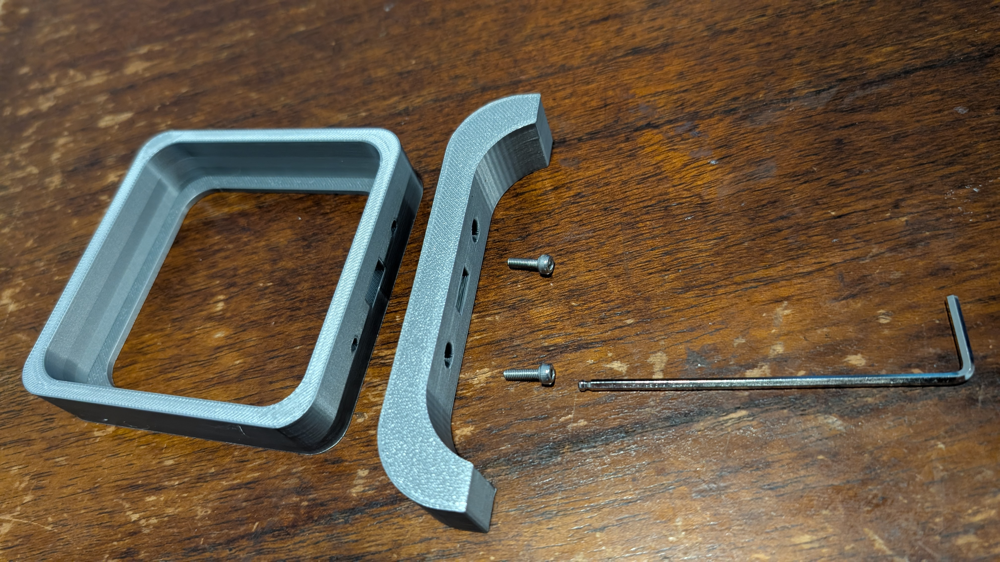
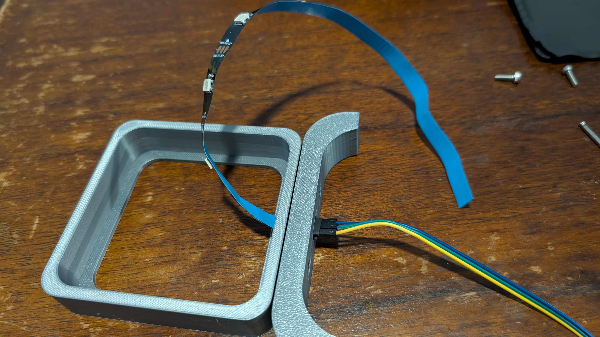
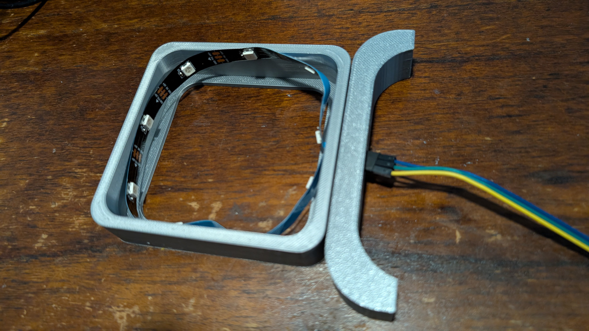
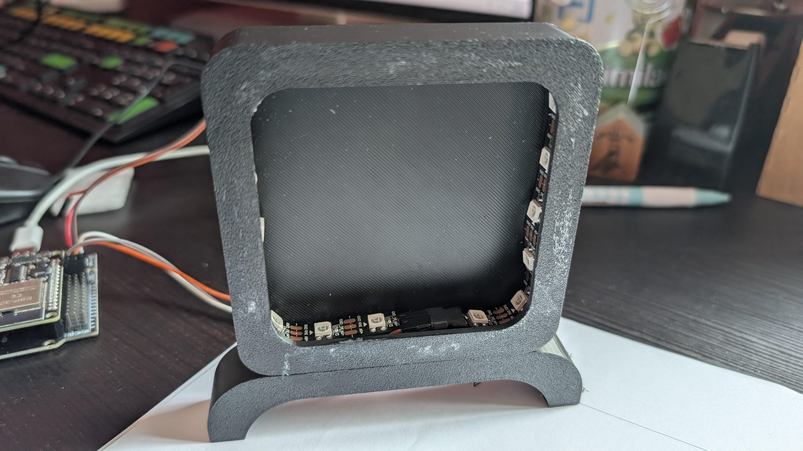

LED Lamp Construction
---

The LED lamp is a simple build with very few moving parts.

To 3D print the lamp parts, you can use [this onshape project](https://cad.onshape.com/documents/24fde9ee871d6931b7727d17/w/6eb9ca324ad8c5c268c704a6/e/275932345d6faaf717b52255?renderMode=0&uiState=6a9f8f20e3d2677dd5341525) and export the 3 parts.

You will need 2 M3 screws, 4mm in length minimum.

<h3>1. Combine Base and Lamp Shade</h3>

Align the base and shade (hollow square) so the holes match up.  

Find the two provided screws and use an allen wrench with the screws entering from the bottom of the lamp base.

Screw in until some tightness but don't overtighten or the screws will end up wearing down the lamp's 3D print filament.

<h3>2. Insert LED Strip</h3>

Insert the LED Strip through the wide rectangular hole such that the LEDs are inside the lamp shade, and the wiring ends are streaming out - eventually we will connect these to the ESP32 for control.

<h3>3. Tape LED Strip</h3>

The blue material on the back of the LED Strip is a covering for sticky tape.

Remove the blue material and carefuly and tightly tape the LED Strip around the shade.

Removing the tape cover can be tricky and may require patience and perseverence.

Try to be thoughtful in covering the corners where the LED strip must bend.

THAT's IT!

You're ready to connect and control the LED Strip.