Gantry Construction
---

This project requires relatively a lot of construction steps and many small parts that can be damaged or lost.  Please be careful, work on a wide area of the table, and keep the parts neat.

You can 3D print the parts from [this onshape project](https://cad.onshape.com/documents/03db0d88b151f728c43cded5/w/1c832fa568602e61f1c236a7/e/bb37f39192853878a41e2325?renderMode=0&uiState=6a9f9c509a7b14f8f430e16c) or from the original [Thingiverse project page](https://www.thingiverse.com/thing:2451583) - we thank the original designer, Vlastimil Hovan, for sharing their Bendy Arm Barrier work under common attribution license.

<h3>Setup</h3>
You shoud get a pack of 3D printed bits with a but and bolt, and a servo pack with 2 screws and a bolt, as well as 3 servo horns.

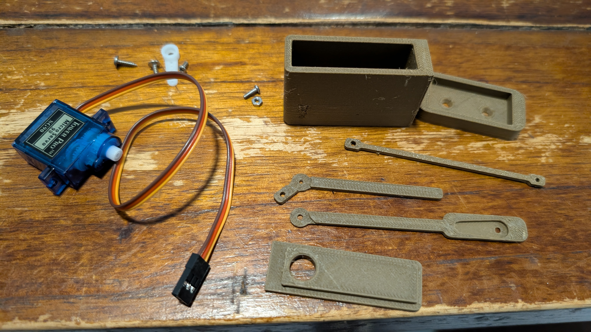

These 2 can be discarded:
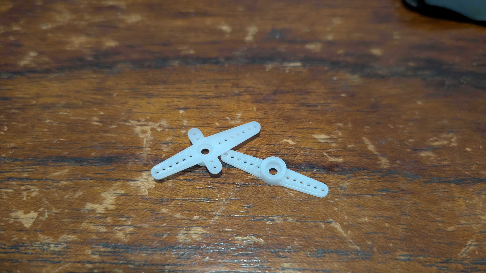

For reference, we will be calling the various small parts as follows in the instruction:

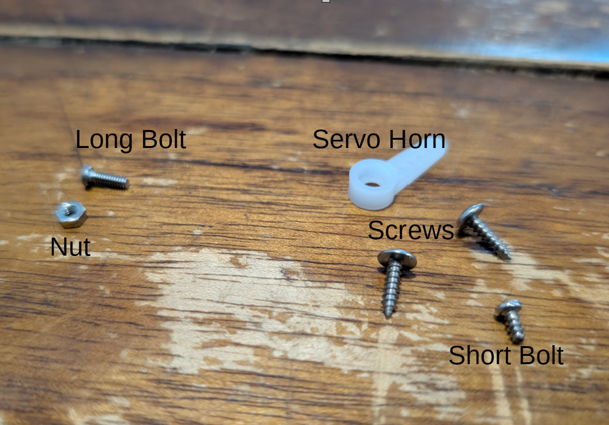

<h3>1. Assemble Gantry Housing</h3>

Take the servo and insert business end first aligned with the matching hole into the gatry housing:

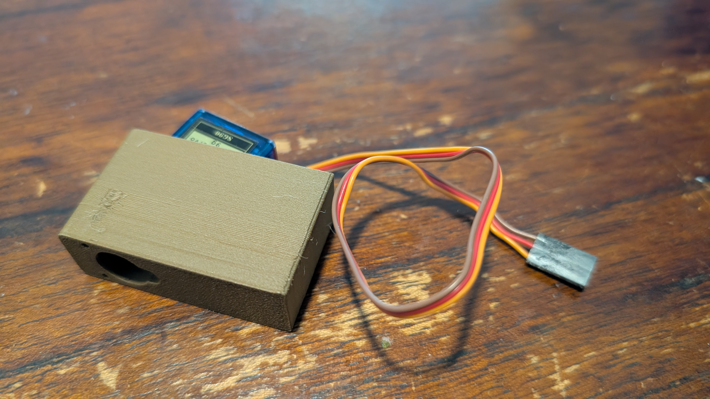

The servo business end should be poking out:

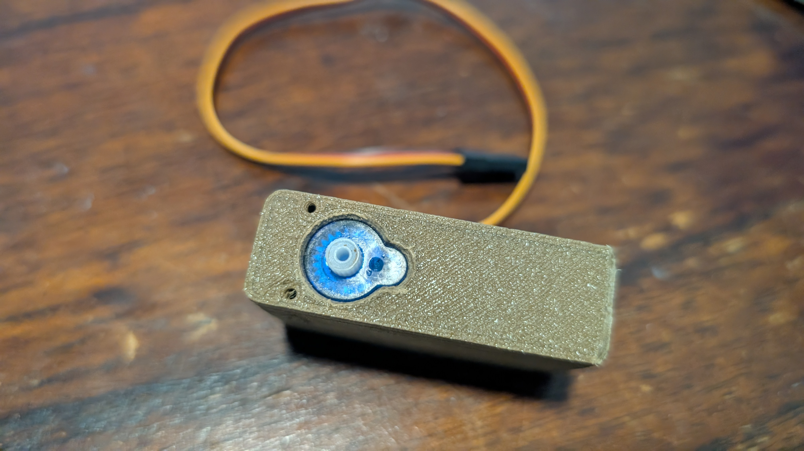

Next wind the servo wiring through the housing cover:

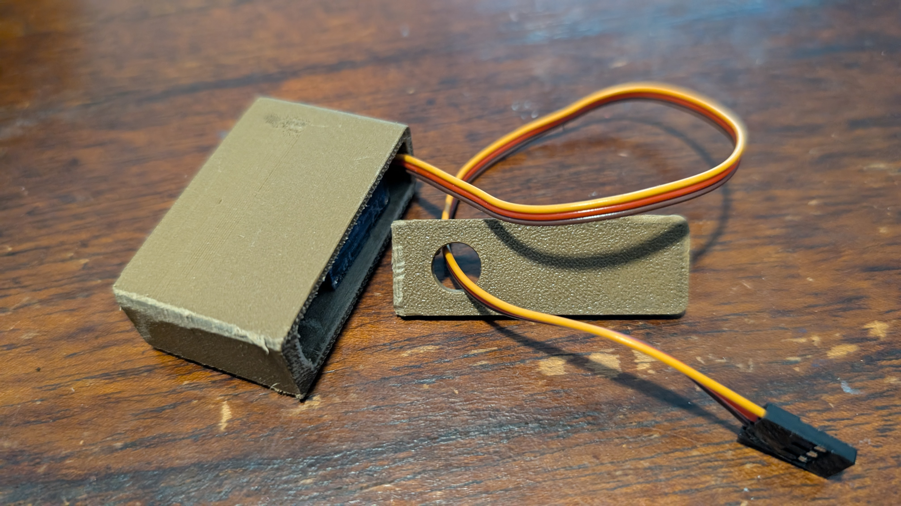

And cover the housing.  

NOTE: the wire should be coming out the opposite end of the housing from the servo head sticking out...

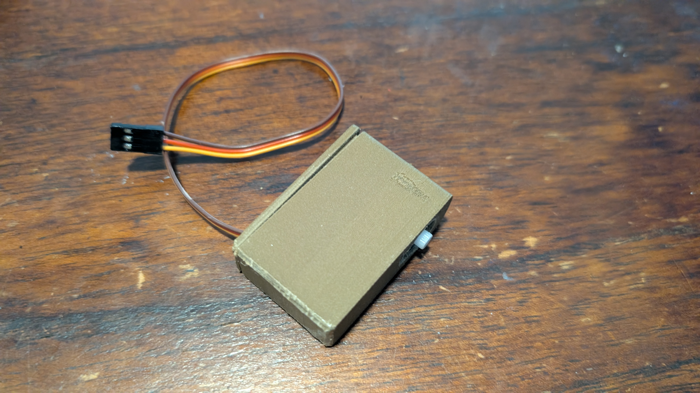

Find the house holder/base:

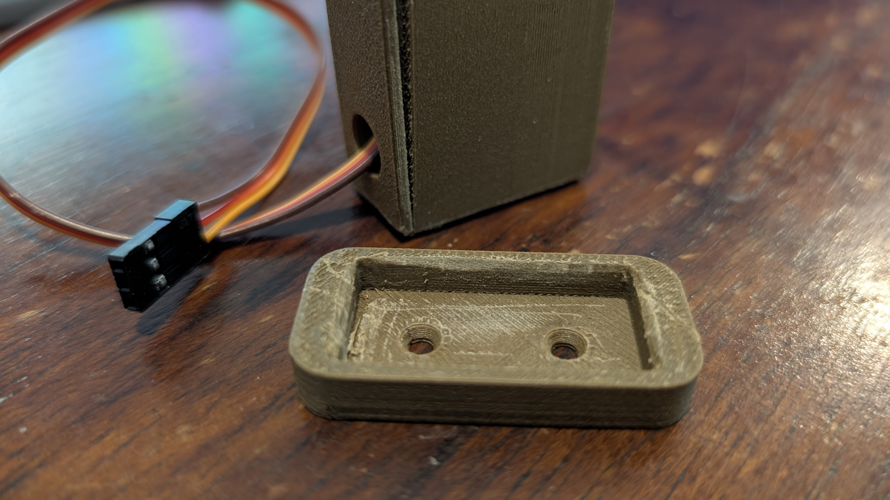

THen fit the housing into the base:

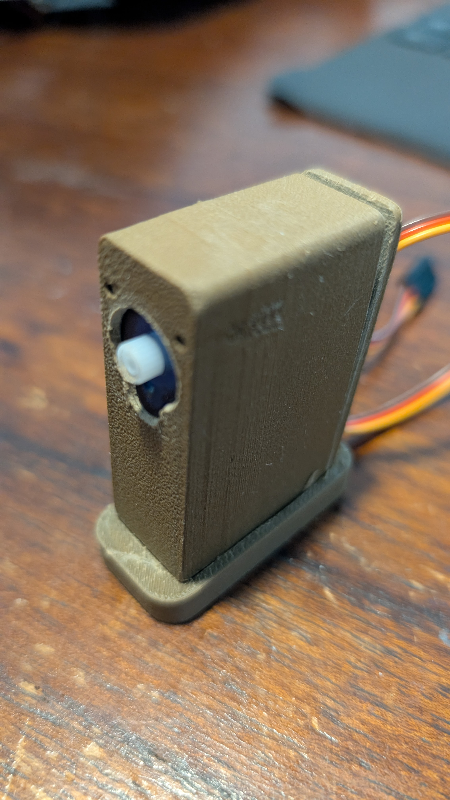

<h2>2. Adjust Servo to 90 Degrees</h2>

Connect the servo to the controller as we will need to adjust the servo position for this next part:

Use the code we learned from [Servo reference](/21%20Automation%20with%20AI/15%20Connecting%20Simple%20Electronics/2%20Servo%20Motor.md) to set the Servo to **90 degrees**.

Once AND ONLY ONCE you are sure the servo gear is aligned to **90 degrees** attach the servo horn as shown here:

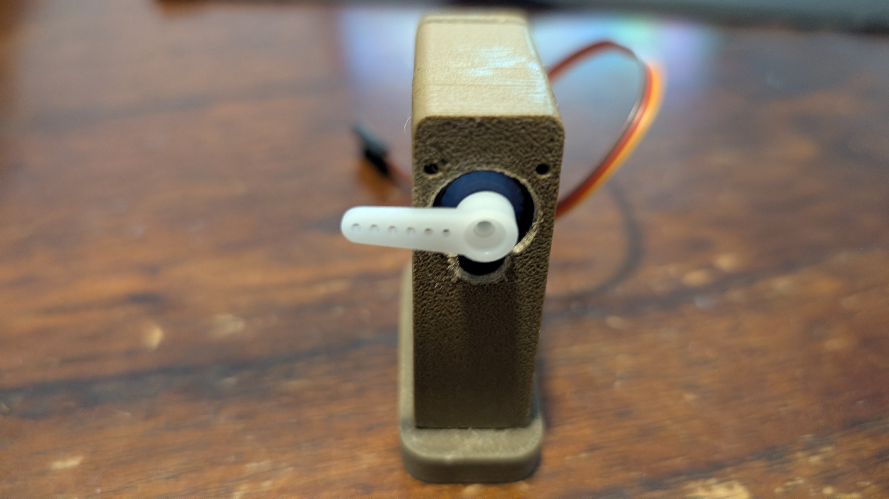

It needs to be sticking out to the left at about perpendicular to the ground.

Failure to calibrate the servo before this step will be detrimental...

<h3>3. Attach Gantry Fence</h3>

Find the large gantry piece with the indentation and fit it over the servo horn:

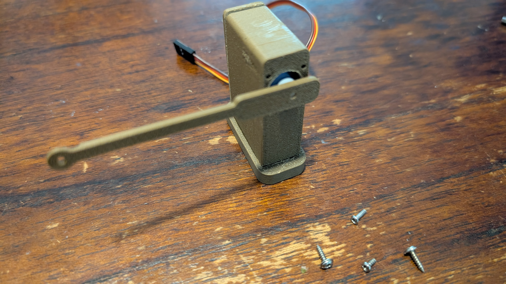

Use the **small bolt** to affix the gate piece onto the servo horn.  Don't overtighten.  This can be challenging because the parts are small and may require a lot of force to tighten just right.

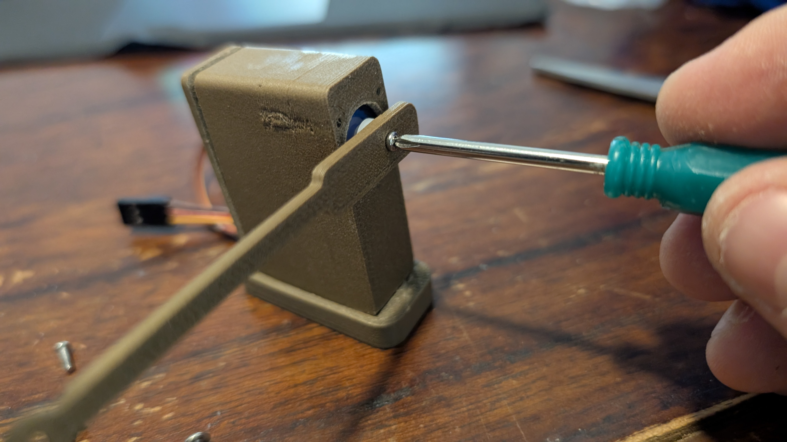

Use one of the screws to affix the gantry support piece to the right end hole in the housing.

Again, do not overtighten, as this piece needs to be able to rotate:

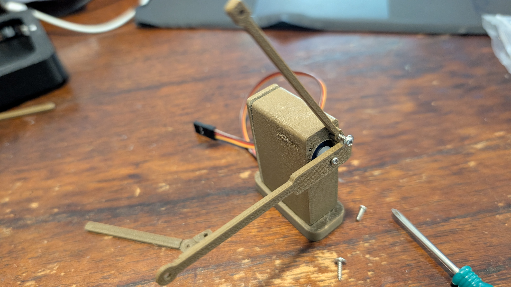

Use the other screw to affix the final piece, the junction, to the other side of the gantry support:

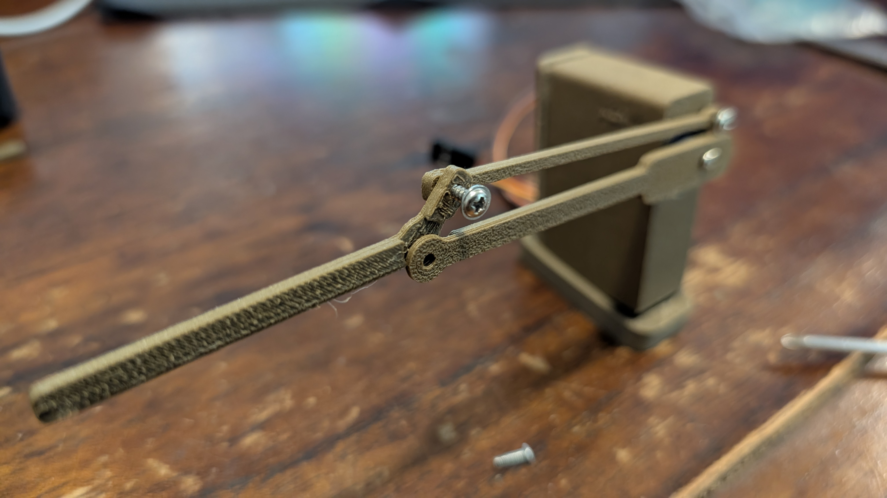

Finally, we will use the long bolt and the nut to secure the junction piece to the gantry gate piece:

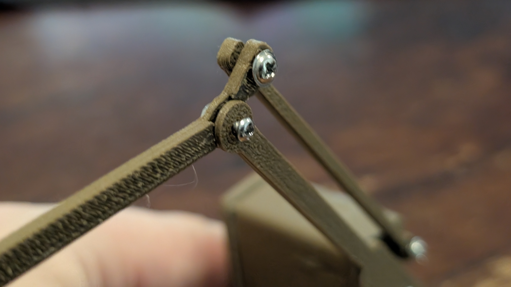
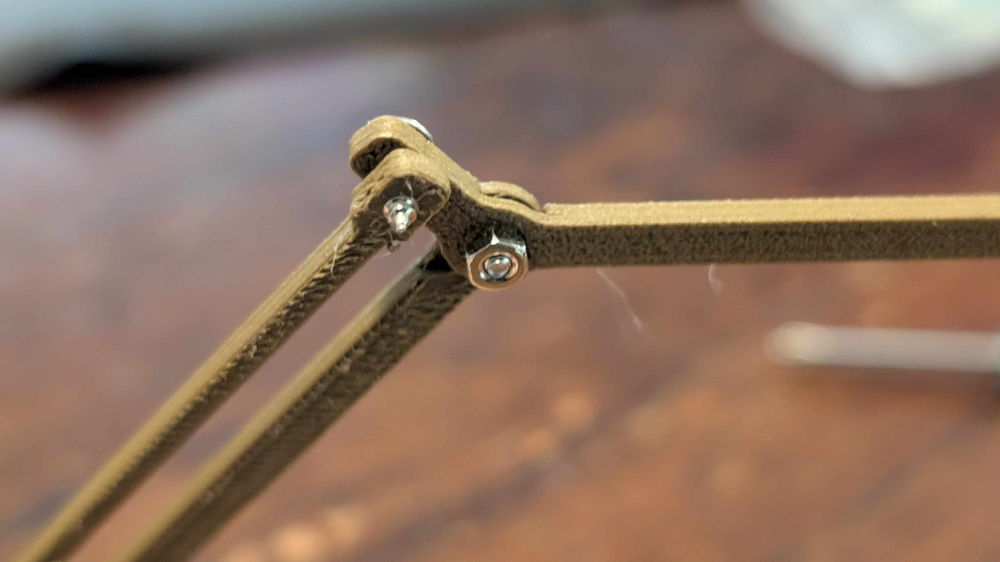

Thats it.  You can now test the gantry and add controls:

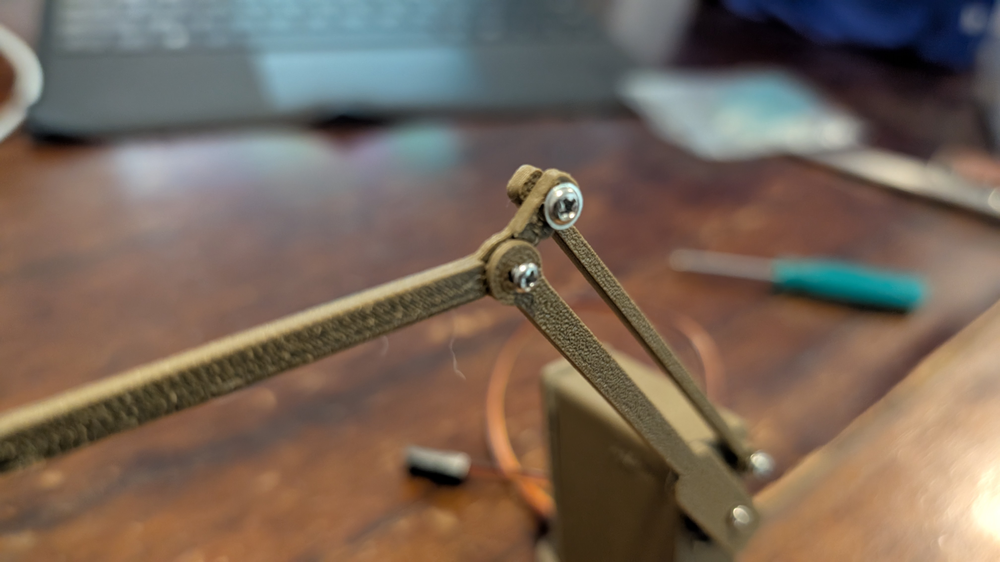
