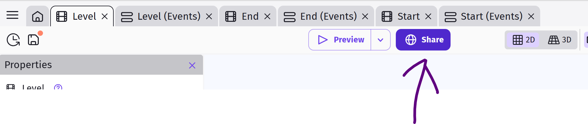
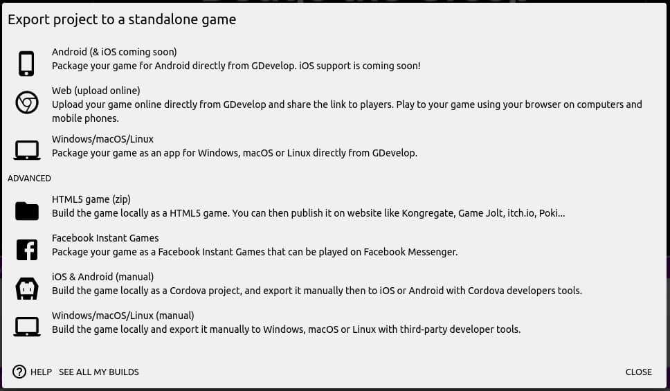

# Sharing the Game

Now that we are done with the game, we can publish it into a standalone application.

Start by clicking the **Share button** next to Preview.

Next, select the platform that you want to export the game to.

**gd.games** This uploads your game to the GDevelop server/cloud.
You can then share the link with anyone, and they'll be able to play the game on their web-browser.

**Browser** This creates a zip package containing all the files for the game.
You'll need to upload these file to a web server to play the game.
If you do not have your own webserver, there are a number of services which will host your game for free (...such as itch.io).

**Desktop** This creates an application package that you can download and install on your computer.

**Android** This creates an Android application that you can install directly on your phone or submit to the Google Play store for listing.
If you wish to install the game directly on your phone, you'll need to enable installation from "Unknown sources".
To submit to the Google Play store, you'll need to register (...and pay) for a developer account.

**iOS and Others** These are advanced options, good for experienced developers who need more control.
We won't be covering them here, but you can read the GDevelop documentations for more details.