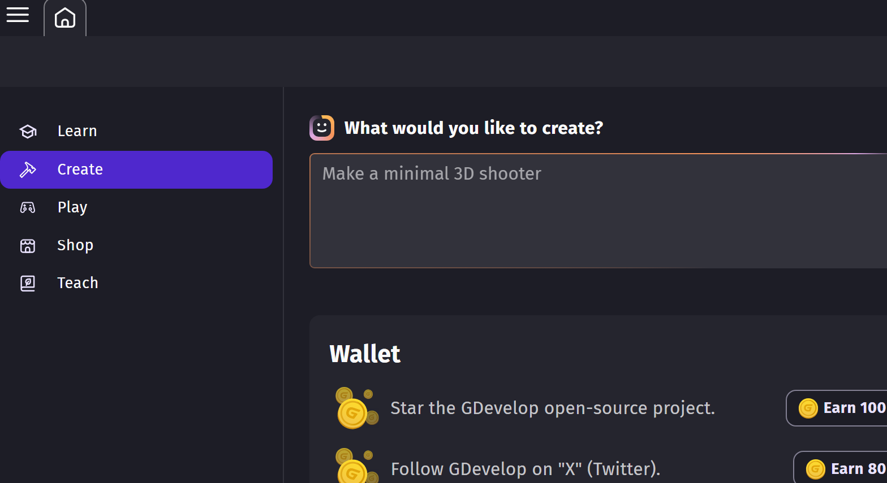
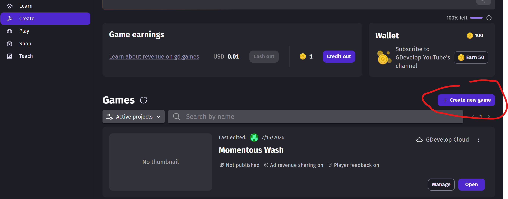
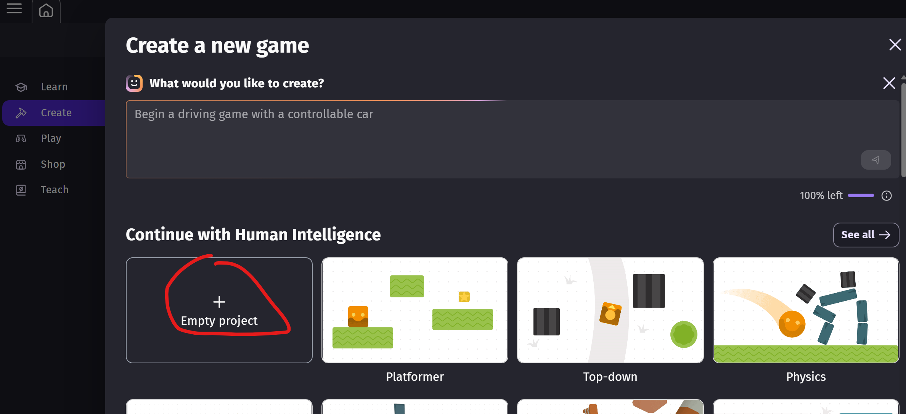
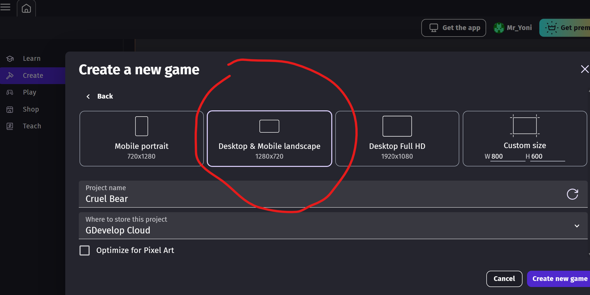
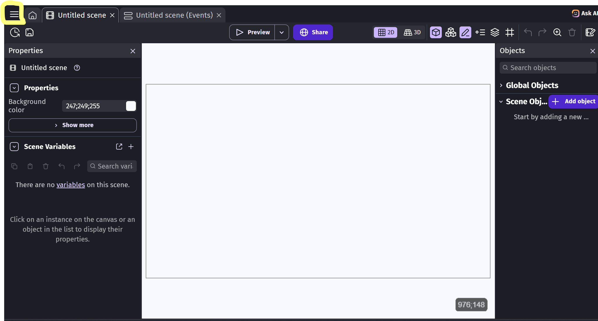
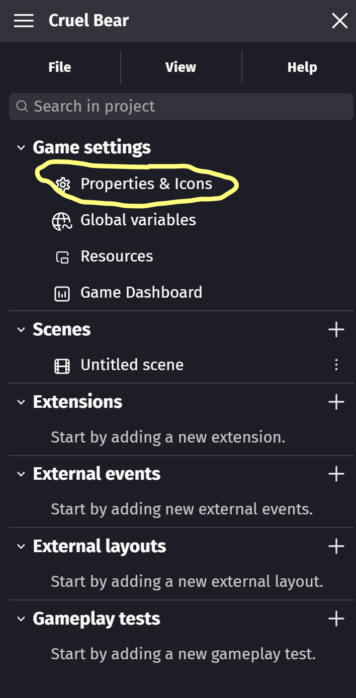
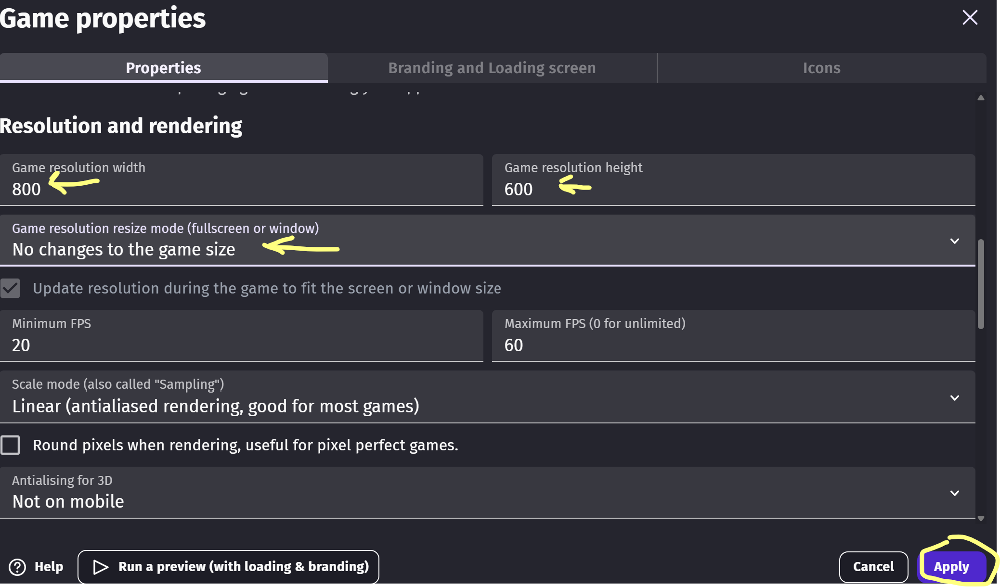
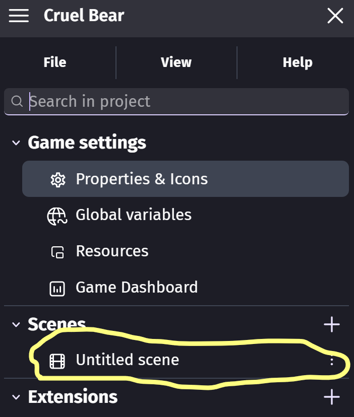
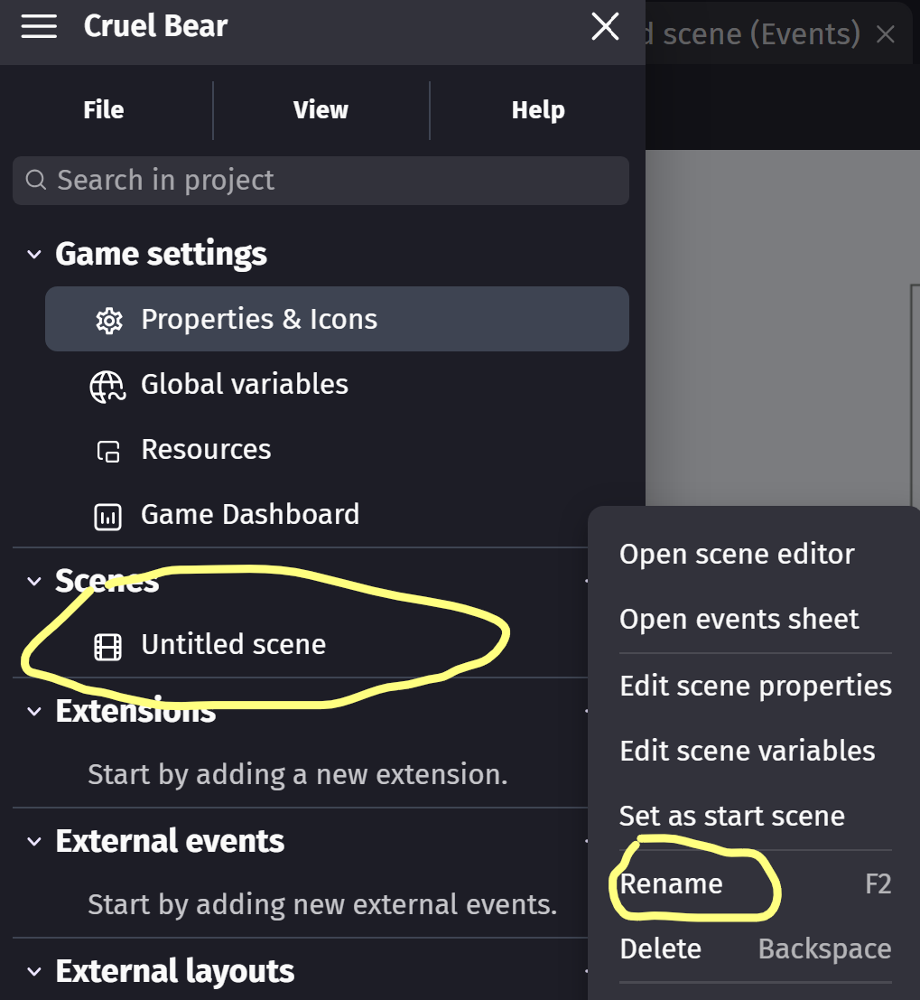
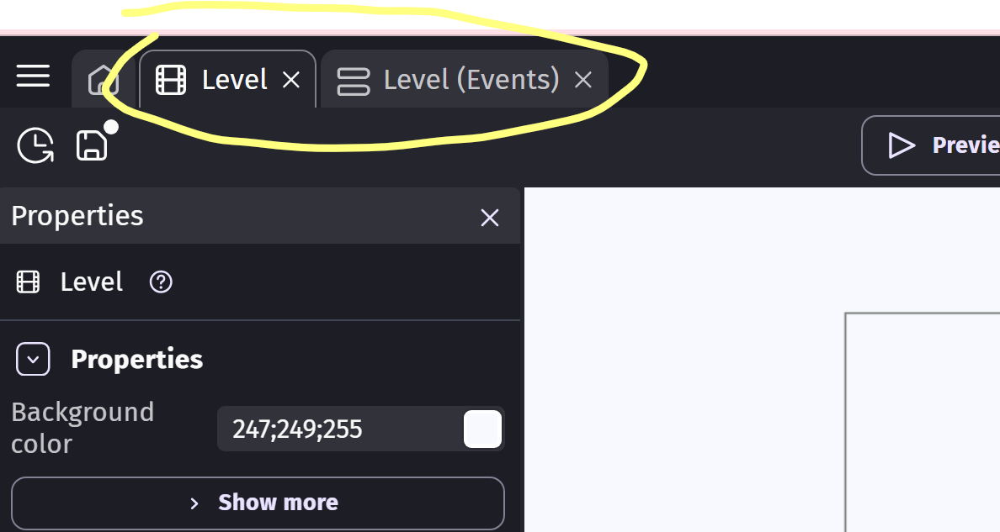

# Getting Started

Go ahead and open up GDevelop. If you're using the web-based editor, use this link https://editor.gdevelop.io/.

<h3>Sign Up or Sign In</h3>

Please create a free account or use one of the classroom accounts we have provided.  You will eventually need to confirm your email so make sure the email you provide is reachable on your device.

<h3>Create</h3>

Once you've logged into GDevelop, you can navigate to the **Create** tab - see menu on left hand:

Click on **CREATE A NEW PROJECT**...

Select **Empty Project**...

Give your project a name, and select Desktop/Landscape - we find this to be the most common size and orientation we work with.

You now have a completely empty project. 
Click on the **Project Menu** burger icon...

We'll need to set a property for the game.

Click **Properties & Icons** under **Game settings** menu...

...and set the **Width: 800** and the **Height: 600**, and change **Game resolution resize mode** to **No changes to the game size**.
This ensures that the game window remains the same size regardless of your actual screen size.

Don't forget to click **Apply**! 

One last thing we can do on the game manager menu is to rename the new untitled scene it starts out with.

Click the 3 dots on the right of the Untitled Scene in the Game Menu.  

Then *rename* it to something like **"Level"**.

Last thing **click** on **Level** scene to open the relevant game design and game events tabs.  You can click away from the menu to close it and make sure the tabs are there:

