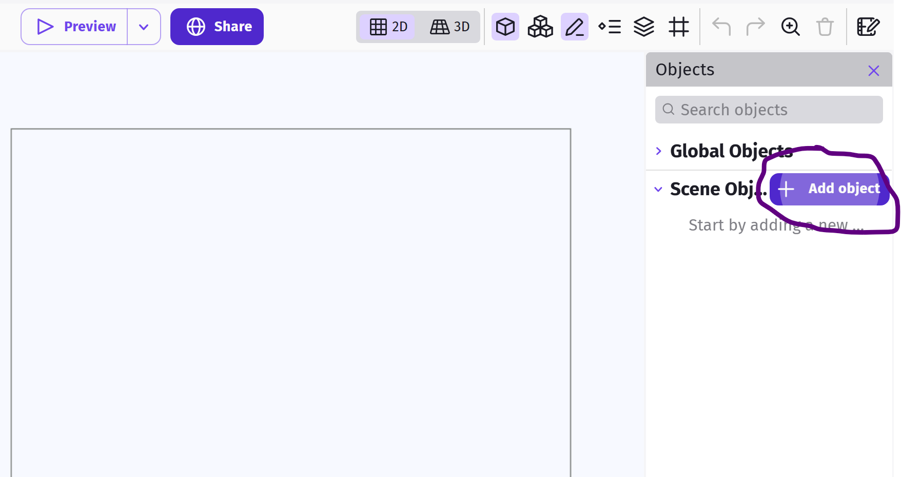
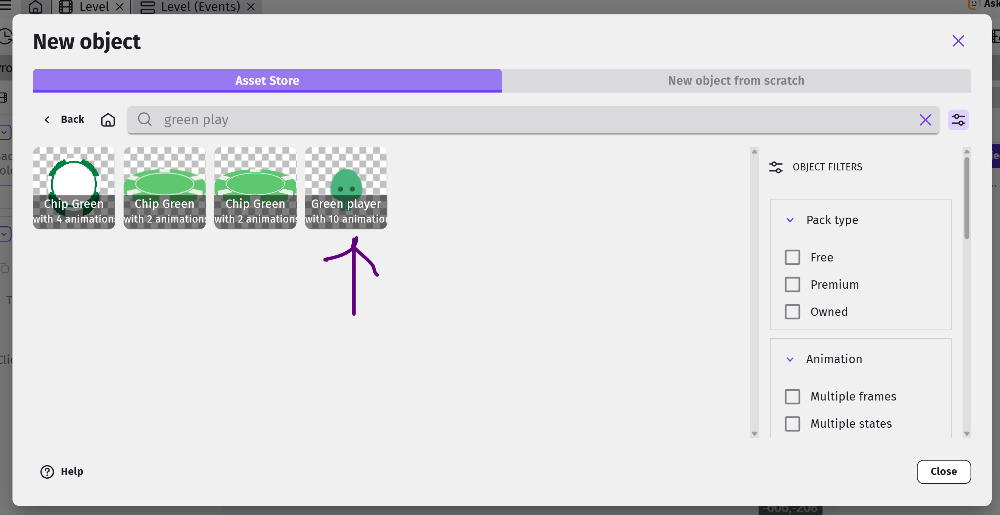
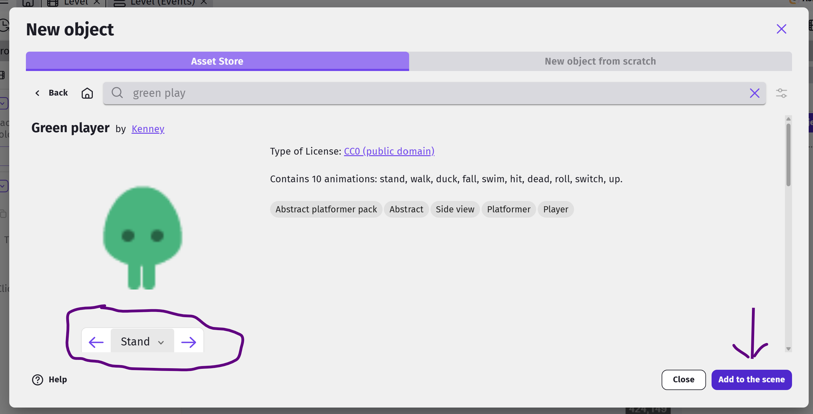
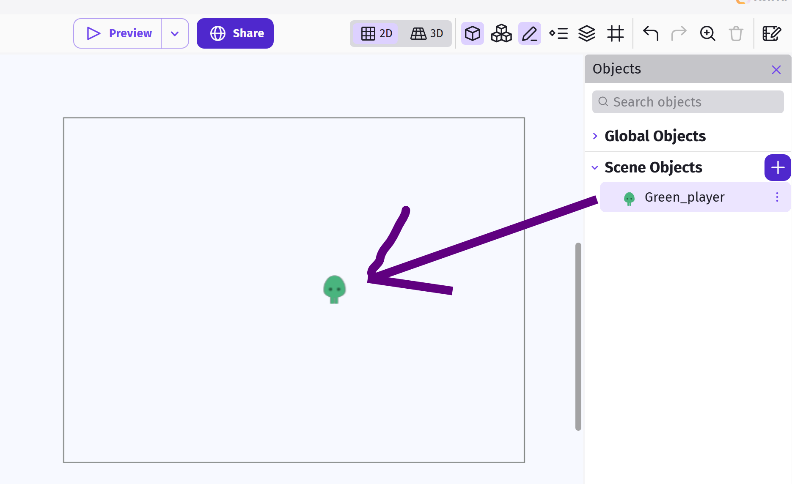
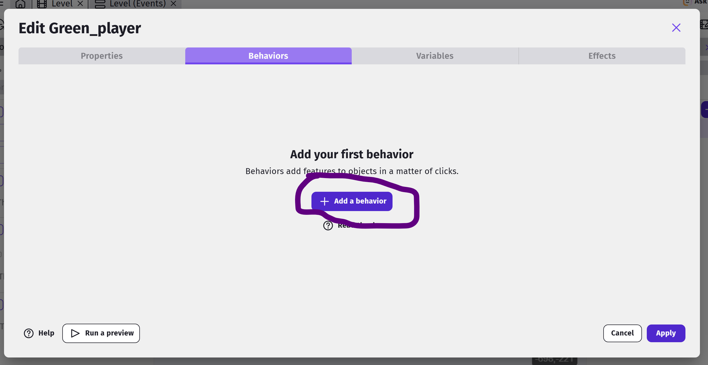
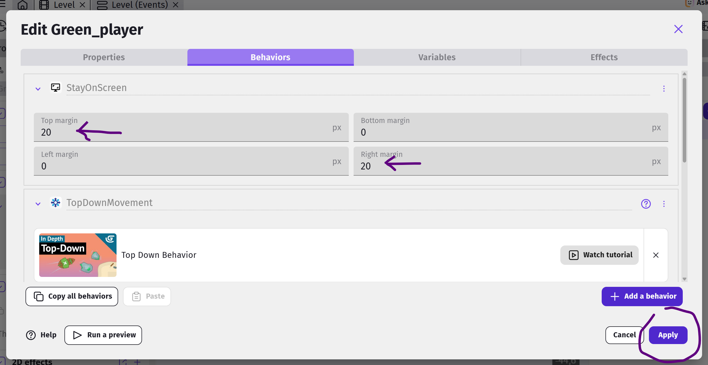
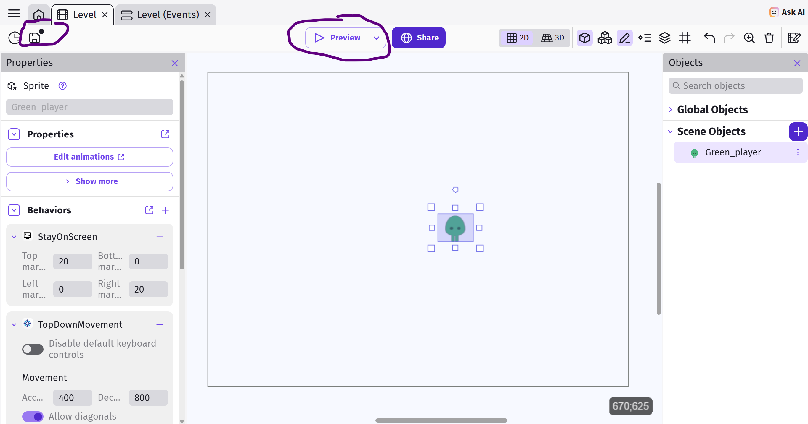

# First Object

Mke sure you are in the Scene Editor tab (not Events).  Click on **Add new object**.

You will see a pop-up.  Stay on the Asset Store tab, then from the asset store search for the **Green Player**.

If you can't find the **Green Player** object, make sure **All assets** is selected, then type in "green player" into the search bar.

Once you find it, click on the **Green Player**, you can scroll through its animations.  Then click the **Add to the Scene** button.

**Important** There's nothing special about the Green Player object.
I like it as it has a lot of useful animations that I can make use of and I like the color green.
If you prefer a different character or have a different favorite color (heathen!), feel free to choose whatever you want.

Once done, you can close the **Add new object** window.

## Creating an Instance

Now you have your first object, but notice that it's not in the game scene yet.
To add the object to your scene, drag it from the objects panel to the scene.
We call this **creating an Instance**.

Each object can have many instances, and every instance can have a different set of properties (eg. position, size, angle).

## Adding Behaviors

One powerful feature of GDevelop, is the ability to easily add **Behaviors** to an object, enhancing it with useful features.
Many of the features used in games are already available as behaviors, allowing us to save a lot of coding.

To start, double click on the player object, switch to the **Behaviors** tab, and click **Add a Behavior to the object**.

We'll be adding two behaviors...

* Top-down movement
* Stay on Screen

The **Top-down movement** behavior is installed by default, so you can just click to add it.
This behavior allows us to move the player using the arrow keys, and after adding it, you can tune the parameters (eg. speed and acceleration).
For now, just make sure the **Rotate object** option is disabled, and leave the rest of the settings alone (...or mess around with it. Experimentation is cool.).

The **Stay on Scene** behavior will prevent your player from leaving the screen and is also installed by default.  Search for it and add it like you added the previous behavior.

Set the **bottom margin** and **right margin** to **20**.

Click **Apply** to complete the behavior changes in Green Player.

## Save & Preview

Let's take a moment to preview our scene - there's not much there yet, but it's good to constantly test your progress and make sure you're not foregtting anything.

It's also a good time to click **Save** - you should be doing this often when using the webApp version of GDevelop.  A red dot over the Save button and a banner on the bottom will remind you you have unsaved changes.

Click on the **Preview Button** and follow any instructions to bring up the Preview window/tab.

You should be able to move the player around if you have a keyboard, by using the arrow keys.