# Character Control

The **Top-down movement** behavior allows you to control the player using the arrow keys on the keyboard, so go ahead and test that in Preview.

If you're using a tablet and require touchscreen control, you can see the extra information at the end of this page on adding touchscreen control buttons.

So, the character can move around, but it doesn't look very lively.  We will need to add some animation to the player, but before we do that, let's consider the low-coding paradign in GDevelop - **Events**.

In GDevelop, events define the logic of a game.
If you have experience with Scratch, you would have used events before.

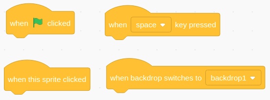

*Events in Scratch*

Each event in GDevelop, consists of **conditions** and **actions**.
**Conditions** define when the event will trigger and also select which object are affected by the action, while the **actions** define what happens when the event triggers.

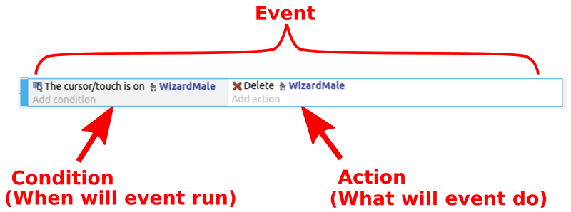

If no conditions are defined, the associated actions will run every frame of the game (usually 60 times per second).

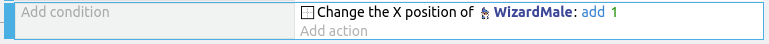

*Events with no conditions will run every frame*

Events may have multiple conditions and actions.
All the conditions must be true for the event to run.

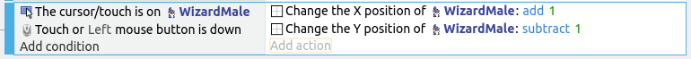

## First Event

Switch to the events tab...

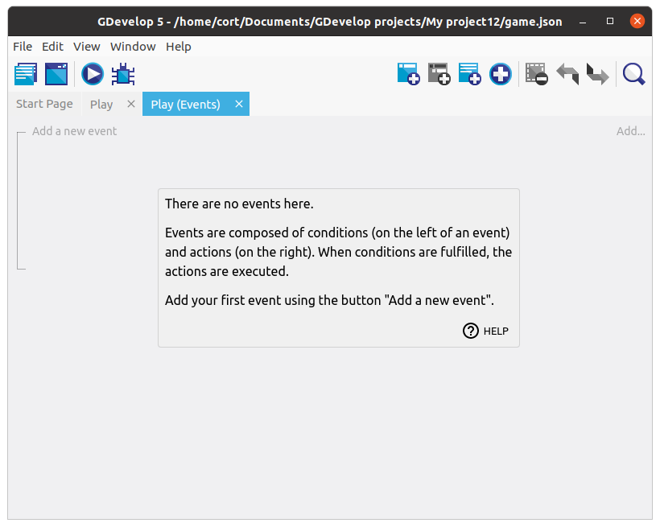

Then click on the **Add new empty event** button. You should now have a new event with empty conditions and actions.

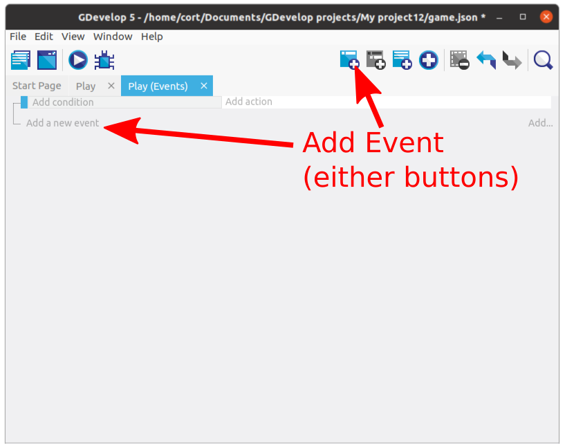

Let's use events to control the animation of our character!

Move to next lesson, Animation, if you don't need Touchscreen Controls.

 
 
 

## (Optional) Touchscreen Control Buttons

ONLY do this scection if you want touchscreen controls.

Add a new object and select an up arrow. You can use whichever one you prefer.

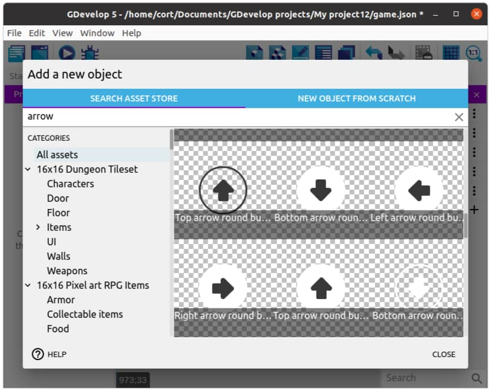

Continue adding arrows until you have one in each direction.

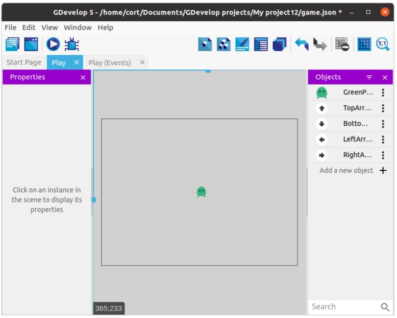

Drag one instance of each arrow into the scene, and for each arrow...

1. Change the size to something appropriate (...if required).
2. Position it like in the following image.

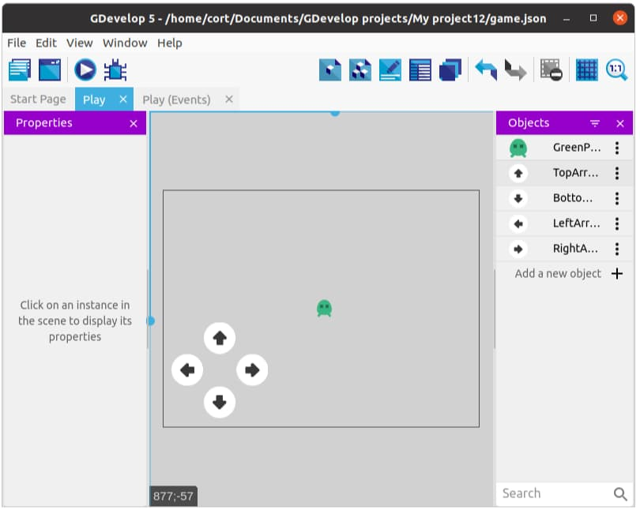

Add events to simulate default control:

Click on **Add condition**, click **Other conditions**, and select the **Mouse button pressed or touch held** condition.

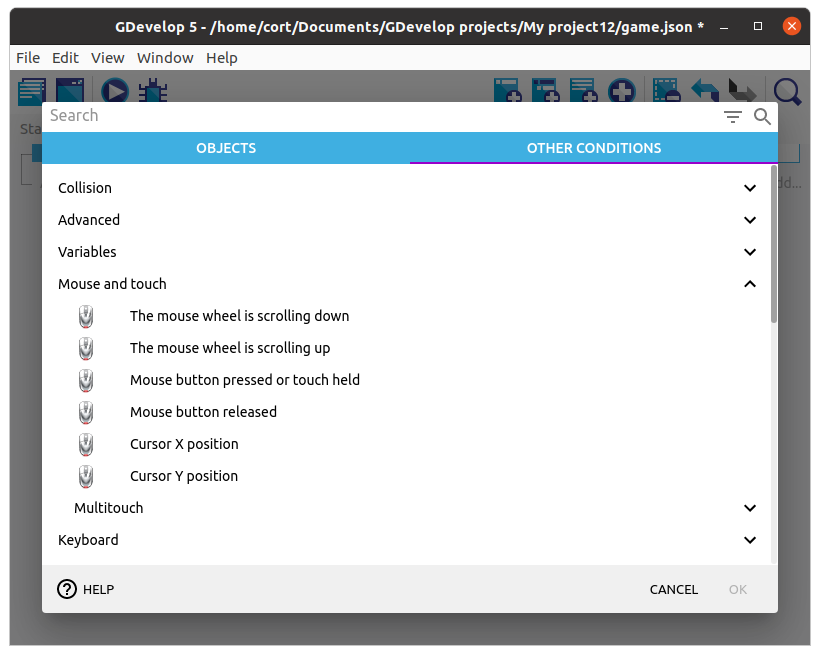

Under **Button to check** select the **Left (primary)** button, then click **Ok**.

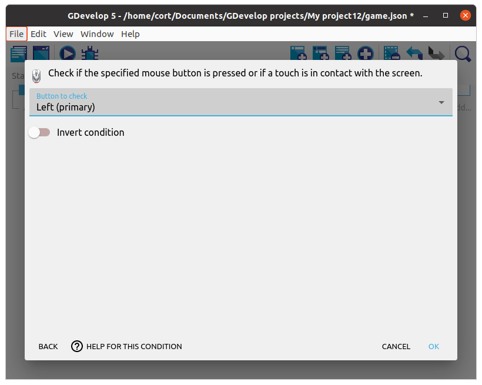

Your events tab should now look like this...

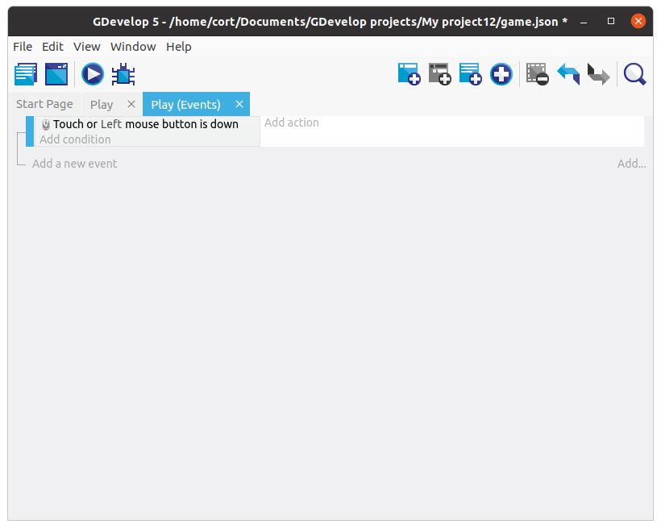

## Sub Events

That first event will detect when you touch the screen, but it can't tell which button was touched.
To do that, we'll add a sub-event under it to detect the buttons.
Sub-events are only considered when their parent event are true.

Select the first created event, and click the **Add sub-event to the selected event** button.

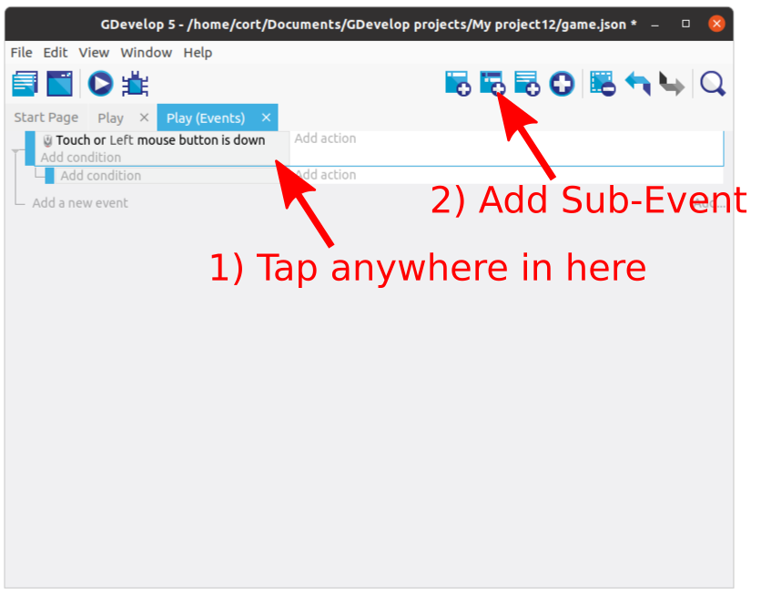

If you created an event wrongly (eg. you created an event when you wanted a sub-event), you can simply drag it into place.
Move an event by dragging the blue bar on the left side of the event.

Make sure that the subevent is under the mouse button event.
If it is not, just drag it into place.

Next, click on the condition for the sub-event, select the **Up** arrow, then select **cursor/touch is on an object** condition.
Click **Ok**.

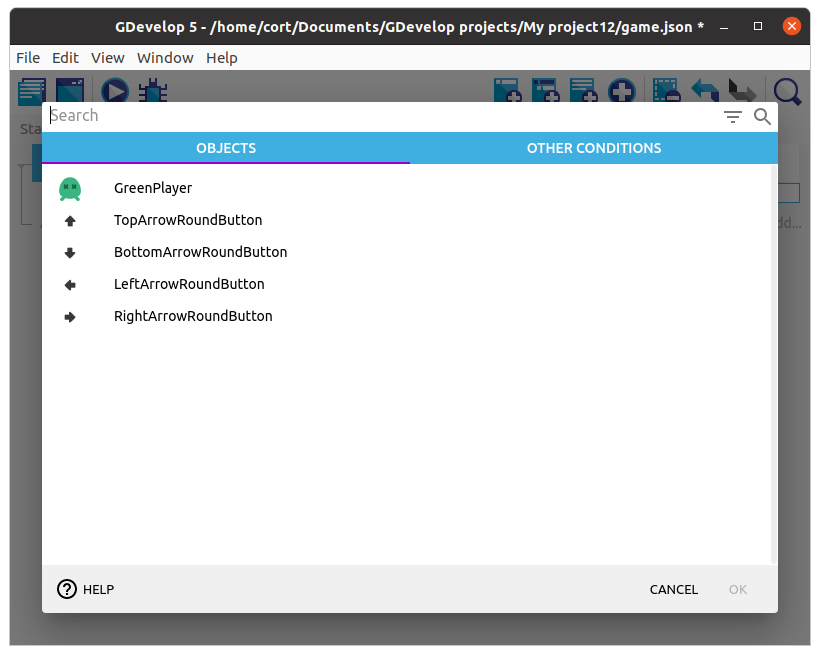

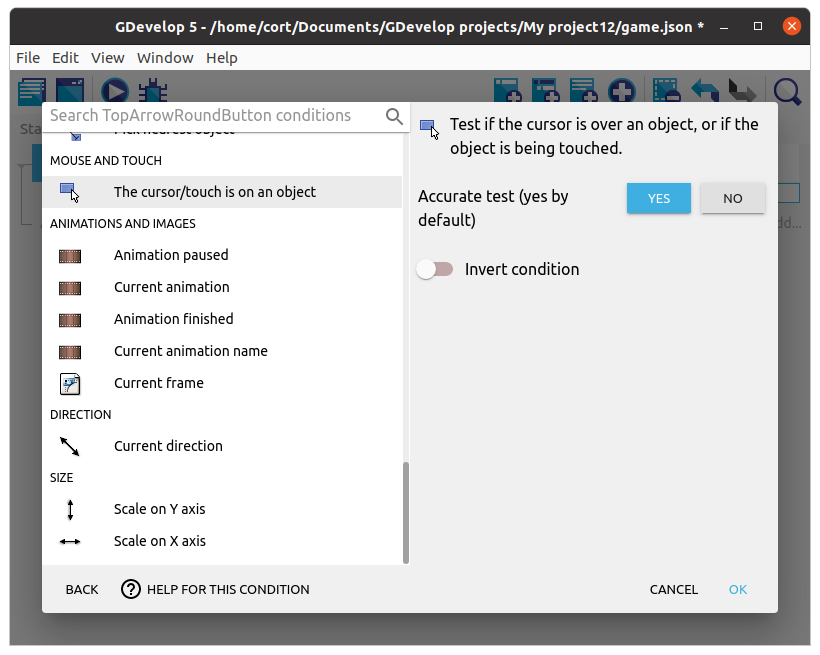

## Action

Now we'll add an action for the sub-event.
When the **Up** arrow is pressed, we want it to simulate an **up** keypress.

Under the sub-event, click **Add action**, select the player, then select the **Simulate up key press** action.
Click **Ok**.

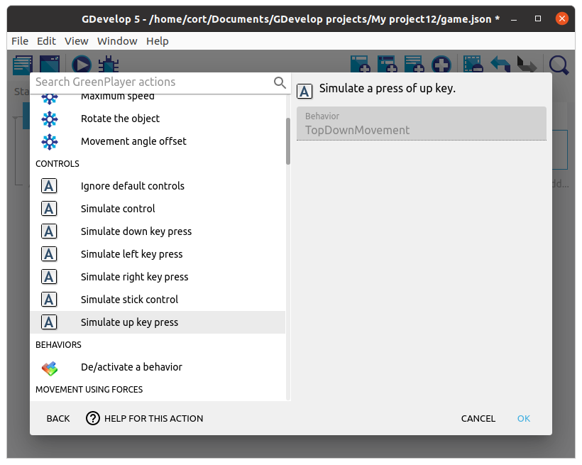

Your events tab should now look like this...

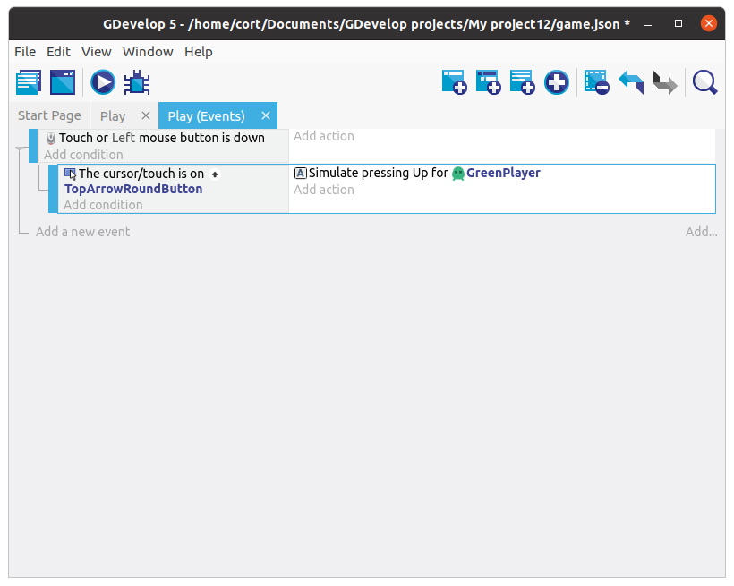

## Add the rest

Repeat the steps, adding a sub-event for each direction.
When you're done, your events tab should look like this...

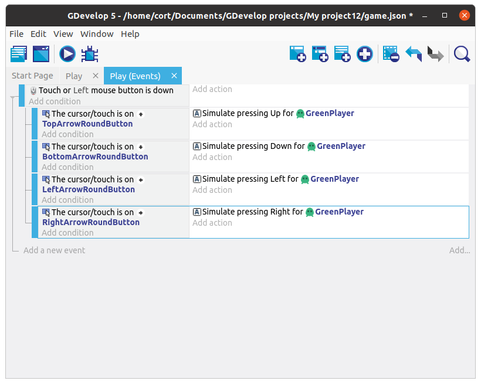

## Preview the Scene

At this point, you can preview the scene by clicking the **Preview** button.

Test the controls and make sure that your player character is moving correctly.

