# Animation

The player character we've selected comes with 10 animations, but currently, we are only seeing the first **Stand** animation (...which only has a single image, so it's not actually animating at all).

To add swimming animation, we'll need to add a new **Change animation** action, but first, let's check out what animations we have available.

Double click the player to open its object window. In the Properties tab you should see a list of 10 animations.

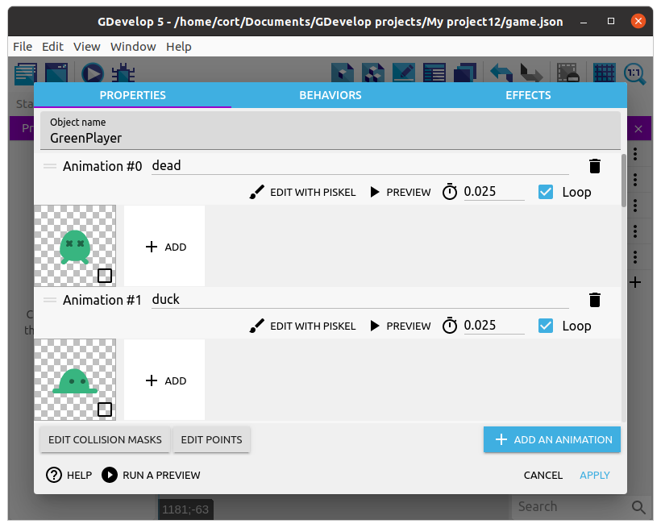

You can preview the animation using the **Preview** buttons associated with each. 

Try it now with **#$ Swim** animation.

If it looks like it's too fast (...it shoud), change the FPS until it looks right.
I think an FPS of 10 looks good, but it's your game, so you decide.

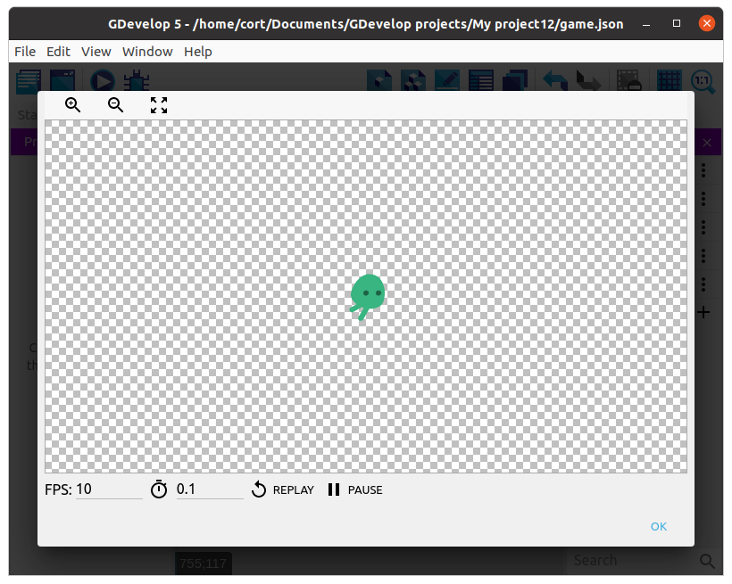

I'll be using the **#4 swim** animation for left and right movement, the **#9 up** animation for up, and the **#3 fall** animation for down.

Make sure the animation FPS is ok for all of these.

## Change Animation

Now we'll need to change the animation depending on which direction the player is moving towards.  We will need to define both the Condition (click a button) and the Action (which animation to activate) for the change animation event.

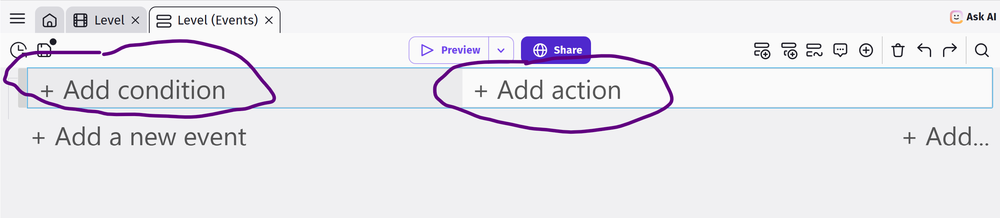

### Condition

In our new event, click on your Player object, and add the condition **Control pressed or simulated ("Up")** to a new event.

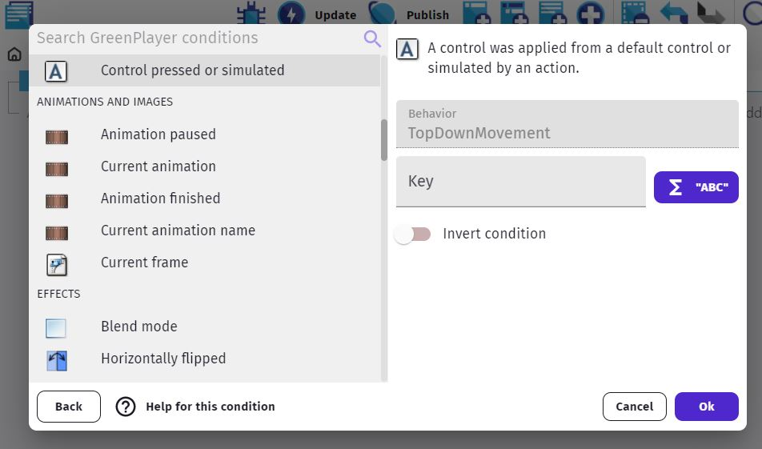

NOTE: If you don't see that condition, make sure to add the correct **Behavior** to your object as previously mentioned. 

### Action
And now the action should be to change the animation to the correct one ("up").

Click on the **Add action** under **Simulate pressing Up**.
Select the player, then choose the **Change the animation (by name)** action.
Under **Animation name** type in **"up"** (...including the double quotes and make sure it's in the correct case).
Click **Ok**

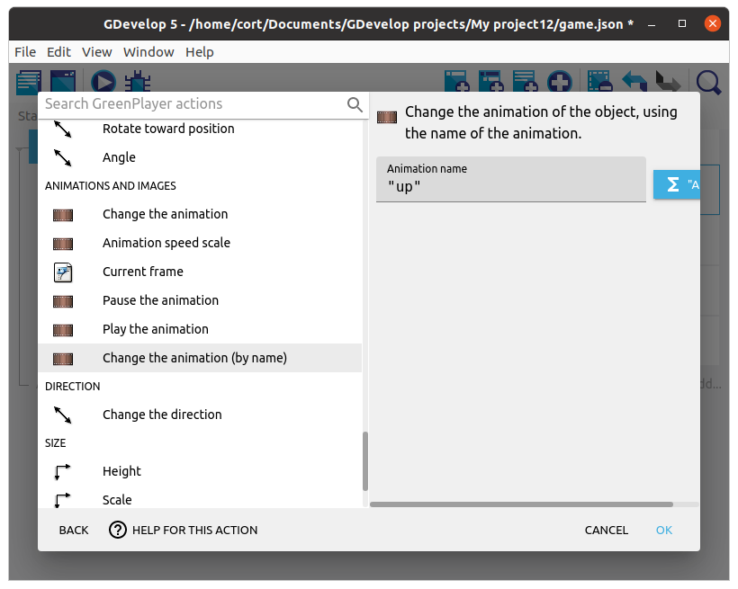

Continue adding the **Change animation** action for the remaining controls.

NOTE: There's a fast way to do this using copy & paste for the event, and then changing the pressed button in condition and animantion name in action.

When done, your event tab should look like this...

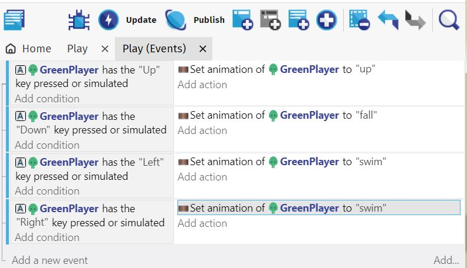

## Idle and Flip

If you **Preview** it now, you'll notice two problems.

* Player continues using the last animation even when nothing is pressed.
* Player faces the wrong direction when moving left

To fix the first problem, we'll switch to the **stand** animation if the player isn't moving.

Start by adding a new event (...not a sub-event), and click on **Add condition**.
Select the player, then the **Is moving** condition.
Since we want to perform the action when the player is **NOT** moving, we'll need to **Invert the condition**.

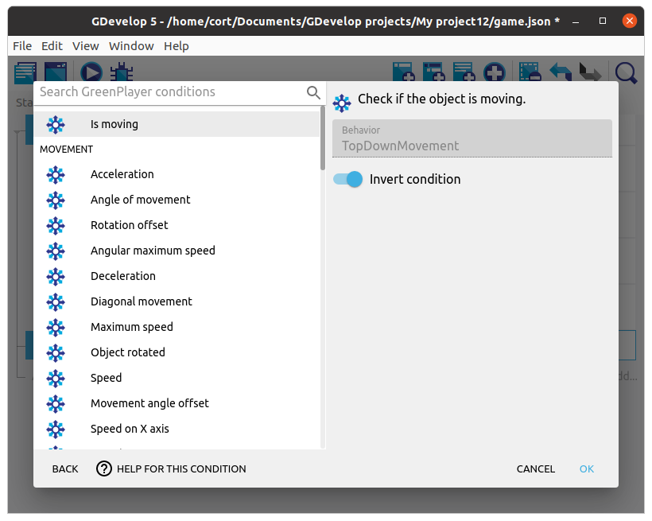

Under the action, add a **Change the animation (by name)** action and set the **Animation name** to **"stand"**.
It should now look like this...

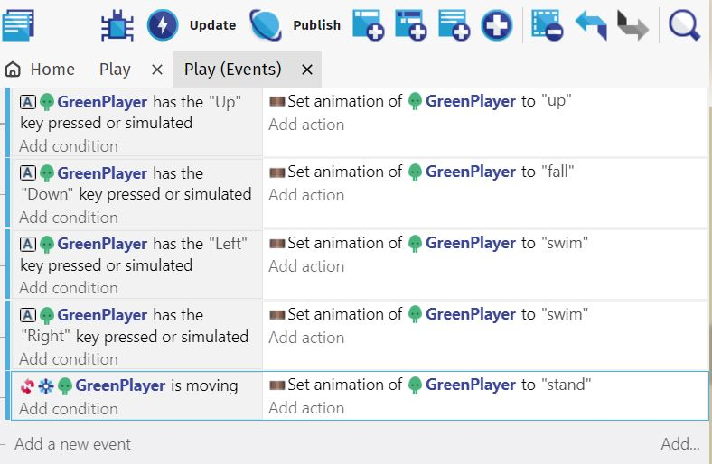

Next, we'll need to flip the player around when moving left.

Add just a **new action** under the move left event, click on the player, then select the **Flip horizontally**.
Under **Activate Flip**, select **Yes**.

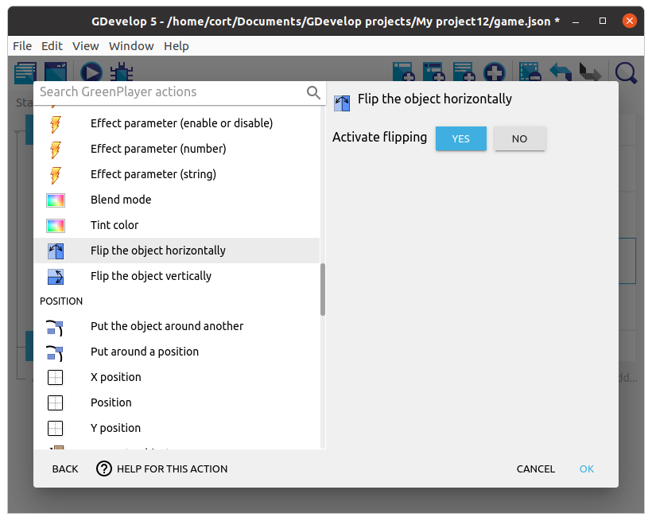

If you **Preview** now you will see that when you press Ledt Arrow your player will face to the left.  However it gets stuck now in this position and when you press back to the right, it will not flip back...

So, do the same for the move right event, but set **Activate Flip** to **No**.
Your events should now look like this...

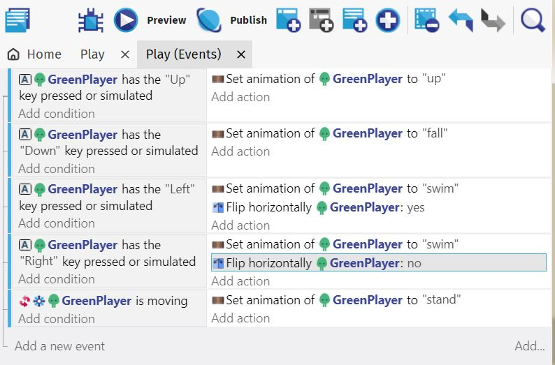

If you've also added touchscreen controls as per the previous lesson's optional section, they should be controlling the character by simulating the arrow controls as well.

You can also add **WASD** control using this approach:

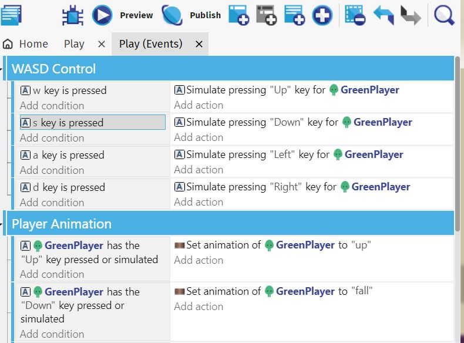

NOTE: I added **Event Groups** to break up the events logically, and make the code more readable and maintainable.

Make sure to **Preview** and test your work.

It's also a very good time to **Save** if you havne't.