# Attacks

To inflict acts of violence on the monsters, we'll add in a sword for our player.
I'm using the **Lavish Sword**...

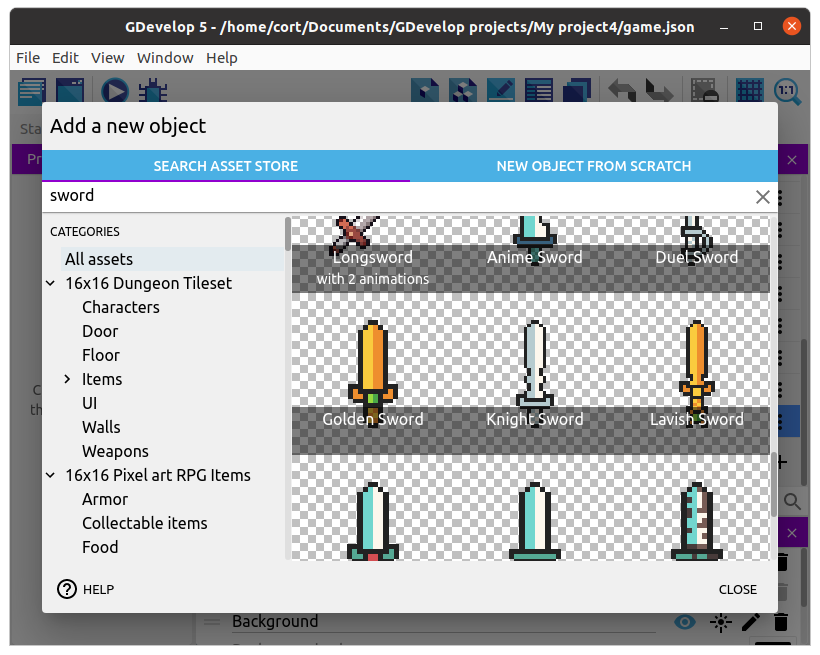

Add it to the game, but don't drag it into the scene; we'll be adding it using events instead.

## Attack Button

We'll need a button to trigger the sword attack.
We're using the **space** button, but you can choose whichever, along with a touchscreen button if necessary...

## Attack Event

Whenever the attack button is pressed, we want...

1. Sword should appear in the direction the player is facing.
2. Sword should remain for a fraction of a second.
3. If any monsters touches the sword, the monster should be deleted.
4. There should be a slight delay before the player can attack again.

We'll start with a new group event, and name it **Player Attack**.

Add a sub-event, and for condition, select **Key Pressed (space)**.

For the action, select the **Sword** and choose **Create an object**.
The **X** and **Y** position doesn't matter, as we'll be changing it in a separate action, so just set them to zero.

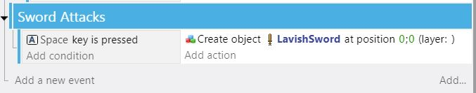

We'll also need to make the sword a little larger, so add a second action, select the sword, and set **Scale** to **2**.

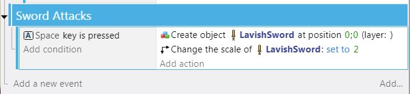

## Attack Direction

Next, we need to determine the direction that the player is facing, so we'll need to add 4 sub-events.
These sub-events will check which animation the player is currently set to.

For the first condition, select the player and choose **Current animation name**.
Set the sign to **= (equal to)** and value to **Up**.
For the action, select **Value of scene variable**, set the name to **playerDirection**, and set the value to **0**.

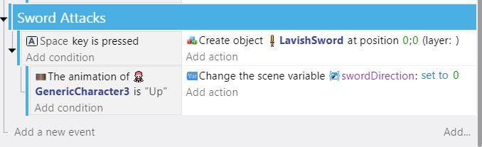

The sword object is drawn facing up by default, with angle = 0.  And using GDevelop coordinate system, Right = 90, Down = 180, and Left = 270 degrees...

Repeat for all 4 animations / directions.

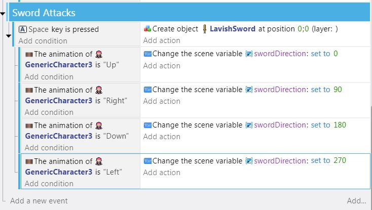

## Position and Rotate Sword

Select the **Key Pressed** event and add a sub-event to that.

For this new sub-event, leave the condition empty.
For the actions, we need two individual statements:

- rotate the sword to the correct direction.
  - select the **Sword** and choose **Angle**.  Set the sign to **= (set to)** and the value to **Expressions**, **Value of scene variable**, and **swordDirection**.

- place the sword a bit offset from the player
  - select the **Sword** and choose **Put the object around another**.  Choose the player as the center object.  For distance, choose 50.  Then for **Angle**, choose **Expressions** and use **Value of scene variable**, and **swordDirection**.
  
  If you preview you will notice the sword is placed incorrectly - that is because the swordDirection is offset by 90 degrees from the character's.  Let's subtract 90 degrees from **Angle** in the second action to correct this.

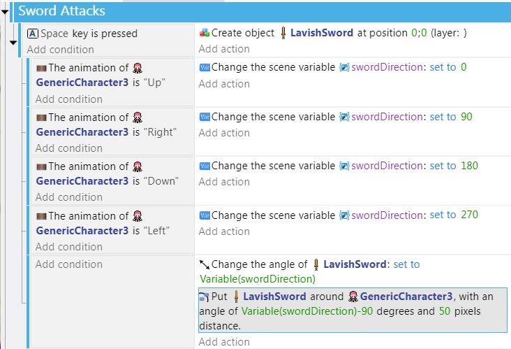

## Remove Sword After Delay

To remove the sword after a short delay, we'll need a timer.
Add a new action to the **Key Pressed** event, select **Other Actions** and choose **Start (or reset) a scene timer**.
Give the timer the name **"swordDelay"**.

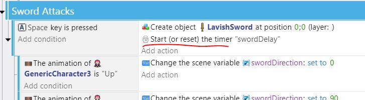

Select the **Sword Attacks** Group and add a sub-event to that (sibling to the main sword attack event block).
For the condition, select the **Other Conditions** and **Value of scene timer**.
Set the timer name to **"swordDelay"**, and time in seconds to **0.3**.

For the action, select the **Sword** and **Delete the object**.

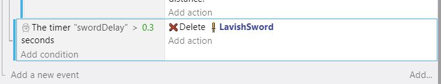

## Delay Before Next Attack

To impose a short delay after each attack, add a new condition to the **Touch or mouse down** event.

For the condition, select **Other ACtions** and **Value of scene timer**.
Set the timer name to **"swordDelay"**, the comparison to **greater than** and time in seconds to **0.6**.

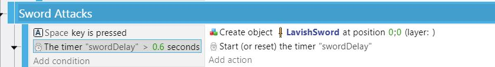

However, for this to work, a timer has already had to start, so we need to add an extra **At the Beginning of Scene** event like so:

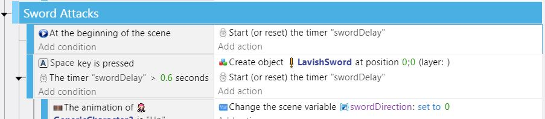

## Removing the Monster

To remove the monster when the touch the sword, add a new sub-event under **Player Attack**.
For the condition, select the **Sword**, **Collision**, and choose the **Goblin**.
For the action, select the **Goblin**, and choose **Delete the object**.

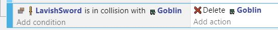

## Events Summary

If you have added all the events correctly, it should look something like this...

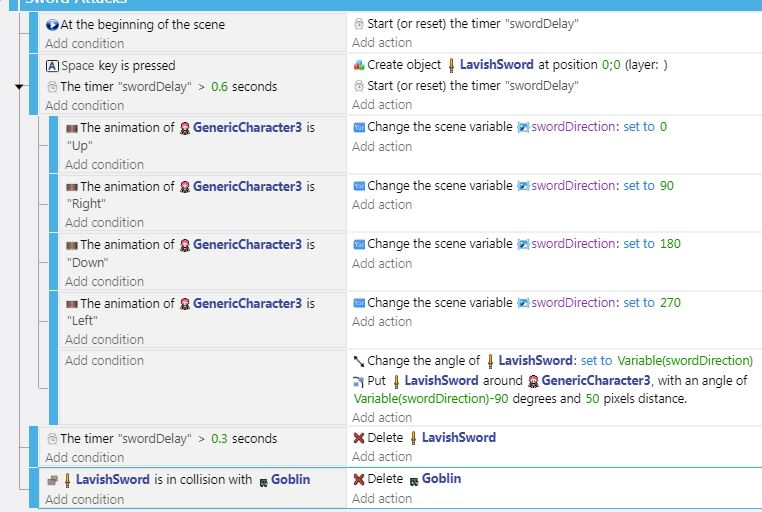

 
 
 

# (OPTIONAL) Add attach Touchscreen Control

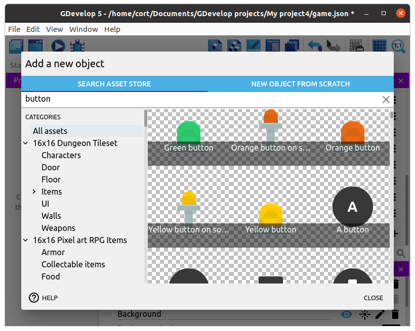

Drag it into the scene and set the layer to **GUI**.
Your scene should now look like this...

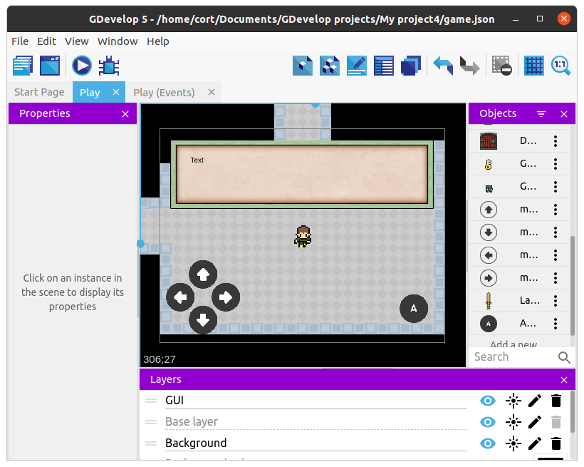

And just add another option for attack using the OR and AND logicals:

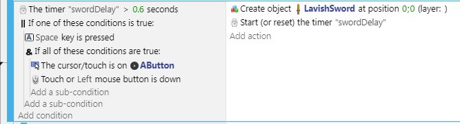
