Monsters Revisited
---

If you want to have different kinds of control over your monster that are not handled by the simple Rectangular Movement Behavior, consider using the technique described below to create various Monster paths or more belligirent behaviors.

## Pathfinding Behaviors

If you want Monsters (or NPCs for that matter) to follow your player, you can use the Pathfinding Behavior:

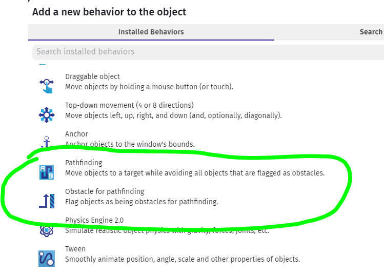

### Using Pathfinding Behavior

Add **Pathfinding** behavior to Monster objects you want to be able to chase you, when they sense you're around.

The behavior's properties include the *max speed* and *acceleration* with which they will move towards your player.  There are other properties like making collisions with obstacles less forgiving, or making obstacles costly, but not insurmountable, but just setting the speed and acceleration should get you well and started.

### Obstacles

If your monster is a ghost maybe you don't care that it can pass through walls that you can't, but for most normal monsters you want them to chase you but still avoid walls in their path to you.

Once you've added the Pathfinding behavior to your monster, you can easily mark the obstacles by adding the **Obstacle for pathfinding** behavior to elements in your base layer, like the Wall object.  And that's it!

### Triggering a Chase

In your Events, add a new event with a condition checking that you are within some distance of the radius of the monster's senses:

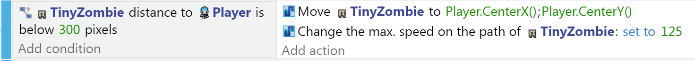

The action is the Pathfinding Behavior's Move to a Position, where the position is the Player's coordinates (we use CenterX/Y).

If the player is fast enough to escape to a safe distance, the Monster can be told to stop.  In this case I change the Max Speed to 0, so in the above chase trigger I reset the Max Speed back to the Behavior's default.

You can also make the monster have variable speeds - like it starts fast and slows down over time, or maybe based on different monster instances, or even assigned randomly.

### Animations

You can use the Trigger and Stop chase events to set the animation of your monster.  Pathfinding kind of breaks the other movement behaviors of the Sprite, so while it's not obvious how to Flip Animation based on X Speed, you can compare the Monster's X to the Player X to make that decision.  It'll always be facing you, even if it has to run backwards to get around an obstacle to get to you...

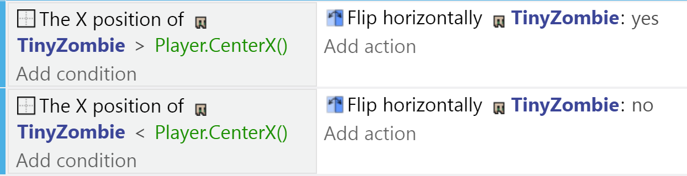

## Creating Hidden Paths

### Instance Variables

Each instance of the monster needs to remember which direction it is moving towards.
To do that, we'll make use of an **Instance Variable**.
Unlike **Scene Variables** which are the same for all objects in the scene, an **Instance Variable** is different for every instance.
This allows us to have multiple monsters, each moving in a different direction.

Select the monster, then click on **Instance Variable**...

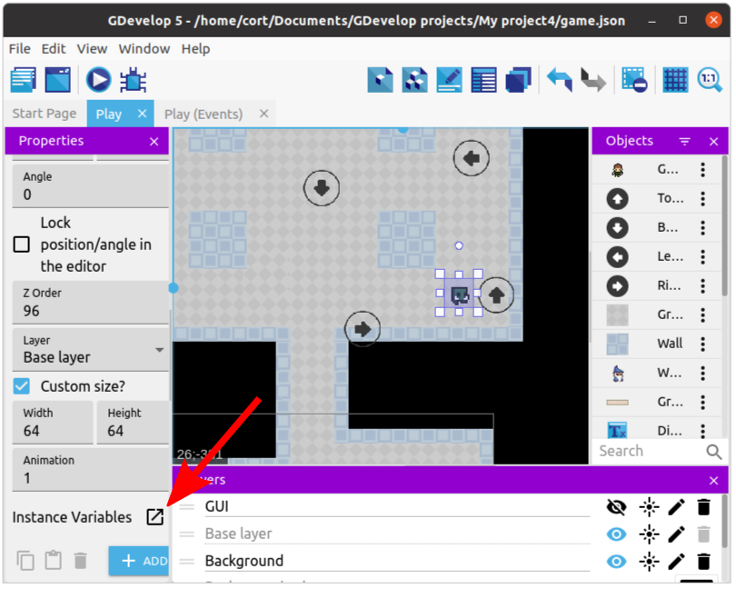

Add a new **Instance Variable**...

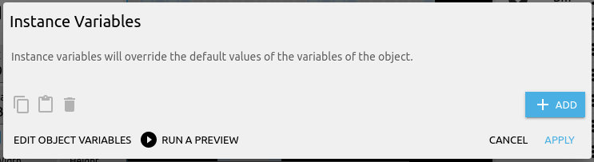

...set the name to **direction**, and the value to **right**.

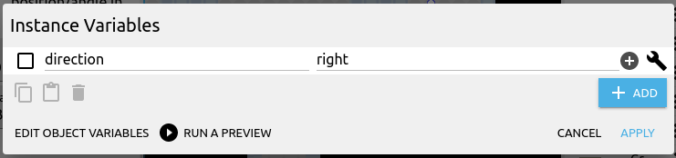

Click **Apply** when you are done.

Together with some events, this will make this monster move to the right.

In GDevelop, the terms **Object variable**, **Instance variable**, and **Object instance variable** are used interchangeably.

### Movement Events

Start by adding a new group event and naming it **Monster**.
Add a sub-event, and for the condition, select the **Goblin** and **Text of an object variable**.
Set the variable name to **direction**, sign to **= (equal to)**, and value to **"up"**.

For the action, select the **Goblin** and **Add a force (angle)**.
Set the angle to **270** degrees, and the speed to **200**.

Repeat for the other 3 remaining directions.

In GDevelop, 0 degrees is East, 90 degrees is South, 180 degrees is West, 270 degrees is North.

### Hidden Arrows

To tell the monsters which way to turn, we'll make use of some hidden objects.
Add 4 arrow objects, one for each direction, and rename them to **moveUp**, **moveDown**, **moveLeft**, and **moveRight**.
What image you use for the arrow won't matter much, as they'll be hidden at the start of the game.

Here I have a goblin, and I want the goblin to move around the pillar in a counter-clockwise direction....

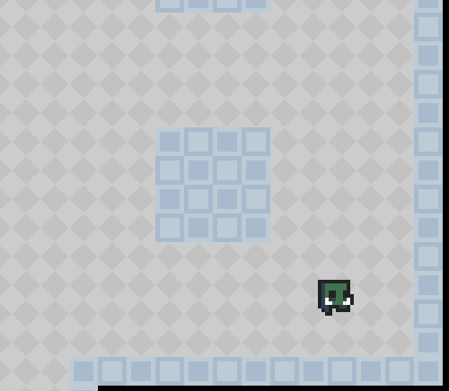

I'll add in the arrows pointing towards the direction I want the goblin to turn to.

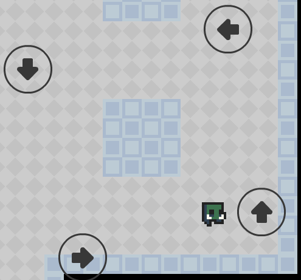

Keep in mind that the goblin will turn as soon as it touches the arrow.

## Turn Events

Add another sub-event to the **Monster** group event.
For the condition, select the **Goblin**, **Collision**, and choose the **moveUp** object.
For the action, select the **Goblin** and **Change text of variable**.
Set the variable name to **direction**, sign to **= (set to)**, and value to **"up"**.

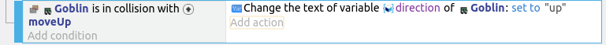

Repeat for the other 3 remaining directions, then test it out and make sure the monster is moving correctly.

### Facing Direction

You may have noticed that the monster is still facing right even when it is moving left.
To fix that, we'll need to modify the **Collision with moveLeft** event, by adding a **Flip horizontally yes** action.

We'll also need to flip the monster back when it is moving right, so add a **Flip horizontally no** action to the **Collision with moveRight** event.

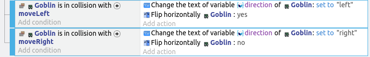

### More Monsters!

Now that you have the first monster working, continue to add more monsters throughout the game world.
This is what mine looks like...

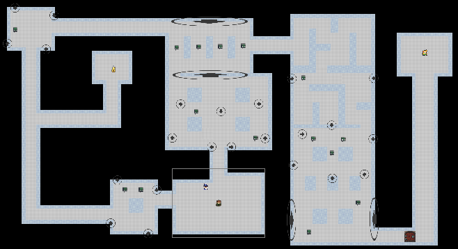

### Hide Arrows

Once you have tested it out and made sure everything is working correctly, we'll add an event to hide all the turn arrows.

For the condition, set it to **At the start of the scene**.
For the action, select the **moveUp** object, and choose hide.
Repeat for all the 4 arrows.

