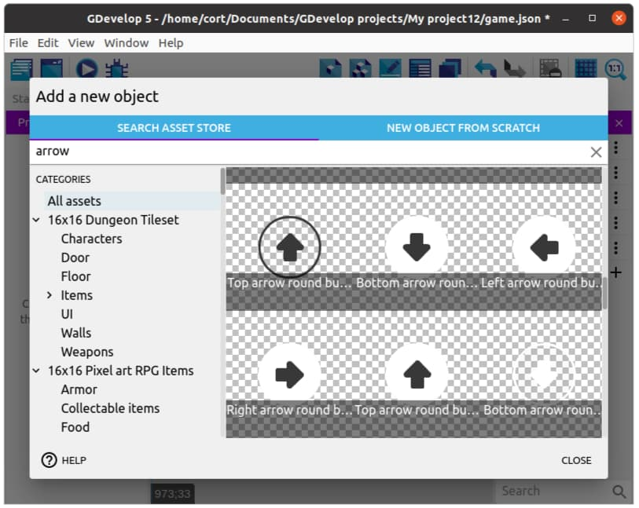

Player Controls
---

The **Top-down movement** behavior allows you to control the player using the arrow keys on the keyboard.

Press the **Preview** button and test moving the character around the screen with the arrow keys.

It moves, but it needs some animation to make it more dynamic.

if you're on a tablet, you might not have a keyboard!
To solve that, we'll add virtual keys to the screen in the optional section at the end of this page.

## Group Events

In **Dodge the Creep**, we only used **Standard Events** and **Sub-Events**.
That works fine, but as we have more events, things starts to get messy.

**Group Events** are used to organize and structure our events.
By themselves, they have a title, but otherwise do nothing at all.

**Group Events** are only useful when we add sub-events to them.
This lets the group event act like a header for a group of events.
For example, we can create a group event with the title "Enemies" and place all the events related to the enemies under this group.

Let's start by creating a group event, and naming it "Player Movements".

## Animation

First you can check the different animations of your GenericCharacter by clicking on the object and previewing the various choices.  

You have four only for this Sprite - up, down, left, right.

So, let's get to animating:

Add a **sub-event** under the Player Movements group, and for condition choose the character object and the condition **Control pressed or simulated ("Up")**.  

Then for action, choose **Change the animation (by name)** and select the **"Up"** animation. 

Repeat this for the 3 other movement controls:

## Pause and Play animation

In our previous game, we switched to an idle animation when the player isn't moving.
For our current player sprite, we don't have an idle animation, so instead, we'll pause the animation when the player is stopped.

Add a new sub-event under the **Player Movements** group event.
For the condition, select the player, choose **Check if the object is moving**, and set it to **Invert condition**.
For the action, select the player, then choose **Pause the animation**.

Since we have paused the animation, we'll also need to restart it when the player is moving.
Add a **Play the animation** action to each of the four movement control/animation events.

Our event tab should now look like this...

 
 
 

# (OPTIONAL) Touchscreen Control

## Control Buttons

Add a new object and select an up arrow. You can use whichever one you prefer.

Continue adding arrows until you have one in each direction.

Drag one instance of each arrow into the scene, and for each arrow...

1. Change the size to something appropriate (...if required).
2. Position it like in the following image.

Create a **Group Event** for Touchscreen Control.

Next, select the group event and add a new sub-event.
For this first sub-event, we'll be adding the **Mouse button pressed or touch held** condition.
Under **Button to check** select the **Left (primary)** button, then click **Ok**.

Your events tab should now look like this...

This first event will detect when you touch the screen, but it can't tell which button was touched.
To do that, we'll add a sub-event under it to detect the buttons.
Select the **Touch or mouse down** event, and add another sub-event.

For the conditions, select the **Up** arrow, then select **cursor/touch is on an object** condition.
And for the action, select the player object, then select the **Simulate Control of Top-Down Movement ("Up")** action.

The animation will be taken care of by our other actions for what to do in case of different controls simulated.

Your events tab should now look like this...

## Add the rest

Repeat the steps, adding a sub-event for each direction.
When you're done, your events tab should look like this...

