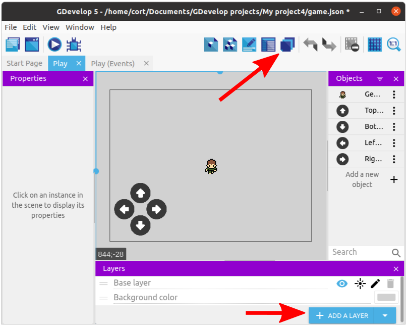
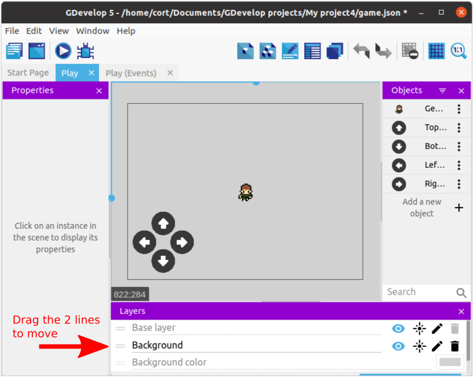
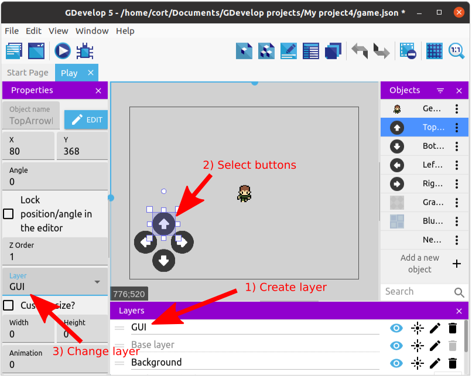
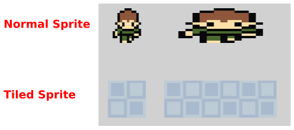
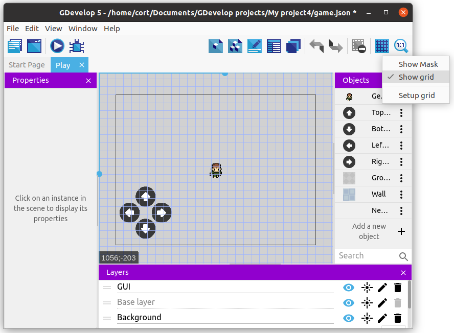

# Layers and Tiles

Next we'll be adding our background.
This includes the ground as well as the walls.

We want our background to always be behind the player (...else it'll cover the player), so we'll be making use of **Layers**.

## Layers

Click on the **Layers** button to open up the layers editor...

You can see that we currently have only a single layer, the default **Base layer**.

Click **Add a Layer** to add a new layer, rename it to **Background**, and move it below the **Base Layer**.

Now anything that's in the **Background** layer will appear behind all the objects in the **Base Layer**.

While we are at layers, we should also add a **GUI** layer for the buttons.
This layer should be place above the **Base layer**.

Select each of the buttons on the scene and change their layer to **GUI**.

This ensures that the buttons will always appear over all other objects in the scene.

GUI stands for **Graphical User Interface**. It includes controls such as buttons and sliders, as well as displays such as score, health, time, etc.

## Tile Sprite

I'll be using **Gray Background** for the floor and **Blue Background** for the walls.
If you are using the desktop version of GDevelop, you can find much better floor and walls images online (eg. [OpenGameArt](https://opengameart.org/)), but since I'll like to keep this tutorial accessible to everyone, I'll just have to make do with what we have in the asset store.

You can see it indicated below the asset name that these are **tiled sprite**.
The differences between a normal **sprite** and a **tiled sprite** are...

| Normal Sprite | Tiled Sprite |
| ------------- | ------------ |
| Support animation | No animation |
| Resizing causes the sprite to be stretched | Resizing causes the sprite to be repeated |

This images demonstrates what happens when you try to resize a normal sprite and a tiled sprite.

Go ahead and add both the **Gray Background** and the **Blue Background** to the scene.

If you have an image that you'll like to use, but it is not available as a tiled sprite in the asset store, you can select **New Object from Scratch** followed by **Tiled Sprite**. This allows you to create a tiled sprite with any image.

## Grids

To make it easier for us to position the tiled sprites properly, we can make use of the **Grid** feature.
Click on the **Grid** button and select **Show Grid**.

By default, the grid size is 32 by 32 pixels, which is good for us.
If you need a different grid size, you can set it using **Setup grid**.
