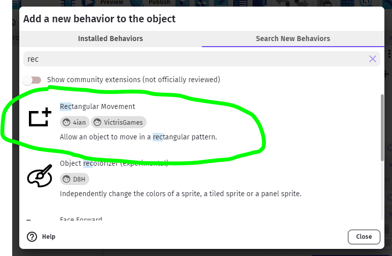
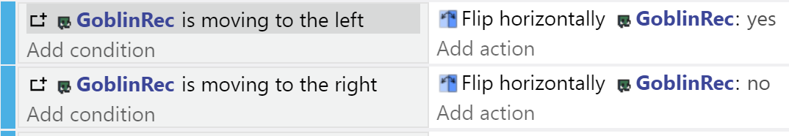
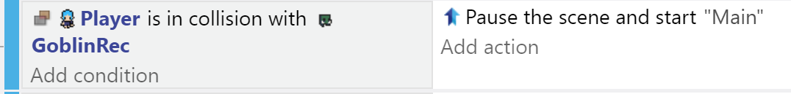

# Monsters

The wizard mentioned an infestation of vile goblins, so let's add them in.

I'm using this goblin, but use whatever you like...

Drag an instance of the goblin to a suitable location, resize it, then set an appropriate animation (...I'm using animation 1, **Run**).

I renamed the object to **GoblinRec** - all the Goblin instances from this object will have the following Rectangular Movement pattern.

## Monster Behavior

For this game, we'll only have a very simple monster behavior.
The monster will move in a perpertual loop, and won't attempt to chase the player.

## Rectangular Movement Behavior

Double-click on the monster, and go to the Behaviors tab.

Click Add a New Behavior.

The one we want is not installed by default, so we need to Search New Behaviors for **Rectangular Movement**.  

When you find it, click to Install it.  Once, installed, you would see it in the Add New Behavior tab for your object and you can now add it.

You need to choose the center of the rectangle, but you can leave it as 0,0 for objects that you expect to place in the scene, as it will use their position.  You then need to choose the height and width bounding the rectangular movement, as well as the acceleration and speed.

Play around with it until you find a suitable set of values.

## Movement Events

You can use events to flip the character when they move in the opposite direction, like so:

## Collisions

For now, we can just make collisions with the monsters restart the level:

Later on we will be creating a Game Over scene we could use instead.

We could also add Health to our player, and coliisions may affect that instead.

## Moving In a Single Line

You can use the same Behavior to create a 1-dimension movement pattern for monsters or obstacles, by either Zero-ing the horizontal or vertical speeds.

##  Instance-Specific Control

You may wish to use the same pattern, but with different properties.  You can either create complex instance-variable control (set and use instance variables in the movement - e.g. *set Behavior X Distance = Goblin.instance.Variable(XDist))*

Or, you can create many different Objects with varying Behavior properties.

You can even use random number generators to create various unexpected patterns, or non-repeating behaviors.

For mor Monster control, please look for the Monsters Revisited page.