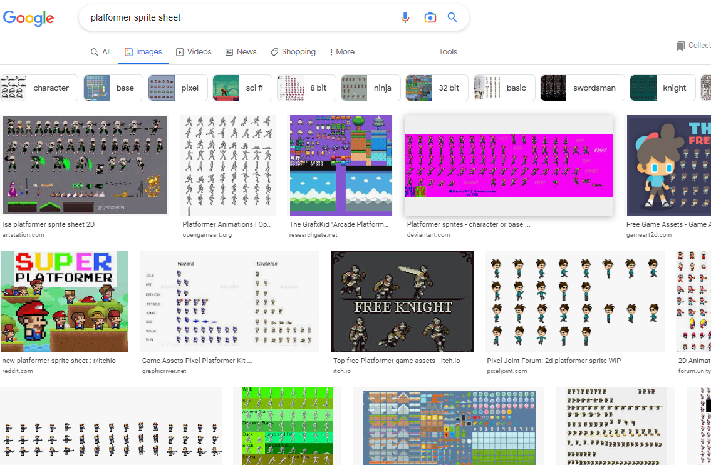
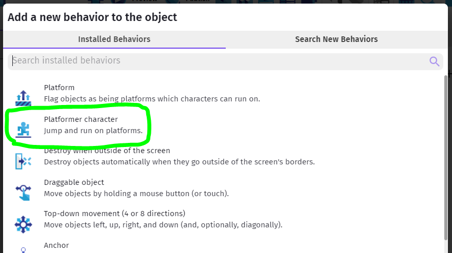
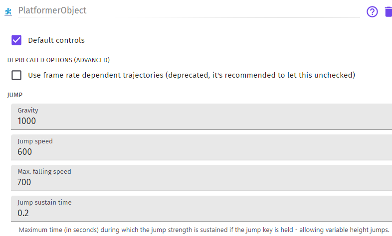

Basics - Character
---

Two main requirements - character and platforms.

If you want to use only built-in GDevelop assets, you can just follow their basic Platfromer tutorial - 3 7-minute videos...

 <iframe width="560" height="315" src="https://www.youtube.com/embed/eU0kkLSdw0Y?start=35" title="YouTube video player" frameborder="0" allow="accelerometer; autoplay; clipboard-write; encrypted-media; gyroscope; picture-in-picture" allowfullscreen></iframe>

## Character

For character you can use anything that has walk/run Left/Right animations, as well as Jump.  

Slide animation might be good.  Some built-in attack animation wouldn't hurt either, but those are not necessary for the basics...

The GDevelop Asset store has a high-res Platformer pack you can use in conjunction with the tutorials mentioned above, but most of the Kenney and other asset packs available have fitting, albeit more pixelated characters for you to choose from.

Mixing high-res and pixel or even two similar, but different thematic packs can make for jarring visuals, but that's a creative choice completely up to you...

So, get your Sprite ready.

## Importing Sprite Sheet

If you're using the web version of GDevelop it can be a nuisance to import your own graphics for animation, but there are many other free, suitable assets out there.  

Just search for "platformer sprite sheet" and see...

[Itch]](https://itch.io/game-assets/free/genre-platformer) is one place where you can browse with more certainty.

Once you find the Sprite Sheet of your dreams, you may need to cut it up, so that you could import the required tiles into GDevelop as single animation cels.  
See **Slicing Tile Sheet** below for more information.

## Platformer Physics

One of the more complicated things you do need to figure out for your character and the world are the physics.  

Luckily all of that is taken care of for you in GDevelop!

Just create or pick the character sprite with all the required animations, and add the **Platformer Character Behavior** to your sprite. 

The Behavior will allow you to adjust certain elements of the physics of your game.

For instance, how high you can jump and how fast will you fall, your maximum horizontal speed, and so forth.

We will try these out later, once we have a few platforms to work with.