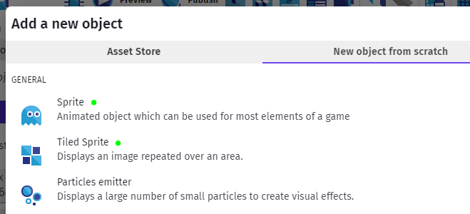
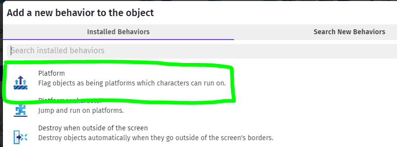
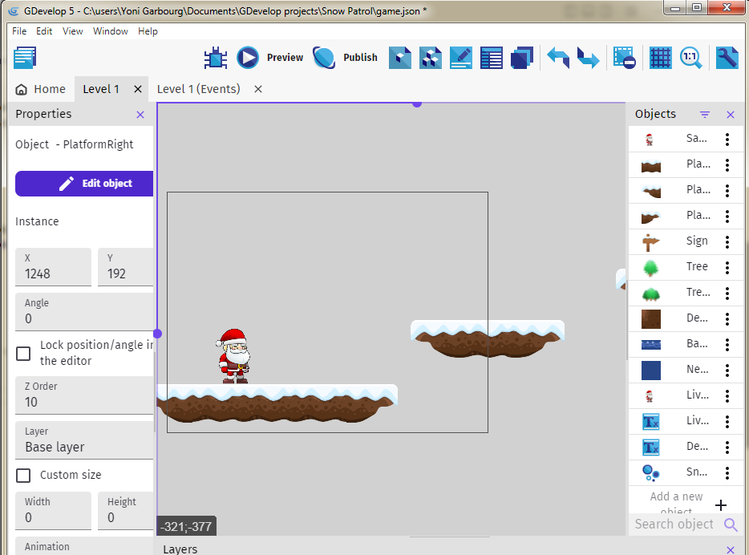

Basics - Platforms
--- 

Now that we have a Platformer Character, let's give it some platforms to run and jump on.

Again, there are many built-in packs you can use in GDevelop's Asset Store - the general recommendation is to try and stay within one pack, and not pick and choose from too many to avoid jarring graphics, but that's a creative choice, so totally up to you.

Just like character Sprite Sheet, you can find other Tile Sheet out there that have platforms.  So you can create your own Sprite tiles with a single animation cel.

## Tiled Sprite Vs. Sprite (no animation)

We wanted to create a winter-themed Platformer, and a search turned up a few tilesheet.  We used [this one](https://opengameart.org/content/winter-platformer-game-tileset) from the OpenGameArt website.

This required downloading the set which came zipped up, and included images in various formats.  We worked with the .png's.  This set already came pre-sliced, so we didn't need to worry about slicing.

Now, the tiles come with some center, and end bits (left and right).

The end bits can be created as simple **Sprites** with a single animation cel.

The middle bits, if from a set like this where they are drawn with starts and ends that match up if tiled, we can create as **Tiled Sprites**.  

That way we can create platforms of various lengths by adding various lengths of the middle tile with the same end bits.  Note that you will need to adhere to a particular grid to make sure the tiles lign up properly.

For this set, 32x32 grid worked well.

## Add Platforms

Once you've added the various sprites (tiled or otherwise) to your project, make sure to make all of them game Platforms by just adding the **Platform Behavior** to each of them.

Time to add some of your Platforms to your scene.
Given the size of your game view area, and your character, place some platforms where the character can move horizontally on them, or jump up or fall down to them.

## Preview / Test

And preview the game so you can get a feel for the physics.

Make changes to Jump Speed & Sustain Time, Max Speed, Gravity/Falling Speed and so forth to see how the game feels.