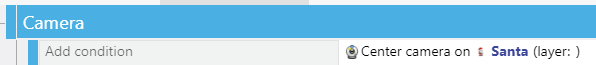
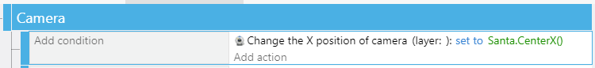
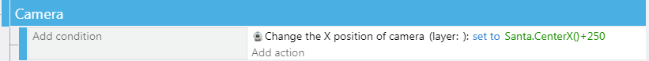
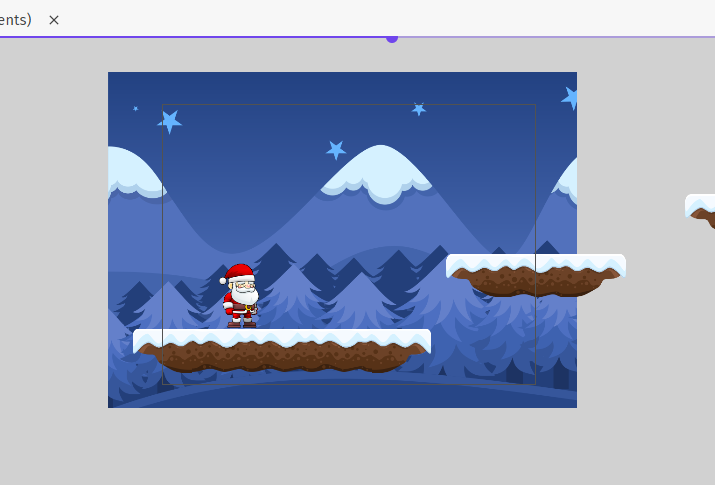
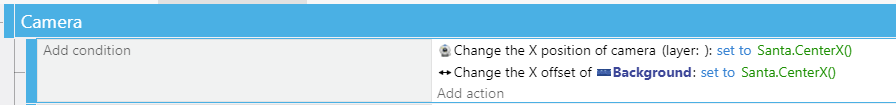
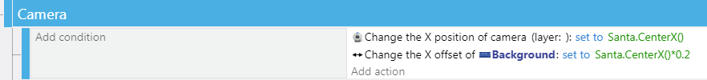

Camera
---

So you've got a character and some platforms.

Hopefully, you also animated your character...

Some useful conditions based on the **PlatformCharacter Behavior** are:

- is jumping
- is falling
- is on floor
- horizontal speed (positive, negative, or zero)

Otherwise you can also use the same Control Simulated/Key Pressed type conditions like we used for **Top-Down Movement Behavior** characters.

But your character moves off-screen.  We need to make the Camera follow.
You already know some ways to do this.

You can add the unconditional event for starters (use your character's object):

 

<video autoplay muted loop width=450 height="auto">
  <source src="images/centerOnObject.mp4" type="video/mp4">
</video>

With this camera center, the character will always be at the center.  As the character climbs further up, the camera follows... You can add a ceiling to this with some conditions.

You can also make the camera feel more like a Super Mario Bros. game where the world view is limited, and your character might be able to jump above it, but the camera only changes on X axis, not vertically:

<video autoplay muted loop width=450 height="auto">
  <source src="images/centerXOnly.mp4" type="video/mp4">
</video>

Finally, Center may not be the right location of the camera - it may want to show the character closer to the left edge like many side-scrolling platformers that move towards the right.

Just add an amount of picels you want to **offset the charcter**:

## Background

Now, let's add a background to the scene.

For this, we will want to use a Tiled image, so it can progress continuously.

For our winter-themed game we chose Winter Background from the GDevelop assets.

You DON'T need to stretch it beyond the size of the camera viewport - mostly you only need to worry about the vertical margins - how far up can the character jump beyond the viewport?  Do you want to follow it there? (see above)

We create a **Background Layer** for it, so the camera control of it can be done separately.  This is for several reasons, but one main one is that we will be applying a so-called **Parallax** effect to the background image.

First, let's just make sure the background scrolls.  Right now, if you just added the background as a new layer and didn't add any camera controls to it. the background wll be just stationary.  Prettier than grey void, but not very dynamic.

## Background Offseting & Parallax

If we add the following Change X Offset action to our Tiled Sprite, it will scrolls continuously as our character moves through the level:

Better than before, but can still be improved upon.

**Visual Parallax** is the apparent difference in motion between objects that are close to us vs. those that are far away.  This is something our human visual system is great at processing and it helps decode a scene.

So the mountains far away would not be moving as fast as our foreground character and platforms if we had a panning camera following the player.

So let's add the **parallax** by offsetting the image at a slower pace than our player's movement, like so:

You can play with the offset factor - we are using 0.2x in the example.

You can also add a vertical offset along with a similar parallax factor.

Finally, you can also add another layer of foreground between the character/platforms and the background (clouds or birds or whatever you wish to pepper the scenery with).  

Since these are meant to be behind the platforms, but in front of the backround, their movements (most likely whispy sprites where we control their positions on the screen) should be somewhere between 0.2 and 1.0 the speed of the player/camera.

