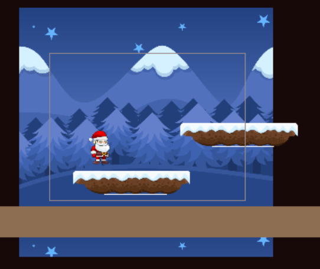

Death Zone
---

When you fall off a platform or mis-judge a jump your character will fall into the abyss.  AT some point this should lead to death.

The simplest way to handle this is a long, invisible death zone under the platforms:

You will need to hide it during the beginning of the scene, and add a collision event to handle the actual death. 

The easiest action to take is to restart the scene - more on that later.

<video autoplay muted loop width=450 height="auto">
  <source src="images/deathZone.mp4" type="video/mp4">
</video>