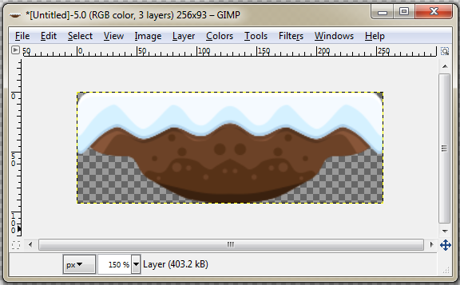
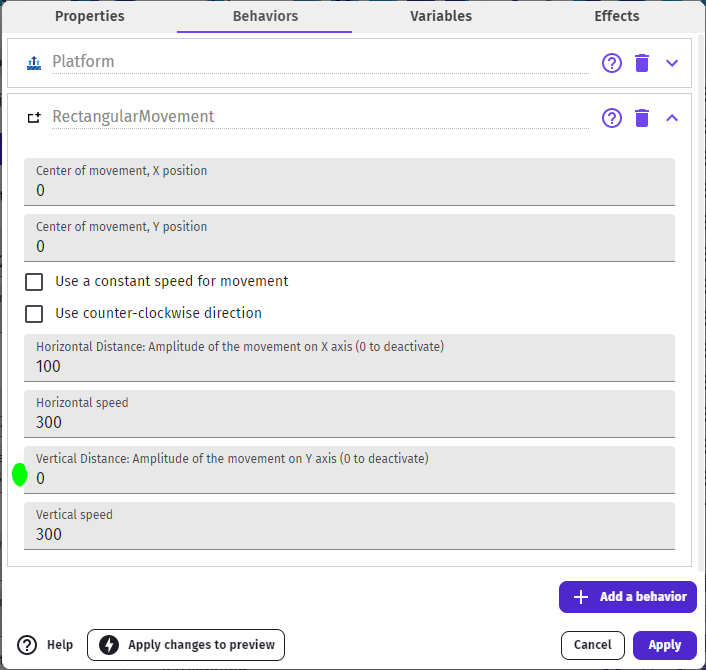
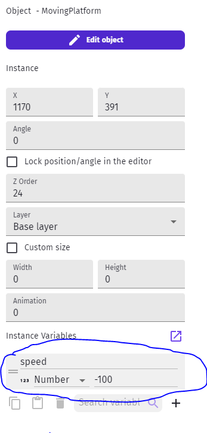
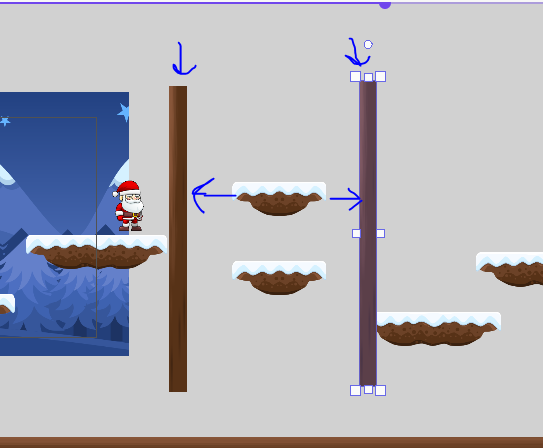
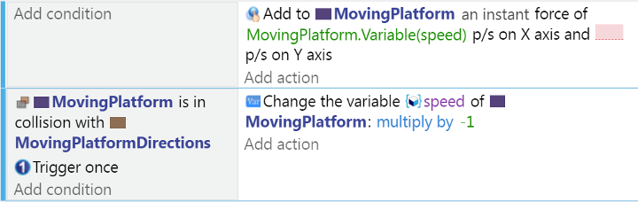
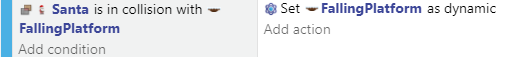

Moving Platforms
---

It's common to have moving platforms:

For this, it's easier if we use an application to create a single-object platform (NOT something using the combined middle tile and end sprites).

It also needs to be its own object, as once we had teh moving behavior, it will apply to all the copies of that object...

We like the desktop app [GIMP](https://www.gimp.org/).

But you can use [Piskel](https://www.piskelapp.com/p/create/sprite) or [PixilArt](https://www.pixilart.com/draw), which are web-based.

## Rectangular Movement 

Once we add this new Sprite to our project, we can add the two following Behaviors to it:

- **Platform**, in order to interact with character as a platform)
- **Rectangular Movement**, to make it move

Once you add this object to your scene you can experiment with the motion properties:

- You can make side-to-side movement by making the Vertical distance 0
- You can make it a vertial platform, like an elevator, by making the horizontal distance be 0
- You can adjust the distances and speeds to suit your game's needs

<video autoplay muted loop width=450 height="auto">
  <source src="images/movingPlatform.mp4" type="video/mp4">
</video>

NOTE: One major limitation of this and similar linear movement behaviors is that you cannot control the starting direction of objects.  So, making platforms with same speed that criss-cross each other's paths regularly becomes impossible.

## Using Hidden Stage Directions

Another way to control moving platforms is to add stage directions that can be reused with simple events.

We did something similar in the Action RPG tutorial with monsters.

Here is an example:

Create a PlatformObject with no movement behavior, and place it somehwere in the area where you want it to move.

Add an instance Speed variable to this object.

Instance Variables are like Object Variables - they belong to the object - but each instance on the scene can have its own value.  In events, you still use the same Object Variable syntax.

Now add some meaningless sprite to your scene, and place it twice, at the two ends of where you wish your platforms to move back and forth between:

Finally, we will add the two simple events to control our moving platforms:

- First, to simply keep it moving at whatever speed/direction it currently has stored in the speed variable

- Second, on collision with the direction walls, simply reverse direction

<video autoplay muted loop width=450 height="auto">
  <source src="images/twoMovingPlatforms.mp4" type="video/mp4">
</video>

You can then have two platforms starting at the same position but with different instance speeds (say, 100 and -100) and they will move in opposite directions!

By the way, don't forget to HIDE the stage direction sprites.

## Irregular Platforms

You may have some ideas about other types of platforms (see-saws, rotators, toggle passthrough on/off, etc)

For instance, we wanted to have platforms that that fall off-screen and you have to jump off of it before it's too late!

There are many ways to do it, but one way for this is to toggle Physics types on the object.

First, create a new version of the Moving Platform (new Sprite, not just anothe rinstance of Moving Platform).

Then add the Behaviors:

- **Platform**: still need character to be able to stand on it
- **Physics Engine 2.0**: set object type to *Static* (leave the rest for now)

Place the object somewhere appropriate in your level.

Then add an event that changes the Physics type to *Dynamic* when your character collides with it:

- *Static*: Non-moveable
- *Dynamic*: Moveable, including by gravity

You can change the Gravity scale to make it fall slower...

<video autoplay muted loop width=450 height="auto">
  <source src="images/fallingPlatform.mp4" type="video/mp4">
</video>

HINT: Make sure when you die to restart the scene or re-position and re-Static the object, so that it's reset when necessary.

## Other Ideas

- Platforms that start mpoving when you land on them
- Moving platforms rthat fall away if you are on top of them AND they have reached some location
- Moving Platforms that STOP when you land on them
- Platforms that rotate with your character's weight (like a lever on a center pivot)