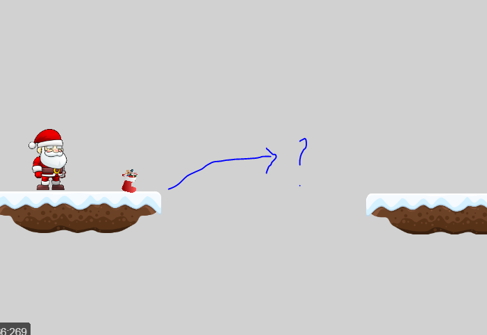
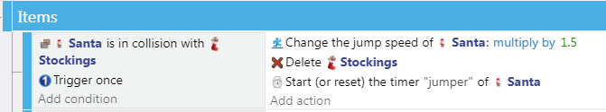
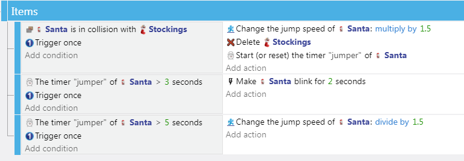

Items
---

In a platformer items can add an interesting dimension to gameplay.

Items can be:

- Part of the level's main goal: *find all of the missing presents in each level*

- Allow a player to reach areas otherwise impossible to reach: *boost jump speed*

- Hard to reach, but then make it easier for a player to pass a following challenge: *make player faster*

They can make game play more interesting by creating multiple path choices for the player to choose from.

## Basics

We already dealt with this in the Action RPG tutorial, so without going into much detail, you place the item sprite somewhere in the level, and when the player collides with it:

- Play a sound

- Delete the object

- Change something about the player or scene, e.g.:

  - Change a variable state
  - Change PlatformCharacter properties
  - Change something in the scene (unlesh hell, change backdrop, slow down platforms, etc)

## Example

Create a new Sprite for the item.  I found a christmas stocking image I decided to use.

Move the new item sprite into the scene, somewhere where it will be useful.

I am making my Stockings give Santa a bit of a jumping boost.  I put the Stockings on a platform where you ned the boost to get to the next platform.

## Timed Behavior Changes

You may wish to start a timer if you want to limit the transformation, and revert whatever properties back after the time - thank getting a Star in Super Mario Bros.

You may wish to make some change to the visual presence of the player to make it known the behavior is on, and maybe play some different background music.  You can use different particle emitter, change player or background colors, and so forth.

You could use blinking (add Flash Behavior for a simple solution) to signal that the behavior is about to run out...

That is why I started a timer in the above example:

## Make it Relevant

Do not add items that have no relevance to the player or game.

Items should create interesting game play by introducing a  challenge, creating choice for players, and making the game mechanics more fun.
