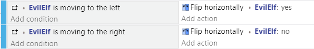
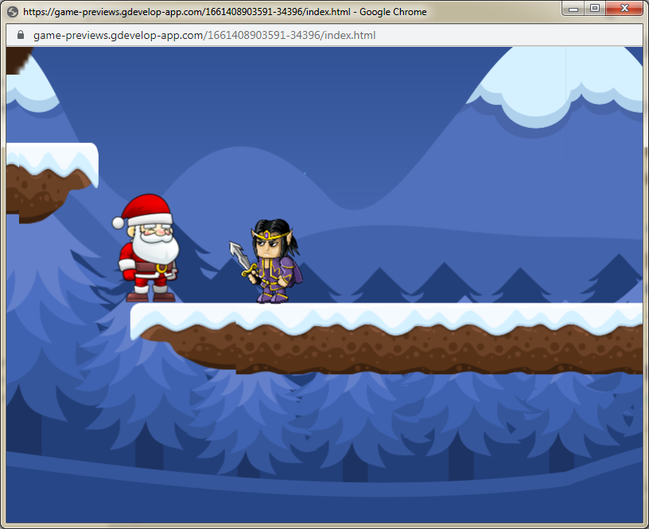
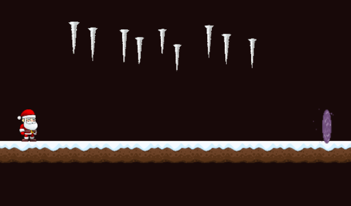

Enemies & Obstacles
---

In a Platformer, enemies can be immobile, moving on a path back and forth, chasing the character, shooting projectiles, etc.

Some enemies are defeated by jumping on them.

Others just need to be avoided, or maybe blasted through if you have projectiles of your own to throw or shoot.

## Basic Enemies

Keeping to your theme, add a scene object (icicle) or some "living" sprite (evil elf).

They can be immobile or you can use the Rectangular Movement behavior, or stage directions as discussed under Moving platforms, in order to animate their movement:

- Evil elves that run around platforms 

Using the Rectangular Movement Behavior (with 0 for vertical distance).
You just need to make sure the animation/horizontal flip is correct:

- Icicles triggered to fall from the sky when you walk under them

Use a trigger to toggle from a Physics Static to a Dynamic object - just like the falling platform we did.  

Here is one approach, so you can make many icicle instances from the same object without worrying about instance-specific triggers:

The one event works for each Icicle separately so will trigger them in a cascade, although this specific formula and with Santa's sluggish speed, the only way to pass is to walk slow and stop before each icicle falls...