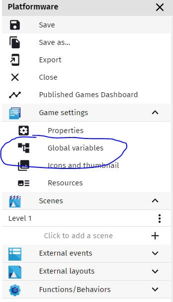
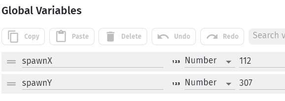
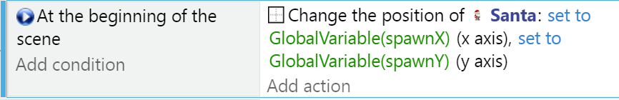
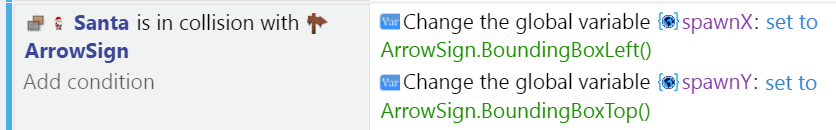

Checkpoints
---

When you have very challenging levels and you don't want players to give up on your game out of frustration, you may want to reward good play with a checkpoint - an area in the level that if you get to it, after you die next you want have to start from the beginning.

For this tutorial we are assuming your collisions with enemies or the death zone below the platforms causes a reloading of the Scene.  There are other approaches to dying (just teleport back to start position), and they each have pluses and minuses (like what happens to items already taken or enemies killed).

## Prep Work

Let's add a pair of Global Variables, spawnX and spawnY:

Make sure they're set to Number types, and then set the spawnX value to start off with the X value of your Player Character - just hover the mouse over your character in the Scene Editor and remember the X & Y.

In the Events Editor, add At the Beginning of Scene Event, and make the Action move Santa to the SpawnX, SpawnY Position.

Now when you die and restart the scene, your position will be whatever those Global Variables say.

## Sprite

Choose any sprite for you checkpoint - it can be animated or just a single cel.

When your character collides with it, simply set the new SpawnX/SpawnY coordinates to the checkpoint's.

