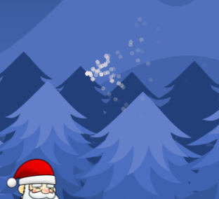
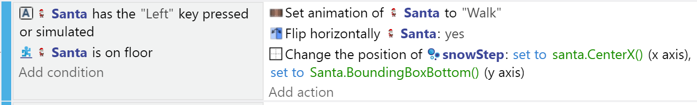
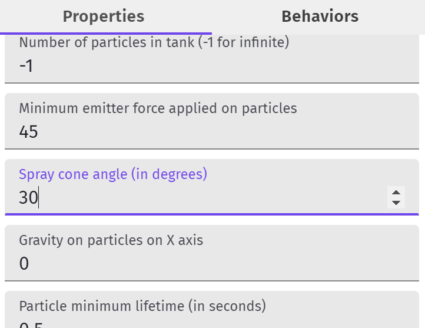
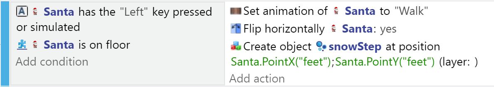
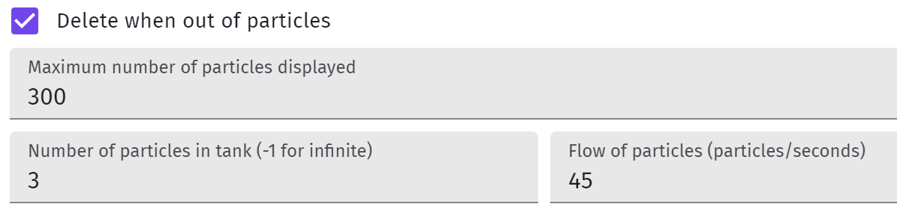
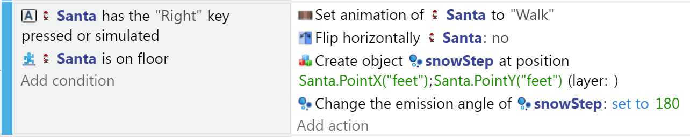

Trail & Other Partcile Emmiters
---

One of the things that makes games more fun to play is the animation and the feel you get from making your character interact with its fantasy environment.

In our theme, we have Santa on snow.  We should add sounds as he walks that sound like footsteps on powdery snow.

Since we can't really add footsteps, at least we can pretend he causes a little flurry under his boots as he trundles around.

Creating character trails is common, and you can use them for various game concepts.  

In this case, we just want to add some dynamism to the animation, and explore particle emitters.

## Particle Emitter

A **Particle Emitter** is an object types that emits particles.

NOTE: This is not useful for making projectiles as the partciles themselves are not objects that can collide with characters and enemies.

But it is useful for making dynamic animation like character trails, smoke/fire, confetti, fireworks, etc

So, let's use one to make Santa's trail.

From the Objects panel, add a **New Object from Scratch** and choose *Particle Emitter* as the type, and just hit Apply.

Drag the emitter into your main scene next to your player and run the preview.

You should see some red bubble emanating from the location of the emitter.

<video autoplay muted loop width=450 height="auto">
  <source src="images/emitter.mp4" type="video/mp4">
</video>

## Color, Shapre, Size of Particles

So first let's pick the shapre and color for our snow trail particles - let's assume little dust balls (circles) and that they start out freshly white, but turn grey after emission.

Double click on or open the properties of the new emitter you created.

Leave the particle type as Circle.

For size, the red bubbles were the default 3, so maybe leave it at that for now.

As for the color, you can select white for start, and grey for the end colors, and you can leave the Opacity as is for now.

You can rerun the preview again to see the change.

## Emitting from Santa's feet

So, now we can put the emitter at Santa's feet so the snow trail comes out from whever he has walked.

In the Events editor, add an action to re-position the emitter at the bottom of the Santa bounding box whenever Santa walks - you might already have an event with that condition, or you can create a new one.  

For position: you can create a new Point to use (**edit Points** in the Sprite properties window), or use CenterX for X and BoundingBoxBottom for Y:

## Styling the Emission

The emission effect as a trail doesn't work well for me yet.  

The particles seem too diffuse and go all over the place.

First, let's narrow down that Spray Cone angle from 90 to 30 - much better.

Now, we need to make the particles stop when Santa stops.

## Limiting the Emission

There are a few ways to make the trail appear only in some occasions (moving, on top of a platform), but instead of toggling the animation on/off, another approach is to constantly create a new limited emitter, and simply create new emitters as Santa walks.  That way we don't need to worry about shutting off and restarting the emitter - we just create as needed.  

So, remove the emitter from the scene, and change the Event from positioning the emitter at Santa's feet to Creating an instance of the Emitter object at Santa's feet - in this case we use a new Point called "feet" that we created in the Sprite's properties.

Now, we must make sure those emitters will stop and delete themselves when they run out of particles:

If the trail seems too thick, you can cut down the number of partciles all the way down to 1...

Now, the main issue left is that the partciles are always coming out towards the right.  When I walk left that's ok, but when I walk to the right, the particles should come out towards the left, behind the character...

You will need to rotate the emitter 180 degress in that case:

And this is what 3 partciles per emitter looks like:

<video autoplay muted loop width=450 height="auto">
  <source src="images/emitterFinal.mp4" type="video/mp4">
</video>

(Note: there's some extra size settings set on the emitter when it's created for jumping)

## Other Uses of Emitters

- Blood Splatter
- Confetti
- Explosions
- Fire/Smoke
- and more...

### *Challenge*

Let's add a bit of confetti celebration animation whenever we pass through a checkpoint.

First, create the emitter(s) that will create the right effect.

Once you are satisfied with the effect, limit the confetti particles, remove the permanent instance from the scene, and add an action to create the emitter(s) at the checkpoint during the collision.

